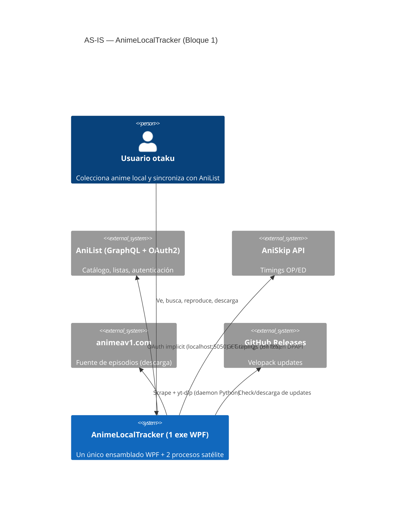
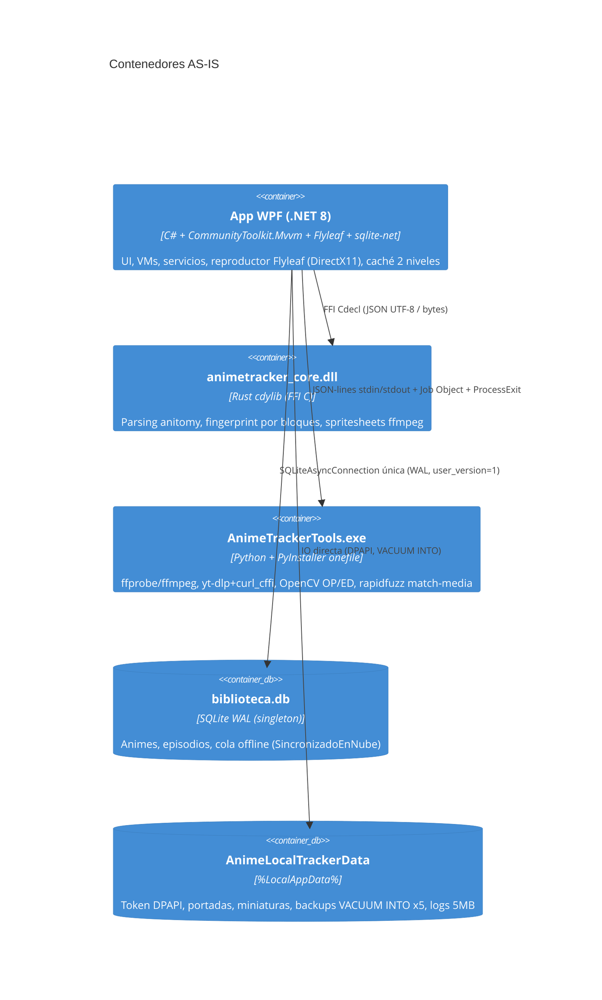

# INFORME DE AUDITORÍA — AnimeLocalTracker · Bloque 1: Seguridad y Arquitectura

| | |
|---|---|
| **Proyecto** | AnimeLocalTracker v1.0.5 (desktop Windows, .NET 8 WPF) |
| **Fecha** | 2026-09-02 |
| **Versión del informe** | 1.0 (entrega parcial del plan por bloques) |
| **Alcance cubierto en esta entrega** | Bloque 1: §4.1 Seguridad (SAST estático + SCA + secretos + STRIDE) y §4.3 Arquitectura. Bloques 2–4 (Funcionalidad, Rendimiento, DevOps, UX, Legal) pendientes — ver §7 |
| **Confidencialidad** | Interno — uso exclusivo del equipo del proyecto |
| **Equipo firmante** | Seguridad ofensiva/defensiva · Arquitectura de software · Analista de sistemas · SRE · (UX, Marketing, Legal: fuera de alcance en este bloque) |
| **Metodología** | Revisión estática de código y config (sin modificar nada), SCA real (`dotnet list --vulnerable`), barrido de secretos manual (gitleaks/trufflehog no instalados en el host), verificación `file:line` de cada hallazgo crítico, STRIDE, C4. Entorno: producción (release Velopack firmado). Repo: `github.com/rodriguezrobinj/AnimeLocalTracker` + copia local. |

> Auditoría "fresca" (los docs v1→v4 referenciados en AGENTS.md no existen en esta máquina). Los hallazgos previos SEC-01…SEC-12/BAK/IMP/INT/DEV citados en comentarios del código **no eran verificables contra su documentación de origen**; este informe no asume su validez y se basa solo en el código actual.

---

## 1. Resumen ejecutivo

**Nivel de madurez global del Bloque 1: 3.7/5** — una base de seguridad y arquitectura notablemente disciplinada para un proyecto desktop de este tamaño, con invariantes de datos cumplidas en código, borde FFI defendido, SQL 100 % parametrizado y SCA bloqueante en CI/CD. La deuda se concentra en **orquestación/presentación** (clases grandes, ServiceLocator, fábrica manual de vistas, scanner duplicado) y en **endurecimientos de borde** del flujo de descargas/OAuth que no llegan al nivel de un producto con procesamiento de contenido de terceros.

### Top 5 riesgos (Bloque 1)

| # | Riesgo | ID | Impacto | Nota ejecutiva |
|---|---|---|---|---|
| 1 | `IFileScannerService` registrado **dos veces** con dos implementaciones duplicadas ~90 %; MS.DI resuelve la última en silencio | ARC-001 | **Alto** | Un cambio en el scanner exige tocar 2 clases que ya divergen; hoy funciona por casualidad de orden de registro |
| 2 | Arquitectura de presentación con ServiceLocator global, VMs gigantes y modelo persistido acoplado a WPF | ARC-002/003/004 | **Alto** | La deuda está localizada pero encarece cada feature y el testeo |
| 3 | Descarga secuencial (fallback sin soporte Range) **sin tope de tamaño** + redirects https→http no bloqueados | SEC-003 | **Medio** | Riesgo de llenado de disco y de contenido servido por http en la ruta de red |
| 4 | OAuth2 *implicit* sin PKCE, puerto fijo 5050 y token en claro por loopback (limitación parcial de AniList) | SEC-001 | **Medio** | Ataque local teórico; mitigado por state de 32 B, orden de arranque y DPAPI en reposo |
| 5 | Fallback a `ffmpeg`/`python` del **PATH del sistema** en 3 puntos | SEC-007 | **Bajo** | Si el PATH es manipulable (misma sesión), un binario falso puede ejecutarse |

**Méritos verificados (a conservar):** token OAuth en DPAPI `CurrentUser` (nunca en claro en disco ni en logs); sin callbacks TLS inseguros; SQLite parametrizado con backup `VACUUM INTO` + `integrity_check` en restore; FFI Rust con `catch_unwind` + null-checks + clamps en toda exportada; daemon Python sin sockets, sin `shell=True`, con guard de rutas ffmpeg; allowlist de hosts del scraper; GitHub Actions pinneadas por SHA + dependabot (4 ecosistemas) + gates SCA bloqueantes; `ProcessExit` garantiza matar el daemon; instancia única por Mutex; Polly (retry+jitter+circuit breaker) en AniList.

### Radar de madurez por área (escala 0–5; textual — radar gráfico completo al cierre del Bloque 4)

```
Seguridad (4.1)      ████████████████████░░ 3.8
Arquitectura (4.3)   ██████████████████░░░░ 3.5
Funcionalidad (4.2)  ░░░░░░░░░░░░░░░░░░░░░░ n/e  → Bloque 2
Integraciones (4.5)  ░░░░░░░░░░░░░░░░░░░░░░ n/e  → Bloque 2
Rendimiento (4.4)    ░░░░░░░░░░░░░░░░░░░░░░ n/e  → Bloque 3
Calidad/DevOps (4.6) ░░░░░░░░░░░░░░░░░░░░░░ n/e  → Bloque 3 (SCA/CI sí revisados parcialmente)
UX/UI (4.7)          ░░░░░░░░░░░░░░░░░░░░░░ n/e  → Bloque 4
Marketing/SEO (4.8)  — no aplica a desktop sin web
Legal (4.9)          ░░░░░░░░░░░░░░░░░░░░░░ n/e  → Bloque 4 (buenas prácticas)
```

---

## 2. Hallazgos de seguridad (§4.1)

### 2.1 Matriz priorizada

| ID | Severidad | Prob./Impacto | Título (resumen) |
|---|---|---|---|
| SEC-001 | **Medio** | Alta/Baja · CVSS 3.1 ≈ 5.4 | OAuth implicit, puerto fijo 5050, token en claro en loopback |
| SEC-002 | **Medio** | n/c local | Logout no revoca token en AniList; sin manejo de 401 |
| SEC-003 | **Medio** | Media/Media · CVSS 3.1 ≈ 5.8 | Descarga secuencial sin tope de tamaño; redirects https→http; host arbitrario tras yt-dlp |
| SEC-004 | **Medio** | Media/Baja · CVSS 3.1 ≈ 4.3 | Portada: validación solo de esquema + bytes escritos antes de validar imagen (SSRF limitado) |
| SEC-005 | **Bajo** | Baja/Baja | Comprobación de `Referer` con `StartsWith` evadible por sufijo de host |
| SEC-006 | **Bajo** | Baja/Baja | UTF-16→UTF-8 con reemplazo silencioso; contrato NUL frágil en FFI |
| SEC-007 | **Bajo** | Baja/Media | Fallback a binarios del PATH (`ffmpeg`, `python`) |
| SEC-008 | **Bajo** | Baja/Baja | `ci.yml` sin `permissions:` mínimas |
| SEC-009 | **Bajo** | Baja/Baja | xunit 2.5.3 arrastra `System.Net.Http/Text.RegularExpressions 4.3.0` (High, tests) y SCA no audita Tests |
| SEC-010 | **Bajo** | Baja/Baja | MaterialDesignThemes prerelease + Dragablz 0.0.3.234 (2018) |
| SEC-011 | **Bajo** | Baja/Media | Velopack cliente sin verificación de firma del paquete |
| SEC-012 | Info | — | Logs con rutas locales completas |
| SEC-013 | Info | — | Historial git con binarios (venv, publish_output) |

### 2.2 Hallazgos detallados

---

#### SEC-001 — OAuth2 implicit sin PKCE, puerto fijo en loopback y token en claro en la red local

- **Categoría:** Seguridad — Autenticación/sesiones (ASVS V3).
- **Severidad:** Medio · Probabilidad media (requiere atacante en la misma sesión de escritorio) · **CVSS 3.1 ≈ 5.4** `AV:L/AC:H/PR:N/UI:N/S:U/C:H/I:N/A:N`.
- **Evidencia:** `Services/AuthService.cs` — `client_id` público embebido `:17`; redirect fijo `http://localhost:5050/` `:54`; flujo `response_type=token` (implicit, sin code+PKCE) `:66`; `state` criptográfico de 32 B `:63` y su validación `:164`; listener iniciado **antes** de abrir el navegador `:51-55` vs `:69` (bien); token en claro viajando por POST al loopback `:110-114`; almacenamiento DPAPI `:198-200`.
- **Causa raíz:** AniList no ofrece authorization-code para apps nativas con client_secret (limitación de plataforma documentada en el historial), lo que empuja al implicit flow; el puerto se fijó para simplificar la configuración del redirect URI en la consola de AniList.
- **Recomendación (defensa en profundidad):** puerto dinámico con redirect registrado como wildcard no es posible en AniList → mitigar con **token efímero de una sola vez** en la respuesta del callback y **validación del proceso padre**; documentar la limitación. Mantener el `state` (ya correcto).
- **Solución propuesta (antes → después):**
  ```csharp
  // Antes: cualquier proceso local puede intentar ocupar 5050 antes del arranque
  // (DoS del login) o, tras un crash, recibir el token en el callback.
  listener.Prefixes.Add("http://localhost:5050/");
  listener.Start();

  // Después (sin cambiar el redirect de AniList): además del state, exigir un
  // nonce de un solo uso en la query que la app genera y el callback debe devolver.
  string expectedNonce = Convert.ToHexString(RandomNumberGenerator.GetBytes(16));
  var url = $"https://anilist.co/api/v2/oauth/authorize?client_id={ClientId}" +
            $"&response_type=token&state={expectedState}&redirect_uri=" +
            Uri.EscapeDataString("http://localhost:5050/callback");
  ```
  En `POST /token` exigir `state == expectedState && nonce == expectedNonce` (comparación de igualdad de cadenas de longitud fija). Además, al recibir el token, borrar el contenido del HTML con `nonce` ya usado.
- **Validación:** test de integración que simule un POST `/token` con state válido y nonce inválido → debe devolver 400; repetir el mismo `state`+`nonce` dos veces → segunda debe fallar (replay).

---

#### SEC-002 — Logout local no revoca el token; 401 no provoca re-login

- **Categoría:** Seguridad — Gestión de sesión.
- **Severidad:** Medio (cualitativo; modelo de amenaza local — no procede vector remoto).
- **Evidencia:** `AuthService.cs:243-259` — `CerrarSesion()` solo borra el archivo DPAPI y la memoria; no hay llamada de revocación. En `AniListTrackingService.cs` no hay manejo de respuestas `401` (solo `429` vía Polly en `App.xaml.cs:233-258`).
- **Causa raíz:** AniList no expone un endpoint público de revocación OAuth en su API v2 (verificar `https://anilist.co/settings/developer`); el logout se diseñó como limpieza local.
- **Recomendación:** (1) documentar al usuario que "cerrar sesión" no invalida el acceso en AniList hasta revocarlo desde la web (enlace directo); (2) ante un `401` persistente, borrar el token local y forzar re-login (hoy la app queda en estado "autenticada" pero rota en silencio).
- **Solución propuesta:**
  ```csharp
  // Antes: 401 → reintentos infinitos silenciosos (el breaker acaba abriéndose sin avisar al usuario)
  // Después: en el retry policy o en el punto de llamada, ante 401:
  //   authService.CerrarSesion();
  //   messenger.Send(new SesionExpiradaMensaje()); // la UI invita a re-conectar
  ```
- **Validación:** test manual: revocar el acceso desde la web de AniList con la app abierta → en ≤1 ciclo de sync la app debe detectar 401, limpiar token y mostrar estado "desconectado".

---

#### SEC-003 — Ruta de descarga: modo secuencial sin tope de tamaño, redirects no restringidos a https, host arbitrario tras yt-dlp

- **Categoría:** Seguridad — Validación de entradas/SSRF parcial, integridad de datos.
- **Severidad:** Medio · **CVSS 3.1 ≈ 5.8** `AV:N/AC:L/PR:N/UI:R/S:U/C:N/I:L/A:L`.
- **Evidencia:** `DownloadService.cs:649-723` — `DownloadSequentialAsync` lee y escribe en bucle `:692-717` sin comparar contra ningún tope (los topes de 35/50 GB existen solo en la ruta segmentada `:546-575`); la ruta secuencial se usa justo cuando el servidor no anuncia tamaño/Range → `ContentLength ?? -1` `:677`. `UrlSeguridad.cs:45-51` (`EsUrlDescargaHttpSegura`) valida solo el primer salto; `HttpClient` sigue redirects por defecto → posible degradación https→http. `ProveedorVideoAnimeAv1.cs:80,129` acepta cualquier host https que devuelva yt-dlp (host arbitrario). URL de logs sanitizada (positivo, `DownloadService.cs:725-730`).
- **Causa raíz:** el tope se diseñó alrededor de la preasignación de la descarga segmentada; el modo secuencial (servidores sin soporte Range) quedó fuera del control.
- **Recomendación:** aplicar en secuencial el mismo `maxBytes` de 35 GB (y cortar si el stream excede lo declarado — un servidor puede mentir en `Content-Length`); bloqueador de redirects `AllowAutoRedirect=false` validando cada salto con `EsUrlDescargaHttpSegura` (y, si el origen es el scraper, con `EsUrlVideoPermitida`); decidir explícitamente si se aceptan hosts https arbitrarios post-yt-dlp (riesgo aceptado documentado vs. allowlist dinámica del resultado del extractor).
- **Solución propuesta (en `DownloadSequentialAsync`):**
  ```csharp
  // Antes:
  using var response = await _httpClient.SendAsync(req, HttpCompletionOption.ResponseHeadersRead, cancellationToken);
  // Después:
  using var handler = new HttpClientHandler { AllowAutoRedirect = false };
  // ...validar cada Location con UrlSeguridad antes de reenviar (máx. 5 saltos)
  const long MaxSecuencialBytes = 35L * 1024 * 1024 * 1024;
  // en el bucle de lectura:
  if (totalRead > MaxSecuencialBytes) { /* cancelar + borrar archivo parcial */ }
  ```
- **Validación:** test unitario con `HttpMessageHandler` simulado que devuelva 302 a `http://…`: debe abortar la descarga. Test de límite: stream infinito simulado → la descarga se corta al superar el tope.

---

#### SEC-004 — Caché de portadas: solo valida esquema http/https y escribe bytes no validados a disco

- **Categoría:** Seguridad — SSRF limitado; validación de contenido.
- **Severidad:** Medio · **CVSS 3.1 ≈ 4.3** `AV:N/AC:L/PR:N/UI:R/S:C/C:L/I:N/A:N` (orientativo).
- **Evidencia:** `ImageCacheService.cs:128-132` — se acepta cualquier URL http/https sin validar host; `:138-158` tope de 10 MB bien implementado (declarado + streaming); `:165` escribe `bytes` a `Covers\{animeId}.jpg` **antes** de decodificar (`:172`) → un `UrlPortada` arbitrario (p. ej. importado por JSON, validado solo por longitud en `DatabaseService.cs:335`) permite sondear servicios internos de la LAN del usuario y deja hasta 10 MB de basura en disco.
- **Causa raíz:** el cliente HTTP se reutiliza sin política de hosts y el flujo optimiza "bajar y guardar" en vez de "bajar, validar, guardar".
- **Recomendación:** validar dominio contra la CDN de AniList (`s4.anilist.co` y subdominios conocidos) y opcionalmente `https:` forzado; comprobar **firma mágica** (JPEG/PNG/WebP) en memoria antes de escribir y eliminar el archivo si la decodificación falla.
- **Solución propuesta:**
  ```csharp
  // Antes:
  await File.WriteAllBytesAsync(localPath, bytes);   // ImageCacheService.cs:165
  // Después: validar antes de tocar disco
  if (!EsImagenValida(bytes)) { AppLogger.Warn(...); return null; }
  await File.WriteAllBytesAsync(localPath, bytes);
  ```
- **Validación:** test con una URL a un host no permitido → no se emite petición; test con payload de 8 MB de bytes aleatorios → no se crea archivo.

---

#### SEC-005 — Validación de origen del callback por `StartsWith` (sufijo de host)

- **Categoría:** Seguridad — Validación de entradas (HTTP).
- **Severidad:** Bajo (defensa en profundidad; requiere además control de DNS/rebinding para explotarse).
- **Evidencia:** `AuthService.cs:144-145` — `referer.StartsWith("http://localhost:5050", …)` aceptaría `http://localhost:5050.evil.com/…` (origen que un atacante con DNS bajo su control podría servir).
- **Causa raíz:** comparación de prefijo de cadena en lugar de comparación de `Uri` exacta.
- **Recomendación:** parsear y comparar `Host` y `Port` exactos con ordinal-ignore-case, y exigir `Origin` (ya se comprueba, pero como alternativa OR al referer).
- **Solución propuesta:**
  ```csharp
  // Antes:
  bool origenValido = origin.Equals("http://localhost:5050", StringComparison.OrdinalIgnoreCase)
                      || referer.StartsWith("http://localhost:5050", StringComparison.OrdinalIgnoreCase);
  // Después:
  static bool EsOrigenLocal(string? valor) =>
      Uri.TryCreate(valor, UriKind.Absolute, out var u)
      && u.Scheme == Uri.UriSchemeHttp
      && u.Host.Equals("localhost", StringComparison.OrdinalIgnoreCase)
      && u.Port == 5050;
  bool origenValido = EsOrigenLocal(origin) || EsOrigenLocal(referer);
  ```
- **Validación:** test unitario: referers `http://localhost:5050.evil.com/callback`, `http://127.0.0.1:5050/` → rechazados; `http://localhost:5050/` → aceptado.

---

#### SEC-006 a SEC-013 (resumen; detalle completo en Anexo C si se requiere)

| ID | Evidencia | Causa raíz | Recomendación |
|---|---|---|---|
| **SEC-006** Bajo | `NativeMethods.cs:213-219` convierte UTF-16→UTF-8 con `Encoding.UTF8.GetBytes` (reemplazo silencioso `?`); `CStr::from_ptr` en `lib.rs:46-47` depende del NUL final que pone C# (`NativeMethods.cs:215`) | Contrato FFI por convención, no por API con longitud | `new UTF8Encoding(false, true)` (lanzar en surrogates rotos) + exportar variantes con `len` o aceptar que el fallo sea benigno documentándolo |
| **SEC-007** Bajo | Fallback a `"ffmpeg"` del PATH (`native/.../spritesheet.rs:20`); `"python"` (`PythonBridgeService.cs:414`); ffmpeg por nombre desde C# (`ReproductorViewModel.cs:955`) | Comodidad en dev vs. robustez | Resolver SIEMPRE la ruta embebida (FFmpeg/ y Tools/) y abortar con log claro si falta; en dev usar la ruta absoluta del venv |
| **SEC-008** Bajo | `ci.yml` no declara `permissions:` (release.yml sí, `:11`) | Plantilla de workflow sin hardening | Añadir `permissions: contents: read` (+ `pull-requests: read` si aplica) en `ci.yml` |
| **SEC-009** Bajo | SCA ejecutado: `System.Net.Http 4.3.0` y `System.Text.RegularExpressions 4.3.0` (High, CVE-2018-8292 y GHSA-cmhx-cq75-c4mj) en Tests vía xunit 2.5.3 → NETStandard.Library 1.6.1; pipelines auditan solo `AnimeLocalTracker.csproj` (`ci.yml:80`, `release.yml:81`) | Paquete antiguo en cadena de test + hueco de auditoría | Subir xunit a ≥2.9; si persiste, añadir `System.Net.Http` 4.3.4 directa; **añadir Tests al `dotnet list --vulnerable`** de ambos pipelines |
| **SEC-010** Bajo | `csproj:31` MaterialDesignThemes `5.3.3-ci1462` (prerelease); Dragablz 0.0.3.234 (2018) | Dependencia de CI de la librería | Mover a release estable de MaterialDesignThemes 5.x; vigilar Dragablz (sin mantenimiento) |
| **SEC-011** Bajo | `UpdateService.cs:48` — `GithubSource` con manifiesto con hash, sin verificación de firma Authenticode del paquete | Velopack valida integridad de contenido, no firma | Cuando `SIGN_CERT_*` esté provisionado, verificar la firma del paquete descargado antes de aplicar |
| **SEC-012** Info | `AppLogger` registra rutas completas (`AppDataPaths.cs:64`, `SettingsService.cs:180`, `PythonBridgeService.cs:367`) | Sin normalización al loguear | Truncar `C:\Users\<perfil>` → `…` en la capa de log (higiene de privacidad, no bloqueante) |
| **SEC-013** Info | Commits antiguos versionaron `BackendPython/venv/` y `publish_output/` (binarios) | Higiene histórica | No purgar (repo público, sin credenciales detectadas); si se desea, `git filter-repo` antes de hacer el repo público |

### 2.3 Threat modeling STRIDE (flujos críticos)

| Flujo | Spoofing | Tampering | Repudio | Info disclosure | DoS | Elevación | Veredicto con evidencia |
|---|---|---|---|---|---|---|---|
| Login OAuth | ✔ mitigado (state 32 B `AuthService.cs:63,164`) | ✔ | — | ⚠ token en claro en loopback + puerto fijo (SEC-001) | ⚠ squatting de 5050 → DoS login (SEC-001) | — | **Parcial** → SEC-001/005 |
| Sync GraphQL | ✔ token solo en header (`AniListTrackingService.cs:60`) | ✔ TLS sistema | — | ✔ sin token en logs | ⚠ 401 sin manejo → silencio (SEC-002); 429 gestionado (Polly `App.xaml.cs:233-258`) | — | **Parcial** → SEC-002 |
| Descargas scraper/yt-dlp | ✔ allowlist hosts + verificación MAL ID (`UrlSeguridad.cs:14-25`, `AnimeAv1VideoSourceResolver.cs:577`) | ⚠ host arbitrario https aguas abajo | — | ✔ logs sanitizados | ⚠ sin tope en secuencial (SEC-003) | ⚠ SSRF portada (SEC-004) | **Parcial** → SEC-003/004 |
| Updates Velopack | ⚠ sin verificación de firma cliente (SEC-011) | ✔ HTTPS + hash manifiesto; firma Authenticode en release (`release.yml:123-157`) | — | — | — | — | **Parcial** → SEC-011 |
| Daemon Python | ✔ proceso hijo propio, sin red (`cli.py:101-120` vs `PythonBridgeService.cs`) | — | — | — | ✔ kill en `ProcessExit` (`App.xaml.cs:80-87`) + Job Object | ✔ sin shell, args en lista, guard de rutas | **Sin hallazgo** |
| FFI Rust | — | — | — | — | ✔ `catch_unwind` (`lib.rs:15-20`) + null-checks + clamps `:58-59` | ⚠ contrato NUL frágil (SEC-006) | **Sin hallazgo** (nits) |
| DB local/backups | — | ✔ WAL + `VACUUM INTO` (`DatabaseService.cs:131-146`) | — | ✔ carpeta usuario; DPAPI solo token | — | ✔ SQL 100 % parametrizado | **Sin hallazgo** |

### 2.4 Positivos de seguridad verificados (con evidencia)

- Token en DPAPI `CurrentUser`, nunca en claro en disco ni en logs (`AuthService.cs:199`, `:41,148,203`).
- Sin `ServerCertificateCustomValidationCallback`/`AcceptAny` en todo el código (TLS del sistema).
- SQL parametrizado en todas las consultas; única interpolación: `VACUUM INTO` con escape de comillas (`DatabaseService.cs:142-144`), destino de diálogo/interno.
- Barrera de panics FFI en todas las exportadas; clamps `width 16..4096`, timestamp finito (`lib.rs:58-59`); guard anti-argument-injection de rutas ffmpeg (`spritesheet.rs:44-74`).
- Daemon: JSON-lines por stdio con `protocolVersion`; cero `shell=True`; guard que rechaza URLs/extensiones no-video (`ffmpeg_guard.py`); sin pickle/eval; yt-dlp pinneado exacto.
- Actions pinneadas por SHA; dependabot 4 ecosistemas; SCA triple bloqueante (cargo-audit 0.22.2, pip-audit 2.10.1, dotnet) con firma de código bloqueante en release.
- SCA producción: **0 vulnerabilidades conocidas** en `AnimeLocalTracker.csproj` (ejecutado hoy).

---

## 3. Hallazgos de arquitectura (§4.3)

### 3.1 Matriz priorizada

| ID | Severidad | Área | Título |
|---|---|---|---|
| ARC-001 | **Alto** | Mantenibilidad | Doble registro de `IFileScannerService` + ~90 % de código duplicado entre implementaciones |
| ARC-002 | **Alto** | Testabilidad/SRP | `ServiceProvider` estático global + `MainViewModel` navegador/ServiceLocator con 13 mensajes |
| ARC-003 | **Alto** | Acoplamiento | Modelo persistido y servicios acoplados a WPF (`ImageSource`, `Key`, `Dispatcher`) |
| ARC-004 | **Alto** | MVVM | Fábrica manual de vistas con `new` (vistas DI muertas) + casts VM→`MainWindow` |
| ARC-005 | **Medio** | Estado global | 3 cachés estáticas duplicadas sin compartir |
| ARC-006 | **Medio** | Evolución de datos | Sin capa de migraciones (solo `user_version=1`) |
| ARC-007 | **Medio** | Mantenibilidad | Triple motor de parsing (Regex C# → Rust anitomy → Python anitopy) en cascada |
| ARC-008 | **Medio** | FFI | `DllImport` + punteros manuales sin `SafeHandle`; strings sin liberar en error |
| ARC-009 | **Medio** | i18n | Cientos de literales sin localizar pese a infraestructura `LocalizationService` |
| ARC-010 | **Medio** | Build | `build.ps1` copia el DLL Rust sin compilar cargo (posible DLL stale en local) |
| ARC-011 | **Medio** | Concurrencia | 5 `async void` en producción |
| ARC-012 | **Bajo** | Testabilidad | `?? new` de dependencias reales en constructores |
| ARC-013 | **Bajo** | Rendimiento de arranque | PyInstaller `--onefile` (extracción temp por proceso) |
| ARC-014 | **Bajo** | CI | Tests pytest de Python no se ejecutan en GitHub Actions |
| ARC-015 | Info | Decisión | Estáticos aceptables pero a no ampliar |

### 3.2 Hallazgos detallados

---

#### ARC-001 — Doble registro de `IFileScannerService` con dos implementaciones duplicadas (Alto)

- **Evidencia:** `App.xaml.cs:115` (`FileScannerService`) y `:145` (`PythonFileScannerService`). En MS.DI, una resolución simple devuelve **la última** registrada — sin error ni aviso. Las implementaciones comparten ~90 % del cuerpo: limpieza de residuales idéntica (`FileScannerService.cs:30-53` ↔ `PythonFileScannerService.cs:29-52`) y `PythonFileScannerService.cs:73` invoca el helper estático de la otra clase. Consumidores actuales no confirmados al 100 % (posiblemente ninguno resuelva la interfaz hoy → riesgo latente).
- **Causa raíz:** migración incremental del escáner nativo → escáner vía daemon Python sin retirar el original; el DI no protege contra registros duplicados.
- **Recomendación:** (1) eliminar una de las dos registraciones y resolver por nombre/estrategia si hay consumidores distintos; (2) unificar el cuerpo duplicado extrayendo un `EpisodioResidualCleaner`/`BibliotecaWalker` compartido; (3) añadir un test de la Composition Root que falle si una interfaz tiene >1 registro no intencionado.
- **Solución propuesta:**
  ```csharp
  // App.xaml.cs — Antes:
  services.AddTransient<IFileScannerService, FileScannerService>();      // :115
  ...
  services.AddTransient<IFileScannerService, PythonFileScannerService>(); // :145
  // Después: un único registro explícito + estrategia interna:
  services.AddSingleton<IScannerEstrategia, RustPrimeroConFallbackPython>();
  services.AddSingleton<IFileScannerService, FileScannerService>(); // única impl. delegando en IScannerEstrategia
  ```
- **Validación:** `dotnet test` + test de registro que enumere `IEnumerable<IFileScannerService>` y exija exactamente 1; cobertura del escáner por el test de integración de Python existente.

---

#### ARC-002 — Composition Root expuesta globalmente + MainViewModel orquestador (Alto)

- **Evidencia:** `App.xaml.cs:17` `public static IServiceProvider ServiceProvider`; resoluciones en el propio `App.xaml.cs:302,308,334,338,346,358…`; `MainViewModel.cs:100-101` recibe `IServiceProvider` y resuelve VMs en 13+ puntos (`:116,187,194…`), implementa 13 interfaces `IRecipient` (`:14-28`) y dialoga con `TaskCompletionSource` (`:450-451`) — navegación + diálogos + toasts + buscador con debounce (`:493-550`) en una clase de 586 líneas.
- **Causa raíz:** crecimiento orgánico: la navegación entre "pantallas" se resolvió con un VM raíz todopoderoso en vez de un `INavigationService`.
- **Recomendación:** extraer `INavigationService` (cambios de vista + caché), mover diálogos/toasts a `IDialogService` (ya existe `:113` — usarlo), inyectar **factories** (`Func<DetalleViewModel>` o `IDetalleVmFactory`) en lugar de `IServiceProvider`. El estático `App.ServiceProvider` puede quedar solo para arranque, no para VMs.
- **Validación:** los tests de `MainViewModelTests` (hoy con 5+ mocks) bajan de complejidad; medir por reducción de mocks y por `grep` de `GetService`/`GetRequiredService` fuera de `App.xaml.cs` (objetivo: 0).

---

#### ARC-003 — Modelo de datos y servicios acoplados a WPF (Alto)

- **Evidencia:** `Models/AnimeItem.cs:63` expone `System.Windows.Media.ImageSource? _portadaImagen` (modelo persistido con sqlite-net acoplado al framework de UI); `SettingsService.cs:112` serializa `System.Windows.Input.Key`; `ImageCacheService.cs:6-7` y `IImageCacheService.cs:2` usan `System.Windows.Media`; VMs tocando `Application.Current.Dispatcher` (`MainViewModel.cs:166,381`, `GaleriaViewModel.cs:280,304`, `DetalleViewModel.cs:158,190`, `ReproductorViewModel.cs:609` — todos con marshalling correcto).
- **Causa raíz:** proyecto único WPF (sin capa Domain) + pragmatismo para la caché visual de portadas.
- **Recomendación:** no hace falta una reescritura: (1) `AnimeItem` no debería exponer `ImageSource` — mover la portada ya resuelta a un diccionario débil por `AniListId` en la capa de caché; (2) abstraer el dispatcher (`IDispatcher` con `Invoke/CheckAccess`) inyectable; (3) si algún día se extrae dominio, hacerlo con los modelos *planos* (sin `ObservableObject`).
- **Validación:** `dotnet test` verde + compilación de la app; grep: ningún `System.Windows.*` en `Models/` salvo lo documentado.

---

#### ARC-004 — Fábrica manual de vistas con `new` y VMs casteando a ventanas (Alto)

- **Evidencia:** `MainWindow.xaml.cs:31-77` — `ActualizarVista` crea vistas con `new GaleriaView()`… con caché por tipo y caso especial `new ReproductorView()` `:46-49` (correcto por el swapchain de Flyleaf, pero al margen del DI); mientras, las vistas registradas en DI (`App.xaml.cs:93-98`) **no se resuelven nunca**. `ReproductorViewModel.cs:602,880` castean a `Views.MainWindow` para fullscreen.
- **Causa raíz:** MVVM "manual" sin ViewLocator ni DataTemplates.
- **Recomendación:** DataTemplates `DataTemplate DataType="{x:Type vm:GaleriaViewModel}"` + un `ContentPresenter` en `MainWindow` (WPF resuelve la vista por tipo); mantener la excepción documentada del `ReproductorView`. Para el fullscreen, subir el estado a una propiedad de `MainViewModel` consumida por binding, o `IMainWindowService` inyectado.
- **Validación:** smoke test existente de vistas + prueba manual de navegación completa (Galería→Detalle→Reproductor→Galería) con y sin pantalla completa.

---

#### ARC-005 … ARC-015 (detalle compacto)

| ID | Evidencia | Recomendación |
|---|---|---|
| **ARC-005** Medio | Cachés duplicadas: `AniListTrackingService.cs:18`, `AniSkipService.cs:17-18`, `SkipTimesCoordinator.cs:20`; `BoundedCache` sin expiración global | Un único `IMediaCache` inyectado con TTL por tipo (evita RAM triplicada e inconsistencias de MAL ID) |
| **ARC-006** Medio | `DatabaseService.cs:72-77`: `user_version` solo 0→1; `CreateTableAsync` no altera columnas | Capa de migraciones: lista ordenada `{version, sql}` ejecutada bajo transacción con `user_version` (preparar para v2) |
| **ARC-007** Medio | `PythonFileScannerService.cs:69-139` cascada Regex C# → Rust → Python; `FileScannerService.cs:15-19` regex C# | Definir un motor canónico por tarea y degradación solo ante indisponibilidad (hoy triplica mantenimiento y divergencia de resultados) |
| **ARC-008** Medio | `NativeMethods.cs:17-34` `DllImport` Cdecl; allocs `Marshal.AllocHGlobal` liberados a mano `:132,159,185,208-209`; Rust liberado con `anitomy_free_string` `:221-232` | Migrar a `[LibraryImport]` source-generated; envolver punteros con `SafeHandle`/`using` para garantizar free en excepciones |
| **ARC-009** Medio | 93 refs a `LocalizationService` en XAML pero cientos de literales sin localizar (`GaleriaView.xaml:28,42,47,55`; ~436 strings largos en VMs) | Inventario de strings + migración gradual (proyecto i18n dedicado, no bloqueante) |
| **ARC-010** Medio | `build.ps1:87-101` copia `target\release\animetracker_core.dll` sin compilar cargo; CI/release sí compilan (`ci.yml:84-85`) | En `build.ps1`, compilar cargo si el binario falta o es más viejo que `native/**/*.rs` (hash de fuentes) |
| **ARC-011** Medio | `async void`: `MainViewModel.cs:190,222,493`, `AgregarAnimeViewModel.cs:152`, `App.xaml.cs:271` (todos con try/catch; riesgo en `Receive`) | `async Task` en receptores vía `IRecipient` alternativo o `IAsyncRelayCommand` |
| **ARC-012** Bajo | `DownloadService.cs:62-64`, `UpdateService.cs:34` (`?? new …`) | Eliminar defaults concretos; todo por DI |
| **ARC-013** Bajo | `build_binary.py:22-32` onefile (opencv/yt-dlp) | Evaluar `--onedir` + daemon persistente (la extracción temp por arranque se amortiza solo en modo daemon) |
| **ARC-014** Bajo | `tools/python/tests/test_parser.py` sin `pytest` en workflows | Añadir job `pytest tools/python/tests` en CI y release (hoy los tests Python no bloquean nada) |
| **ARC-015** Info | Estáticos: `App.ServiceProvider`, `LocalizationService.Instance`, `AppLogger`, `NativeMethods` | Decisión válida para WPF; regla: no añadir más estáticos con estado |

### 3.3 Diagrama C4 (AS-IS)





**Observaciones de contexto (desde Arquitectura):** dos procesos satélite (Rust in-proc, Python out-proc) bien aislados; la app WPF única concentra todo el dominio → la frontera de degradación es buena, pero la testabilidad del orquestador es el cuello de botella (ARC-002). **Desde Seguridad:** el proceso Python queda como el único componente que ejecuta contenido de terceros (yt-dlp/curl_cffi contra Cloudflare) — el aislamiento por Job Object + kill en `ProcessExit` es correcto; valoraría un modo `--isolated` con token de sesión si algún día el daemon abre red local.

### 3.4 Diagrama C4 (TO-BE — objetivo post-remediación)

```mermaid
C4Context
  title TO-BE — AnimeLocalTracker (post ARC-001…004, extracción de capa Domain)
  System(domain, "AnimeLocalTracker.Domain.dll", "Modelos planos, reglas puras (Core/ migrado): parsing, URLs, titulos, episodios")
  System(app, "AnimeLocalTracker.App (WPF)", "VMs + Views acopladas solo a la UI; navegación por INavigationService + DataTemplates")
  System_Ext(anilist, "AniList", "OAuth code+PKCE si plataforma lo permite; revocación; 401→re-login")
  Rel(domain, app, "Contratos (interfaces) — sin referencias WPF/UI")
  Rel(app, anilist, "GraphQL con Polly + caché única IMediaCache")
  Rel(app, "Daemon Python (onestart daemon persistente)", "Contrato versionado + timeout handshake")
```

**Dilema entre roles (debatido):**
- **Desde Seguridad:** `http://localhost:5050` en claro es "aceptado por diseño" en OAuth nativo, pero un puerto **fijo** es una superficie de predicción evitable → preferiría puerto aleatorio + redirect dinámico.
- **Desde UX/Arquitectura (réplica):** AniList exige un redirect URI *registrado exacto*; un puerto aleatorio rompería el registro o forzaría el uso de un dominio intermedio. **Consenso:** mantener 5050, compensar con nonce de un solo uso (SEC-001) y no abrir el navegador hasta confirmar el bind (`AuthService.cs:51-56` ya lo hace).
- **Seguridad vs. mantenibilidad (ARC-001/007):** Seguridad preferiría un único motor de parsing **en Rust** (menos superficie, sin transporte de datos a Python); el costo es la duplicación de lógica en dev. Decisión: consolidar en Rust como canónico (el daemon queda para lo que solo él sabe hacer: ffmpeg/yt-dlp/OpenCV).
- **Desde SRE:** las gates SCA de CI no cubren Tests (SEC-009) ni pytest (ARC-014) → el pipeline verde puede contener deuda que no se ve. Costo de corregir: ~1 h. Aceptado en quick wins.

---

## 4. Checklist de cumplimiento (parcial — solo áreas auditadas)

| Marco | Ítem | Estado |
|---|---|---|
| OWASP ASVS V2 (authn) | Token en reposo cifrado (DPAPI) | ✔ `AuthService.cs:199` |
| OWASP ASVS V2/V3 | OAuth sin PKCE; sin revocación | ⚠ SEC-001/002 |
| OWASP ASVS V5 (validación) | SQL parametrizado 100 % | ✔ |
| OWASP ASVS V5 | Validación de URLs/redirects | ⚠ SEC-003/004/005 |
| OWASP ASVS V7 (cripto) | Aleatoriedad CSPRNG (`RandomNumberGenerator`) | ✔ `AuthService.cs:63` |
| OWASP ASVS V9 (comunicaciones) | TLS del sistema, sin bypass | ✔ |
| OWASP ASVS V12 (archivos) | Tope de tamaño en descargas de contenido | ⚠ SEC-003 (secuencial) |
| OWASP ASVS V14 (config) | Mínimos privilegios CI (release sí, ci no) | ⚠ SEC-008 |
| OWASP SCA | 0 vuln. conocidas en producción; hueco en Tests | ⚠ SEC-009 |
| CWE/SANS Top 25 | Command injection (0 shell=True, ArgumentList, guards) | ✔ |
| STRIDE | Matriz por flujo (§2.3) | ✔ (3 flujos con mitigación parcial) |
| ISO/IEC 25010 — Mantenibilidad | SRP/cohesión | ⚠ ARC-001/002 |
| ISO/IEC 25010 — Seguridad funcional | Datos siempre en `%LocalAppData%`, backups atómicos | ✔ (invariantes AGENTS verificadas en código) |
| ISO/IEC 25010 — Portabilidad | Acoplamiento UI en capa de datos | ⚠ ARC-003 |
| OWASP Supply Chain | Actions por SHA, dependabot, firmas bloqueantes | ✔ |

---

## 5. Plan de remediación priorizado (Bloque 1)

| Fase | Hallazgos | Esfuerzo | Impacto |
|---|---|---|---|
| **Quick wins (≤1 semana)** | SEC-005 (Uri exacto), SEC-008 (`permissions` en ci.yml), SEC-009 (xunit ≥2.9 + Tests en SCA), ARC-001 (eliminar doble registro + test Composition Root), ARC-014 (pytest en CI) | ~0.5-1 día | Alto (riesgo latente eliminado, hueco de SCA cerrado) |
| **Corto plazo (2-4 semanas)** | SEC-003 (topes secuencial + redirects https-only), SEC-004 (validación mágica + allowlist s4.anilist.co), SEC-002 (manejo 401→re-login), ARC-010 (cargo build en build.ps1), ARC-011 (`async Task` en receptores) | 3-5 días | Medio-alto |
| **Mediano plazo (1-2 meses)** | ARC-002 (NavigationService + factories), ARC-004 (DataTemplates + quitar casts), ARC-003 (mover ImageSource fuera de AnimeItem, IDispatcher), ARC-005 (caché única) | 2-4 semanas | Alto (arquitectura de presentación) |
| **Largo plazo (3+ meses)** | ARC-006 (migraciones), ARC-007 (motor Rust canónico), ARC-008 (LibraryImport), SEC-001 (nonce/one-time token), SEC-007 (rutas embebidas sin PATH), SEC-011 (verificación de firma de paquete) | según evolución | Medio |

---

## 6. Comandos de reproducción y verificación

```powershell
# SCA producción (resultado hoy: 0 vulnerables)
dotnet list AnimeLocalTracker/AnimeLocalTracker.csproj package --vulnerable --include-transitive

# SCA tests (resultado hoy: 2 HIGH transitivas — SEC-009)
dotnet list AnimeLocalTracker.Tests/AnimeLocalTracker.Tests.csproj package --vulnerable --include-transitive

# Cadena de origen (SEC-009): localizar el paquete raíz en project.assets.json
# xunit 2.5.3 → NETStandard.Library 1.6.1 → System.Net.Http 4.3.0 / System.Text.RegularExpressions 4.3.0

# Secretos (instalar gitleaks y ejecutar en CI como gate, hoy no está en el repo)
gitleaks detect --source . --redact --log-opts="--all"

# Suite completa (regresión tras cualquier cambio)
powershell -ExecutionPolicy Bypass -File .\build.ps1 -RunTests
```

**Evidencia SCA ejecutada hoy (2026-09-02):**

| Proyecto | Vulnerables | Detalle |
|---|---|---|
| `AnimeLocalTracker.csproj` | 0 | ✔ sin paquetes vulnerables |
| `AnimeLocalTracker.Tests.csproj` | 2 (transitivas, High) | `System.Net.Http 4.3.0` → GHSA-7jgj-8wvc-jh57; `System.Text.RegularExpressions 4.3.0` → GHSA-cmhx-cq75-c4mj (CVE-2018-8292). Solo consumidas por xunit en tiempo de test; no se despliegan en runtime net8. |

---

## 7. Limitaciones, pendientes y no verificado

1. Sin gitleaks/trufflehog instalados → barrido de secretos manual con regex de alta señal (falsos negativos posibles); recomendación: añadir a CI.
2. `cargo audit` / `pip-audit` no ejecutados localmente (no instalados; el CI los ejecuta pinneados y bloquean).
3. DAST dinámico no aplicable a desktop: OAuth2/AniList revisado estáticamente; no se probó runtime ni el flujo end-to-end de Velopack.
4. Archivos >700 líneas (VMs principales, resolvers, XAML) leídos de forma dirigida por greps, no íntegros.
5. Consumidores reales de `IFileScannerService` no confirmados al 100 % (refuerza ARC-001 como riesgo latente).
6. No se ejecutó la suite de tests (265) — verificación de regresión queda para la fase de correcciones (Bloque 2).
7. Análisis legal no aplicado (Bloque 4, marco: buenas prácticas genéricas). **Este informe no constituye asesoría jurídica.**

**Bloques pendientes (confirmados en Fase 0):**
- Bloque 2 — Funcionalidad §4.2 + Integraciones §4.5
- Bloque 3 — Rendimiento §4.4 (benchmarks reales: `run_benchmarks_and_reports.ps1`) + Calidad/DevOps §4.6
- Bloque 4 — UX §4.7 (WCAG/heurística estática) + Legal §4.9

---

*Informe emitido por el equipo multidisciplinario: hallazgos de seguridad firmados desde Red/Blue Team; arquitectura firmada desde Arquitectura/Analista; plan de fases revisado por SRE. Sin cambios realizados sobre el código (solo propuestas).*
