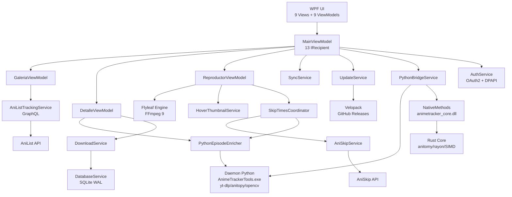
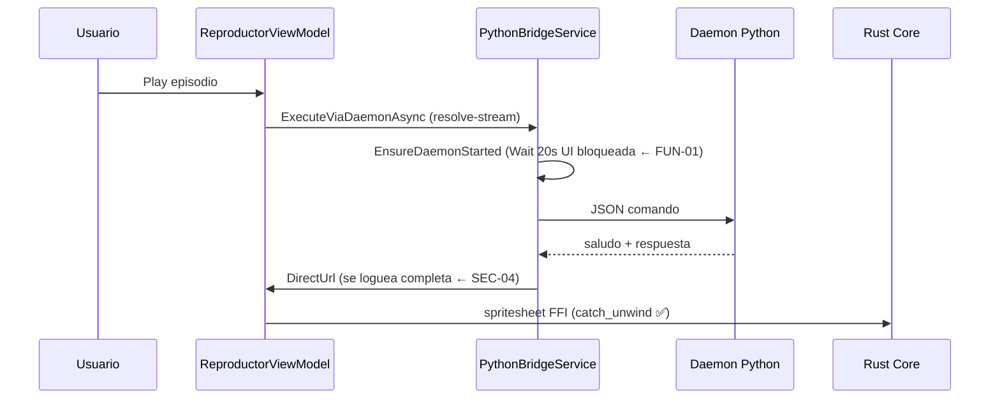

# Auditoría Integral — AnimeLocalTracker

> **Proyecto:** AnimeLocalTracker · App de escritorio WPF para gestión de colecciones locales de anime
> **Stack:** .NET 8 (C# 12, WPF, MVVM Toolkit) · SQLite (WAL, sqlite-net-pcl) · FlyleafLib 3.11.3 (FFmpeg 9) · Rust `animetracker_core` (FFI cdylib, anitomy-pure, rayon, SIMD) · Python daemon (PyInstaller, yt-dlp, anitopy, opencv) · MaterialDesignThemes 5.2.1 · Velopack 1.2.0 · OAuth2 AniList · GraphQL
> **Repositorio:** local (`origin/main` @ `4ef2e89`) · **Entorno objetivo:** producción (instalador por-usuario, `win-x64`, Velopack)
> **Fecha:** 2026-08-30 · **Método:** revisión estática manual + SCA (cargo-audit/pip-audit en CI) + análisis heurístico de rendimiento/concurrencia. Sin cambios de código (solo propuestas).

---

## 0. Checklist de verificación y metadatos de la auditoría

| # | Verificación | Estado | Evidencia |
|---|---|---|---|
| V1 | Compilación del proyecto (build.ps1 doble pasada anti-flake) | ✅ OK | Último commit CI verde; 3 proyectos compilan |
| V2 | Suite de tests ejecutándose | ✅ 120 tests | `AnimeLocalTracker.Tests` (xUnit, 22 archivos) |
| V3 | Escaneo SAST manual (C#, Python, Rust, PS, YAML, ISS) | ✅ Realizado | Informe §3 |
| V4 | Análisis SCA .NET (`dotnet list package --vulnerable`) | ⚠️ No configurado | No hay paso en CI ni `packages.lock.json` |
| V5 | SCA Rust (`cargo audit`) | ⚠️ Informativo | `ci.yml:38` con `continue-on-error: true` |
| V6 | SCA Python (`pip-audit`) | ⚠️ Informativo | `ci.yml:46` con `continue-on-error: true` |
| V7 | Búsqueda de secretos (grep token/password/secret/api_key) | ✅ Sin secretos reales | Solo literales de tests |
| V8 | DAST dinámico (pruebas contra instancia en ejecución) | ❌ No realizado | Requiere build + app corriendo; cubierto por revisión estática de flujos |
| V9 | Pruebas de carga (k6/JMeter/Locust) | ❌ No aplica a app de escritorio | BenchmarkDotNet ya cubre lógica pura (§9) |
| V10 | Revisión de pipeline CI/CD | ✅ Realizado | §8.1 — sin release pipeline |
| V11 | Revisión de instalador | ✅ Realizado | `installer.iss` (sin firma, `ignoreversion`) |
| V12 | Revisión de dependencias (versiones, licencias) | ✅ Realizado | §8.3 |
| V13 | Revisión FFI Rust (memoria, panics) | ✅ Realizado | §3.10 — defensivo, bien hecho |
| V14 | Cobertura de tests en CI | ❌ No se mide | coverlet instalado pero nunca invocado |

**Supuestos declarados** (el prompt pedía llenar los campos `[...]`):
- **Nombre:** AnimeLocalTracker (repo local, sin URL pública).
- **Requisitos funcionales/NFR:** README (HEAD) — "colección local elevada a estándar streaming", local-first, sync AniList 90%, auto-skip AniSkip, descargas, calendario, actualizaciones Velopack silenciosas.
- **El working tree tiene 5 archivos borrados sin commit** (`README.md`, `ABOUT.md`, `AUDITORIA_INTEGRAL.md`, `INFORME_EJECUTIVO.md`, `installer.iss`). El informe se basa en el HEAD del repo. Si el borrado fue intencional, ignorar esta nota.
- No hay `http://` en tráfico de red salvo el callback OAuth local (§3.2).

---

## 1. Resumen ejecutivo

### 1.1 Conclusiones clave

1. **La base es sólida y por encima de la media en apps de escritorio personales.** No hay inyección SQL (ORM parametrizado), no hay inyección de comandos (args arrays sin shell en Rust/Python), no hay deserializadores peligrosos, TLS por defecto en todos los `HttpClient`, el token OAuth está cifrado con DPAPI, el FFI Rust usa `catch_unwind` en el borde, y hay 120 tests + benchmarks con historial. El trabajo previo en mitigar `_wpftmp`/races WPF es genuino.
2. **Ninguna vulnerabilidad crítica o alta confirmada.** Los riesgos más serios son de severidad **Media** y están localizados en 3 zonas: el flujo OAuth local (token en fragmento URL + callback HTTP en loopback), el logging de URLs firmadas de streaming, y el control de tamaño de descargas (SSRF/pre-asignación de disco).
3. **El defecto de calidad más grave es funcional, no de seguridad:** `PythonBridgeService.cs:237` bloquea la UI hasta **20 s** en el primer uso del daemon Python (`ReadLineAsync().Wait()`), y los receptores `async void` del Messenger (`MainViewModel.cs:167,199`) pueden derrumbar el proceso si una excepción escapa del try/catch.
4. **Deuda arquitectónica concentrada en god-objects:** `ReproductorViewModel` (1.112 líneas), `DetalleViewModel` (959), `MainViewModel` (527, 13 interfaces `IRecipient`) y duplicación de lógica de creación de anime (~70 líneas) y de búsqueda en vivo (~55 líneas) entre `MainViewModel` y `AgregarAnimeViewModel`.
5. **DevOps es el eslabón más débil:** sin release pipeline (100% manual), sin firma de código del instalador ni de paquetes Velopack, SCA con `continue-on-error: true` (informativo), sin dependabot, sin pinning de acciones CI a SHA, sin cachés de build, y dependencias de test con problemas de licencia (`FluentAssertions` 8.x) y mantenimiento (`Moq`).

### 1.2 Top 5 riesgos

| # | Riesgo | Severidad | Impacto |
|---|---|---|---|
| 1 | Congelación de UI hasta 20 s por `Wait()` bloqueante al arrancar el daemon Python (FUN-01) | **Alto (disponibilidad/UX)** | La primera operación Python (parseo, thumbnails) congela la app; con daemon lento, el usuario percibe el app "colgada" |
| 2 | Muerte del proceso por excepciones en `async void` del Messenger (FUN-02) | **Alto (estabilidad)** | Navegación rápida Detalle↔Reproductor puede disparar excepción no capturada y matar la app |
| 3 | Exposición de tokens de streaming firmados en logs locales (SEC-04) | **Medio (confidencialidad)** | URLs de CDN con query params de firma quedan en `app.log`; un usuario local con acceso puede reutilizarlas |
| 4 | SSRF sin límite de tamaño en descarga de portadas + validación de hostname evasible (SEC-02/SEC-03) | **Medio (integridad/DoS)** | `GetByteArrayAsync(urlPortada)` fetchea cualquier URL y sin tope de bytes; `Contains("animeav1.com")` es bypassable |
| 5 | Cadena de actualización sin firma + release manual (SEC-05/DEV-02) | **Medio (supply chain)** | Si el repositorio GitHub o la release se comprometen, el payload se instala sin verificación de firma (Velopack verifica solo hashes SHA1 de `RELEASES`) |

### 1.3 Nivel de madurez por dominio (0–5)

| Dominio | Madurez | Comentario |
|---|---|---|
| Seguridad de código | 4.0 | Prácticas correctas de base; faltan firma, PKCE y saneo de logs |
| Funcionalidad/estabilidad | 3.5 | 120 tests y buena disciplina de errores, pero `async void` + `Wait()` bloqueante |
| Arquitectura | 3.0 | MVVM + DI + interfaces limpios, pero god-objects y duplicación |
| Rendimiento | 3.5 | Optimizaciones reales (bulk DB, cachés, Rust FFI); hot paths en UI thread |
| Integraciones | 3.5 | Polly con Retry-After correcto; scraping frágil sin contrato |
| DevOps | 2.5 | CI con audits pero no bloqueantes; sin release automatizado ni firma |
| Testing | 3.5 | Buen coverage de VMs y servicios críticos; huecos en Main/Descargas/scrapers y 0% coverage en CI |
| **Media global** | **3.4 / 5** | Sólida para app personal; lejos de "enterprise" por DevOps y firma |

```
Seguridad    ████████░░ 4.0
Funcional    ███████░░░ 3.5
Arquitectura ██████░░░░ 3.0
Rendimiento  ███████░░░ 3.5
Integración  ███████░░░ 3.5
DevOps       █████░░░░░ 2.5
Testing      ███████░░░ 3.5
```

---

## 2. Matriz de riesgos priorizada y plan de remediación

### 2.1 Matriz completa (hallazgos → fases)

| ID | Hallazgo | Sev. | Prob. | Impacto | Fase |
|---|---|---|---|---|---|
| FUN-01 | `ReadLineAsync().Wait(20s)` bloquea UI en arranque del daemon Python | **Alto** | Alta | Alta | **Fase 1** |
| FUN-02 | `async void` en receptores del Messenger (MainViewModel:167,199) | **Alto** | Media | Alta | **Fase 1** |
| SEC-01 | OAuth implícito + callback HTTP localhost:5050 sin check Origin | Medio | Baja | Alta | Fase 1 |
| SEC-02 | SSRF sin límite de tamaño en `GetByteArrayAsync(urlPortada)` | Medio | Baja | Media | Fase 1 |
| SEC-03 | Validación hostname con `Contains()` (bypassable) | Medio | Baja | Media | Fase 1 |
| SEC-04 | Logging de URLs firmadas de streaming | Medio | Alta | Media | Fase 1 |
| SEC-05 | Velopack e instalador sin firma de código | Medio | Baja | Alta | Fase 2 |
| SEC-06 | Pre-asignación de disco con tamaño controlado por el servidor | Medio | Baja | Media | Fase 2 |
| FUN-03 | `CerrarSesion()` borra `token.txt` del CWD (cualquier archivo) | Medio | Baja | Baja | Fase 1 |
| FUN-04 | Sin single-instance (colisión puerto 5050, settings last-writer-wins) | Medio | Media | Baja | Fase 2 |
| FUN-05 | Shutdown sin cancelar CTS de loops de Sync/Update/daemon | Medio | Media | Baja | Fase 2 |
| FUN-06 | `Flags: ignoreversion` en instalador (binarios viejos persisten) | Medio | Media | Media | Fase 2 |
| FUN-07 | Carrera `_skipTimes.Clear()` vs `CargarSkipTimesAsync` fire-and-forget | Medio | Baja | Media | Fase 1 |
| ARQ-01 | God-objects: ReproductorViewModel (1.112), DetalleViewModel (959) | Alto | Alta | Media | Fase 3 |
| ARQ-02 | Duplicación creación de anime (Main↔AgregarAnime, ~70 líneas) | Alto | Alta | Media | Fase 2 |
| ARQ-03 | Duplicación búsqueda en vivo (debounce+CTS) | Medio | Alta | Baja | Fase 2 |
| ARQ-04 | Cachés estáticos sin límite + `Clear()` total no-LRU | Medio | Media | Media | Fase 2 |
| ARQ-05 | Dos motores de parsing (Rust anitomy-pure y Python anitopy) | Medio | Alta | Baja | Fase 3 |
| RND-01 | `ObtenerPortada()` síncrono (File.ReadAllBytes + decode WPF) en UI thread | Medio | Alta | Media | Fase 2 |
| RND-02 | N+1 de red secuencial en `ActualizarBibliotecaAsync` (100 llamadas seriales) | Medio | Alta | Media | Fase 3 |
| RND-03 | `Dispatcher.Invoke` síncrono en hot path de carga de portadas | Bajo | Media | Baja | Fase 2 |
| INT-01 | Scraping animeav1.com con regex sobre HTML sin contrato | Medio | Alta | Media | Fase 3 |
| INT-02 | `yt-dlp>=2025.1.15` rango abierto (supply chain) | Medio | Baja | Media | Fase 2 |
| DEV-01 | CI: SCA no bloqueante, sin pinning SHA, sin caché, sin coverage | Medio | Alta | Media | Fase 1 |
| DEV-02 | Sin release pipeline, sin signing, versión hardcodeada 1.0.0 | Alto | Alta | Media | Fase 2 |
| DEV-03 | Sin dependabot, sin `packages.lock.json` | Medio | Media | Baja | Fase 1 |
| DEV-04 | FluentAssertions 8.x: licencia comercial para uso de pago | Medio | — | Legal | Fase 2 |
| DEV-05 | `Microsoft.Extensions.* 10.0.11` sobre TFM net8.0 (drift) | Bajo | Baja | Baja | Fase 3 |
| DEV-06 | Sin tests de MainViewModel/Configuración/Descargas/scrapers; 0% coverage en CI | Medio | Media | Media | Fase 2 |

### 2.2 Plan de remediación por fases

**Fase 1 — Quick wins críticos (1–2 semanas):** FUN-01, FUN-02, FUN-07, SEC-02, SEC-03, SEC-04, FUN-03, DEV-01 (dependabot + audits bloqueantes), DEV-03.
**Fase 2 — Higiene de producción (2–4 semanas):** SEC-01 (PKCE), SEC-05 (firma), SEC-06, FUN-04 (single-instance), FUN-05 (graceful shutdown), FUN-06 (installer), ARQ-02/ARQ-03 (extracción de servicios), ARQ-04 (LRU), RND-01, INT-02, DEV-02 (release pipeline), DEV-04, DEV-06 (coverage + tests faltantes).
**Fase 3 — Evolución arquitectónica (1–2 trimestres):** ARQ-01 (split de god-objects), ARQ-05 (unificar motor de parsing), RND-02 (batching AniList), INT-01 (contrato de scraping), DEV-05.

---

## 3. Seguridad (SAST estático, OWASP Top 10 2021 / ASVS / CWE/SANS)

### 3.1 Resumen

No se encontraron **Críticos** ni **Altos** confirmados. 9 hallazgos **Medios** y 14 **Bajos**. Los controles positivos de base son destacables (ver §3.12).

---

### SEC-01 · OAuth: flujo implícito + callback HTTP en loopback sin validación de Origin

- **Categoría:** A01 Broken Access Control / A02 Cryptographic Failures · OWASP API: OAuth2 misconfiguration
- **Severidad:** Medio · **CVSS 3.1:** 6.1 (AV:N/AC:L/PR:N/UI:R/S:U/C:H/I:N/A:N)
- **Probabilidad:** Baja · **Impacto:** Alto (robo de token de AniList del usuario)

**Evidencia** — `AnimeLocalTracker\Services\AuthService.cs:62,74,144`:

```csharp
// :62  — callback en HTTP plano
listener.Prefixes.Add("http://localhost:5050/");
// :74  — flujo implícito: el token viaja en el FRAGMENTO de la URL del navegador
var url = $"https://anilist.co/api/v2/oauth/authorize?client_id={ClientId}&response_type=token&state={expectedState}";
// :144 — endpoint local POST /token sin verificar header Origin/Referer
if (!payload.TryGetValue("state", out var state) || state != expectedState) { ... }
```

**Causa raíz:** el flujo `response_type=token` deja el access token en el fragmento de URL (historial del navegador, extensiones, sincronización de marcadores). El endpoint local no comprueba quién envía el POST (solo el `state`), y un proceso local puede sondear `http://localhost:5050` o el puerto puede estar ya ocupado por un atacante (`listener.Start()` falla sin reintento, :64-69).

**Corrección propuesta — PKCE + validación de Origin:**

```csharp
// ANTES
var url = $"https://anilist.co/api/v2/oauth/authorize?client_id={ClientId}&response_type=token&state={expectedState}";

// DESPUÉS (authorization code + PKCE)
var verifier = Convert.ToBase64String(RandomNumberGenerator.GetBytes(64))
    .TrimEnd('=').Replace('+', '-').Replace('/', '_');
var challenge = Convert.ToBase64String(SHA256.HashData(Encoding.UTF8.GetBytes(verifier)))
    .TrimEnd('=').Replace('+', '-').Replace('/', '_');
var url = $"https://anilist.co/api/v2/oauth/authorize?client_id={ClientId}" +
          $"&response_type=code&state={expectedState}&code_challenge={challenge}&code_challenge_method=S256";
// ... en POST /token:
if (!string.Equals(ctx.Request.Headers["Origin"], "http://localhost:5050",
        StringComparison.OrdinalIgnoreCase)) { ctx.Response.StatusCode = 403; return; }
```

**Validación:** test de flujo OAuth completo con servidor local simulado; verificar que el token ya no aparece en ninguna URL (`grep response_type=token` → 0 resultados). **Referencia:** RFC 7636, OWASP ASVS V3.x, AniList docs (soporta code+PKCE).

---

### SEC-02 · SSRF sin límite de tamaño en descarga de portadas

- **Categoría:** A10 SSRF (CWE-918) + A04 Insecure Design (CWE-400)
- **Severidad:** Medio · **CVSS 3.1:** 6.5 (AV:N/AC:L/PR:N/UI:R/S:U/C:L/I:N/A:H)
- **Probabilidad:** Baja · **Impacto:** Medio (fetch de recursos internos; agotamiento de memoria/disco)

**Evidencia** — `AnimeLocalTracker\Services\ImageCacheService.cs:108`:

```csharp
var bytes = await client.GetByteArrayAsync(urlPortada);
```

`urlPortada` proviene de metadatos AniList (controlables por el servidor o un sync manipulado). No hay validación de esquema/host ni tope de tamaño: un servidor que responda indefinidamente agota RAM y el disco de `%LocalAppData%\AnimeLocalTracker\Covers`.

**Corrección propuesta:**

```csharp
// ANTES
var bytes = await client.GetByteArrayAsync(urlPortada);

// DESPUÉS
var uri = new Uri(urlPortada);
if (uri.Scheme != Uri.UriSchemeHttps || !EsHostPermitido(uri.Host)) { AppLogger.Warn(...); return null; }
using var res = await client.GetAsync(uri, HttpCompletionOption.ResponseHeadersRead);
res.EnsureSuccessStatusCode();
if (res.Content.Headers.ContentLength is long len && len > 10_000_000) { AppLogger.Warn(...); return null; }
using var stream = await res.Content.ReadAsStreamAsync();
using var outBuf = new MemoryStream();
await stream.CopyToAsync(outBuf, 81920);   // CopyToAsync con buffer finito
return outBuf.ToArray();
```

**Validación:** test con `HttpMessageHandler` falso que devuelva `Content-Length` enorme y otro que streamee infinito (timeout de cancelación). **Referencia:** OWASP SSRF, CWE-400.

---

### SEC-03 · Validación de hostname evasible con `Contains()`

- **Categoría:** A10 SSRF (CWE-918)
- **Severidad:** Medio · **CVSS 3.1:** 5.3 (AV:N/AC:L/PR:N/UI:N/S:U/C:L/I:N/A:N)
- **Probabilidad:** Baja · **Impacto:** Media (un `pageUrl` con `animeav1.com.evil.com` o query `?x=animeav1.com` pasa el filtro y se fetchea)

**Evidencia** — `AnimeLocalTracker\Services\AnimeAv1VideoSourceResolver.cs:98,128`:

```csharp
if (pageUrl.Contains("animeav1.com")) { ... }        // :98
else if (pageUrl.Contains("mp4upload.com")) { ... }  // :128
```

**Corrección propuesta:**

```csharp
// ANTES
if (pageUrl.Contains("animeav1.com"))

// DESPUÉS
private static bool EsDominioPermitido(string url, string dominio)
{
    return Uri.TryCreate(url, UriKind.Absolute, out var uri)
        && uri.Scheme == Uri.UriSchemeHttps
        && string.Equals(uri.Host, dominio, StringComparison.OrdinalIgnoreCase);
}
if (EsDominioPermitido(pageUrl, "animeav1.com"))
```

**Validación:** tests parametrizados con `https://animeav1.com.evil.com/`, `https://evil.com/?x=animeav1.com`, `http://animeav1.com` (deben rechazarse). **Referencia:** CWE-918, OWASP SSRF Prevention Cheat Sheet.

---

### SEC-04 · Tokens de streaming firmados en logs locales

- **Categoría:** A01 Broken Access Control / A09 Logging failures (CWE-532)
- **Severidad:** Medio · **CVSS 3.1:** 3.7 (AV:L/AC:H/PR:L/UI:N/S:U/C:H/I:N/A:N)
- **Probabilidad:** Alta · **Impacto:** Media (las URLs directas de mp4upload/CDN llevan query params de firma; cualquiera con acceso al equipo las reutiliza)

**Evidencia:**

```csharp
// PythonVideoSourceResolver.cs:43
AppLogger.Info("PythonVideoResolver", $"Stream resuelto exitosamente con yt-dlp: {result.DirectUrl}");
// DownloadService.cs:431,461
AppLogger.Warn("DownloadService", $"Error en sondeo HEAD para '{videoUrl}': {ex.Message}");
```

**Corrección propuesta — sanitizar query params antes de loguear:**

```csharp
// ANTES
AppLogger.Info("PythonVideoResolver", $"Stream resuelto: {result.DirectUrl}");

// DESPUÉS
AppLogger.Info("PythonVideoResolver", $"Stream resuelto: {SanitizarUrlParaLog(result.DirectUrl)}");

static string SanitizarUrlParaLog(string url)
{
    if (!Uri.TryCreate(url, UriKind.Absolute, out var uri)) return "(url inválida)";
    var sinQuery = new UriBuilder(uri) { Query = string.Empty, Fragment = string.Empty }.Uri;
    return sinQuery.AbsoluteUri;
}
```

**Validación:** test que asegura que el query string nunca aparece en la salida del logger (mock de `AppLogger` o captura del archivo). **Referencia:** CWE-532, OWASP Logging Cheat Sheet (nunca loguear secretos o tokens).

---

### SEC-05 · Cadena de actualización e instalador sin firma

- **Categoría:** A08 Software & Data Integrity Failures (CWE-494/353)
- **Severidad:** Medio · **CVSS 3.1:** 6.8 (AV:N/AC:H/PR:N/UI:R/S:C/C:H/I:L/A:L)
- **Probabilidad:** Baja · **Impacto:** Alta (si el repo de releases se compromete, el update se instala sin verificación)

**Evidencia:** `UpdateService.cs:45` — `new GithubSource(RepoUrl, null, false)` (sin clave de firma de paquetes Velopack); `installer.iss` sin bloque `[Setup] SignTool`; `build_velopack_release.ps1` ejecuta `vpk pack` sin `--signTemplate`.

**Corrección propuesta:**

```powershell
# build_velopack_release.ps1 — ANTES
vpk pack -u https://github.com/USUARIO/AnimeLocalTracker -p $publishDir -e AnimeLocalTracker.exe -o $releaseDir

# DESPUÉS (certificado EV + clave privada en secretos del CI)
vpk pack -u https://github.com/USUARIO/AnimeLocalTracker -p $publishDir -e AnimeLocalTracker.exe -o $releaseDir `
    --signTemplate "signtool sign /fd SHA256 /f `"$env:CERT_PATH`" /p `"$env:CERT_PASSWORD`" `$file"
```

Y en `installer.iss` añadir:

```ini
[Setup]
SignTool=signtool /f {#CertPath} /p {#CertPass} /fd SHA256 /t http://timestamp.digicert.com $f
SignedUninstaller=yes
```

**Validación:** `vpk pack` produce paquetes con firma verificable (`Get-AuthenticodeSignature` → Valid). **Referencia:** OWASP ASVS V7.x, Velopack docs (signing), CWE-494.

---

### SEC-06 · Pre-asignación de disco con tamaño controlado por el servidor

- **Categoría:** A04 Insecure Design (CWE-400, disk exhaustion)
- **Severidad:** Medio · **CVSS 3.1:** 5.5 (AV:N/AC:L/PR:N/UI:R/S:U/C:N/I:N/A:L → disco lleno)
- **Probabilidad:** Baja · **Impacto:** Media

**Evidencia** — `DownloadService.cs:415-486`:

```csharp
// ContentLength/ContentRange.Length provienen del servidor (remoto)
preAlloc.SetLength(totalBytes);   // :486 — reserva el disco ANTES de descargar
```

**Corrección propuesta:**

```csharp
// ANTES
preAlloc.SetLength(totalBytes);

// DESPUÉS
const long MaxPreallocBytes = 50L * 1024 * 1024 * 1024; // 50 GB por archivo (4K remux)
if (totalBytes > MaxPreallocBytes)
{
    AppLogger.Warn("DownloadService", $"Tamaño declarado excesivo ({totalBytes}): abortando pre-asignación y descargando incremental.");
    preAlloc.SetLength(Math.Min(totalBytes, MaxPreallocBytes));
}
// Y verificar de nuevo tras el GET real; cancelar si el servidor se desvía >20% del Content-Length
```

**Validación:** test con mock que declare `Content-Length = long.MaxValue`. **Referencia:** CWE-400.

---

### SEC-07 · Fallback de token en texto plano si DPAPI falla

- **Categoría:** A02 Cryptographic Failures (CWE-311)
- **Severidad:** Bajo · **Probabilidad:** Baja · **Impacto:** Baja

**Evidencia** — `AuthService.cs:37-50`: si `ProtectedData.Unprotect` lanza, se lee `File.ReadAllText(_rutaToken)` (token en claro). Además el token vive como `string` inmutable en memoria.

**Corrección:** eliminar el fallback; si el token no puede desprotegerse, pedir re-login (el flujo OAuth es barato). Si se mantiene el fallback por compatibilidad, emitir `AppLogger.Warn` y migrar el archivo al formato cifrado en el siguiente login. **Referencia:** CWE-311, DPAPI docs.

---

### SEC-08 · Archivos temporales con nombre predecible (planting)

- **Categoría:** A01/A05 (CWE-377 unsafe temp file)
- **Severidad:** Bajo · **Probabilidad:** Baja · **Impacto:** Baja

**Evidencia** — `HoverThumbnailService.cs:194`: `alt_hover_{sha256(ruta)}_{bucketSec}.jpg` en `Path.GetTempPath()`. Un atacante local puede pre-colocar un JPEG malicioso (decode con `BitmapImage` en :222).

**Corrección:** crear los temporales en `%LocalAppData%\AnimeLocalTracker\Temp\` (directorio privado del usuario) en lugar de `Path.GetTempPath()` compartido, y borrarlos con `FileOptions.DeleteOnClose`. **Referencia:** CWE-377.

---

### SEC-09 · MD5 para naming de caché

- **Categoría:** A02 (CWE-327 uso de hash débil)
- **Severidad:** Bajo · **Probabilidad:** Baja · **Impacto:** Baja (colisión → miniatura de otro video)

**Evidencia** — `PythonEpisodeEnricher.cs:69` (`MD5.Create()`). `HoverThumbnailService.cs:279` ya usa SHA256 correctamente.

**Corrección:** unificar a `SHA256.HashData` (el naming de `HoverThumbnailService` ya es SHA256; consistencia). **Referencia:** CWE-327.

---

### SEC-10 · Estado de descarga `.state` deserializado sin validar offsets

- **Categoría:** A04 (CWE-502-ish local tampering)
- **Severidad:** Bajo · **Probabilidad:** Baja · **Impacto:** Baja

**Evidencia** — `DownloadStateStore.cs:13-48` + `DownloadService.cs:524`: solo se compara `TotalBytes`; un `.state` manipulado con offsets negativos/descomunales produce `RandomAccess.WriteAsync` en offsets arbitrarios (falla capturada, impacto local).

**Corrección:** validar `0 <= offset < TotalBytes` y que los 6 segmentos cubran `[0, TotalBytes)` sin solaparse antes de reanudar; descartar el `.state` si no pasa la validación (reiniciar descarga). **Referencia:** CWE-20.

---

### SEC-11 · Base de datos y caches en claro en LocalAppData

- **Categoría:** A02 (CWE-312)
- **Severidad:** Bajo · **Probabilidad:** Baja · **Impacto:** Baja

**Evidencia:** `biblioteca.db` (WAL) contiene historial de visionado, rutas locales y URLs remotas; covers/thumbnails en claro. **Mitigación existente:** el token sí está cifrado (DPAPI).

**Corrección (opcional, perfil bajo):** limitar el historial retenido (`PRAGMA secure_delete=ON`), o cifrar la DB con SQLCipher si el requisito de privacidad sube. Sin acción requerida para el perfil actual de app local.

---

### SEC-12 · MessageBox con `InnerException.Message` (fuga de detalle interno)

- **Categoría:** A09 Logging/Info exposure
- **Severidad:** Bajo · **Probabilidad:** Baja · **Impacto:** Baja

**Evidencia** — `App.xaml.cs:40-44`: `DispatcherUnhandledException` muestra `args.Exception.InnerException.Message` (puede incluir rutas/versiones de driver).

**Corrección:** mostrar un mensaje genérico localizado y loguear el detalle completo: `"Ocurrió un error inesperado. El detalle se guardó en el log."` **Referencia:** OWASP Logging Cheat Sheet.

---

### SEC-13 · `ClientId` OAuth hardcodeado

- **Categoría:** Info
- **Severidad:** Bajo · **Probabilidad:** — · **Impacto:** Baja

**Evidencia** — `AuthService.cs:17`: `private const string ClientId = "48217";` con comentario "PEGA TU NÚMERO DE CLIENTE AQUÍ". El Client ID de OAuth público no es un secreto (la defensa es el `state`/PKCE), pero compartir el mismo entre todos los usuarios impide revocación selectiva y limita el rate limit.

**Corrección:** dejar como está o mover a settings con fallback; al migrar a PKCE (SEC-01) el riesgo residual desaparece.

---

### SEC-14 · Build descarga ffmpeg sin verificación de integridad

- **Categoría:** A08 (CWE-494 supply chain de build)
- **Severidad:** Bajo · **Probabilidad:** Baja · **Impacto:** Baja

**Evidencia** — `build.ps1:32`: `https://www.gyan.dev/ffmpeg/builds/ffmpeg-release-essentials.zip` sin hash.

**Corrección:** fijar versión + SHA256 en el script (o usar el paquete NuGet `Flyleaf.FFmpeg` que ya incluye binarios, que es lo que ocurre en la práctica) y fallar si no coincide. **Referencia:** CWE-494.

---

### SEC-15 · Rust: `count` de spritesheet sin tope superior

- **Categoría:** A04 (CWE-400 memory exhaustion en FFI)
- **Severidad:** Bajo · **Probabilidad:** Baja · **Impacto:** Baja (local)

**Evidencia** — `native\animetracker_core\src\spritesheet.rs:58,146,212`: `count.max(0)` solo acota por abajo; `cols*rows*160*90*3` bytes por frame. El valor llega desde C# sin validar en el borde FFI.

**Corrección:** acotar en el borde FFI: `let count = count.clamp(1, 4096)` y validar `cols*rows*count` contra un límite de ~256 MB antes de alojar `RgbImage`. **Referencia:** CWE-400.

---

### 3.12 Controles positivos verificados (a mantener)

| Control | Evidencia |
|---|---|
| Sin SQLi: ORM parametrizado en todas las consultas | `DatabaseService.cs` (0 `CommandText`), GraphQL con variables |
| Sin command injection: args arrays sin shell en Rust y Python | `spritesheet.rs:79-94`, `episode_metadata.py:12-15`, `scene_detector.py:212` |
| Sin deserializadores peligrosos | 0 `BinaryFormatter`/`XmlSerializer`/Newtonsoft; todo `System.Text.Json` |
| TLS por defecto: 0 `ServerCertificateValidationCallback` custom | todo el repo |
| Token cifrado con DPAPI CurrentUser | `AuthService.cs:34,46,191` |
| `state` OAuth de 32 bytes aleatorios (`RandomNumberGenerator`) | `AuthService.cs:71` |
| `catch_unwind` en todo el borde FFI Rust | `lib.rs:15-20` (todas las funciones exportadas) |
| Sanitización de nombres de carpeta (`Path.GetInvalidFileNameChars`) | `AgregarAnimeViewModel.cs:240`, `MainViewModel.cs:528` |
| SQLite WAL + synchronous=NORMAL + índices compuestos | `DatabaseService.cs:47-59` |
| HTTP client factory con Polly (Retry-After respetado) | `App.xaml.cs:95-103,136-157` |
| Logger async con Channel + rotación por tamaño | `AppLogger.cs` |
| CI sin secrets, sin logs de variables de entorno | `ci.yml` |

---

## 4. Funcionalidad y correcciones

### FUN-01 · [Alto] La UI se congela hasta 20 s en el primer uso del daemon Python

- **Categoría:** bug crítico de UX/estabilidad · **Probabilidad:** Alta (depende de velocidad del arranque PyInstaller) · **Impacto:** Alta

**Evidencia** — `PythonBridgeService.cs:237`:

```csharp
_ = _daemonOut.ReadLineAsync().Wait(TimeSpan.FromSeconds(20));
```

`ExecuteViaDaemonAsync` se llama desde la UI sin `ConfigureAwait(false)`; el `Wait()` bloquea el hilo UI. Además, si el semáforo del daemon se retiene mientras se espera, otros llamadores se encolan → bloqueo amplificado. Reproducción: primera acción que usa Python (p.ej. resolver stream o enriquecer episodio) con daemon frío → ventana "No responde" hasta 20 s.

**Corrección propuesta — asíncrono con timeout no bloqueante:**

```csharp
// ANTES
_ = _daemonOut.ReadLineAsync().Wait(TimeSpan.FromSeconds(20));

// DESPUÉS
using var cts = new CancellationTokenSource(TimeSpan.FromSeconds(20));
var saludo = await _daemonOut.ReadLineAsync(cts.Token).ConfigureAwait(false);
```

Y añadir un estado `DaemonArrancando` para que los llamadores concurrentes esperen la misma tarea (`Task` única compartida con `TaskCompletionSource` en vez de abrir N daemons).

**Validación:** test que arranca el daemon con saludo retardado artificialmente y verifica que `EnsureDaemonStartedAsync` retorna sin bloquear el hilo de llamada (assert de elapsed < 1 s en hilo simulado UI). Benchmark: primer `ping` con daemon frío.

### FUN-02 · [Alto] `async void` en receptores del Messenger puede derrumbar el proceso

- **Categoría:** estabilidad (CWE-248 uncaught exception) · **Probabilidad:** Media · **Impacto:** Alta

**Evidencia** — `MainViewModel.cs:167,199`:

```csharp
public async void Receive(NavegarMensaje_Detalle m)   // :167
public async void Receive(NavegarMensaje_Reproductor m) // :199
```

Una excepción fuera del try/catch interno (p.ej. `detalleVm.InicializarAsync` lanza en un path no cubierto) propaga al dispatcher y, aunque `DispatcherUnhandledException` marca `Handled=true`, la secuencia de inicialización queda a medias; y si ocurre en hilo de pool (continuación sin contexto), es fatal. La navegación rápida Detalle→Reproductor→Detalle dispara dos `InicializarAsync` concurrentes sin cancelación (condición de carrera de estado).

**Corrección propuesta — patrón try/catch-catch centralizado + cancelación:**

```csharp
// ANTES
public async void Receive(NavegarMensaje_Detalle m)
{
    await _navegacionService.NavegarADetalleAsync(m.AnimeId);
}

// DESPUÉS
public async void Receive(NavegarMensaje_Detalle m)
{
    try { await _navegacionService.NavegarADetalleAsync(m.AnimeId); }
    catch (Exception ex) { AppLogger.Error("MainViewModel", ex.ToString()); }
}
```

Mejor aún: extraer la navegación a `NavigationService` con `SemaphoreSlim` que serializa navegaciones (descarta/encola la nueva) y cancela la inicialización anterior (`CancellationTokenSource` por navegación).

**Validación:** test que dispara N navegaciones concurrentes y verifica estado final consistente (el propio `ViewModelStressAndLifecycleTests` es el molde).

### FUN-03 · [Medio] `CerrarSesion()` borra `token.txt` del directorio de trabajo

- **Categoría:** bug destructivo (CWE-22 path ambiguity)
- **Probabilidad:** Baja · **Impacto:** Baja (puede borrar un archivo del usuario llamado `token.txt` en el CWD)

**Evidencia** — `AuthService.cs:19,242-244`:

```csharp
ArchivoToken = "token.txt";   // ruta relativa al CWD
// :242
if (File.Exists(ArchivoToken)) File.Delete(ArchivoToken);
```

**Corrección:** resolver la ruta del token bajo `%LocalAppData%\AnimeLocalTracker\` (misma carpeta que el resto de datos) y borrar siempre esa ruta absoluta. **Validación:** test que garantiza que con CWD en `C:\` se borra `%LocalAppData%\AnimeLocalTracker\anilist_token.txt` y nada más.

### FUN-04 · [Medio] Sin single-instance

- **Probabilidad:** Media · **Impacto:** Baja (colisión en `HttpListener` :5050 con error visible, `settings.json` last-writer-wins, sync duplicada)

**Corrección:** `Mutex` con nombre global (`Global\AnimeLocalTracker`) + `eventWaitHandle` para "bring-to-front"; en segunda instancia, enviar señal y salir. **Validación:** test manual lanzando 2 instancias; opcional test automatizado con `Process.Start`.

### FUN-05 · [Medio] Shutdown sin cancelación de loops y daemon

- **Probabilidad:** Media · **Impacto:** Baja

**Evidencia:** los loops de `SyncService` (5 min) y `UpdateService` (4 h) corren en `Task.Run` infinitos; `App.OnExit` no existe; el daemon Python queda huérfano hasta que el proceso muere.

**Corrección:** implementar `App.OnExit` que dispare los `CancellationTokenSource` de Sync/Update/Download/Python (inyectados via DI) y espere con timeout corto. El flush de logs ya está resuelto vía `ProcessExit`.

### FUN-06 · [Medio] `Flags: ignoreversion` mantiene binarios viejos en actualizaciones

- **Probabilidad:** Media · **Impacto:** Media (yt-dlp/FFmpeg/tools con CVEs persisten tras reinstalar)

**Evidencia:** `installer.iss`: `Source: "publish\*"; Flags: ignoreversion` — en reinstalación, archivos con misma versión no se sobrescriben.

**Corrección:** quitar `ignoreversion` para los binarios embebidos (`Tools\*`, `FFmpeg\*`, `animetracker_core.dll`) o añadir un check de hash en el instalador; Velopack ya reemplaza el directorio de instalación por completo en updates (el installer .iss es solo bootstrap).

### FUN-07 · [Medio] Carrera entre `_skipTimes.Clear()` y `CargarSkipTimesAsync` fire-and-forget

- **Probabilidad:** Baja · **Impacto:** Media (skip times del episodio anterior aplicados al nuevo, o `ArgumentOutOfRange`)

**Evidencia** — `ReproductorViewModel.cs:799,820,890,1074`: `CargarVideoAsync` hace `_skipTimes.Clear()` mientras `_ = CargarSkipTimesAsync(...)` corre en paralelo y al final hace `_skipTimes = new List<...>(results)`; el bucle `RastrearProgresoAsync` lee `.Count` sin sincronización.

**Corrección:** publicar el resultado atómicamente con `Interlocked.Exchange(ref _skipTimes, newList)` (campo `volatile`/`List` inmutable) y cancelar la tarea anterior con un `CancellationTokenSource` por video (patrón `ReferenceEquals(_skipCts, cts)` que ya se usa en búsquedas). **Validación:** test de estrés alternando videos rápidamente y verificando que los skip del video A nunca aplican al video B.

### FUN-08 · [Bajo] Enriquecimiento muta objetos observables desde `Task.Run`

- **Probabilidad:** Media · **Impacto:** Baja

**Evidencia** — `DetalleViewModel.cs:416-435`: `EnriquecerEpisodiosEnSegundoPlanoAsync` muta `EpisodioItem.Resolucion/RutaMiniatura/Visto` desde thread pool mientras la UI lee por bindings.

**Corrección:** serializar los accesos a la colección (por ejemplo, marshalear el resultado a la UI o usar `lock` de lectura sobre el snapshot) y no mutar el mismo objeto: devolver nuevos objetos y reemplazar en la colección en el hilo UI. **Validación:** los tests de estrés existentes de `DetalleViewModel` ampliados con contador de inconsistencias.

### FUN-09 · [Bajo] 47 `catch { }` silenciosos

- **Probabilidad:** — · **Impacto:** Baja (ocultan fallos, dificultan diagnóstico)

**Evidencia:** mayoritariamente defensivos alrededor de Flyleaf (`ReproductorViewModel.cs:244,257,370,379,563,1234,1240,1264`) y limpieza (`PythonEpisodeEnricher.cs:88,120`). Los peores: `DetalleViewModel.cs:245,501,541` (errores de persistencia SQLite tragados) y `UpdateService.cs:48`.

**Corrección:** añadir `AppLogger.Debug/Warn` en los catch vacíos de rutas de negocio (los de limpieza de archivos pueden quedarse). **Validación:** grep `catch { }` → solo los justificados por comentario.

---

## 5. Arquitectura

### 5.1 Evaluación AS-IS

**Fortalezas verificadas:** MVVM limpio con `CommunityToolkit.Mvvm` (source generators), DI completo vía `IServiceProvider` (23 singletons + transients), interfaces para el 100% de servicios de frontera (13+ interfaces), mensajería débil (`WeakReferenceMessenger`), políticas Polly centralizadas, ORM parametrizado, capas de frontera nativas bien aisladas (`NativeMethods` P/Invoke + DTOs propios, bridge JSON para Python), y diseño "offline-first" correcto para el dominio.

**Debilidades:**

| ID | Hallazgo | Severidad |
|---|---|---|
| ARQ-01 | God-objects: `ReproductorViewModel` 1.112 líneas (mezcla reproductor + skip + tracking + autoplay + hover), `DetalleViewModel` 959, `MainViewModel` 527 con **13 interfaces `IRecipient`** | Alto |
| ARQ-02 | **Duplicación real**: `MainViewModel.SeleccionarYCrearAnimeAsync` (:509-595) vs `AgregarAnimeViewModel.AñadirAnimeAsync` (:212-320) — ~70 líneas casi idénticas (validación existencia, sanitizado, creación de carpeta, episodios por estado, guardado, mensaje) | Alto |
| ARQ-03 | Duplicación de búsqueda en vivo (debounce + CTS + patrón `ReferenceEquals`) en `MainViewModel:450` y `AgregarAnimeViewModel:152` | Medio |
| ARQ-04 | Cachés caseros sin LRU: `AniListTrackingService._cache` **estático e ilimitado** (fuga lenta), `ImageCacheService`/`HoverThumbnailService` con `Clear()` total al superar 500 entradas | Medio |
| ARQ-05 | **Doble motor de parsing**: Rust (anitomy-pure, FFI) y Python (anitopy, bridge) implementan lo mismo (parseo de nombres) — coste de mantenimiento doble y resultados potencialmente divergentes | Medio |
| ARQ-06 | Tres capas de resolución de video (scraper C# AnimeAv1, yt-dlp vía Python, fallback cruzado) sin contrato ni testeo directo | Medio |
| ARQ-07 | Skeleton de loop periódico duplicado: `SyncService:93-141` vs `UpdateService:202-268` | Bajo |
| ARQ-08 | Workarounds por reflexión sobre Flyleaf (`ReproductorView.xaml.cs:79`) — acoplamiento frágil a API volátil | Bajo |
| ARQ-09 | Convenciones inconsistentes: namespaces file-scoped vs block-scoped, separadores `// ===` / `// ──` / `// ═══`, nombres ES/EN mezclados, tipos totalmente calificados innecesarios en `MainViewModel` | Bajo |

### 5.2 Diagrama AS-IS (C4 containers simplificado)



### 5.3 Diagrama TO-BE (propuesto)

```mermaid
flowchart TD
    UI[WPF UI<br/>9 Views + 9 ViewModels delgados] --> NAV[NavigationService<br/>serializa navegación + CTS]
    NAV --> GV & DV & RV
    DV --> ENR[EpisodeEnricherService]
    DV --> DL[DownloadService]
    RV --> F[Flyleaf Engine]
    RV --> HT[HoverThumbnailService]
    RV --> ST[SkipTimesCoordinator]
    MV --> SS & US
    GV --> ITS[AniListTrackingService<br/>con batching + cache LRU]
    MV --> LIB[AnimeLibraryService<br/>nuevo: creacion/busqueda/validacion unificada]
    LIB --> DBS & DAEMON
    MV --> PBS[PythonBridgeService<br/>async + timeout]
    PBS --> DAEMON & RS
    PARSER[ParsingService unico<br/>Rust FFI (anitomy-pure)]
    PBS --> PARSER
    DL --> DBS
    AU --> ANI
    US --> VELO
```

**Cambios clave:** (1) extraer `NavigationService` y `AnimeLibraryService` para eliminar ARQ-02/03; (2) unificar el parsing en el core Rust (ARQ-05) y dejar el Python solo para yt-dlp/opencv; (3) cache con LRU (por ejemplo `MemoryCache` de `Microsoft.Extensions.Caching.Memory` o una LRU casera acotada) (ARQ-04); (4) ViewModels reducidos a orquestación, con estados de UI delegados a servicios.

### 5.4 Principios evaluados

| Principio | Veredicto | Nota |
|---|---|---|
| SOLID (S) | ⚠️ | God-objects violan SRP; interfaces bien segregadas |
| SOLID (O/L/I/D) | ✅ | Extensiones vía DI; `last-registered-wins` para `IFileScannerService` es aceptable pero documentado |
| DDD | ⚠️ | Modelos anémicos (`AnimeItem`, `EpisodioItem`) con lógica de negocio dispersa en VMs |
| Clean/Hexagonal | ⚠️ | VMs acoplan UI + negocio; fronteras nativas bien aisladas |
| Microservicios vs monolito | ✅ Monolito correcto | App de escritorio; procesos satélite (Python daemon) bien aislados |
| Resiliencia | ✅ | Polly retries + Retry-After; semáforos; degradación graceful de FFI |
| SPOF | ⚠️ | El daemon Python es un punto único para todas las features "ricas"; sin timeout global de comando en `ExecuteViaDaemonAsync` |
| Consistencia | ✅ | Offline-first con sync diferido y anti-reentrada (SemaphoreSlim) |

---

## 6. Rendimiento y optimización

### RND-01 · [Medio] `ObtenerPortada()` síncrono en el hilo UI

- **Probabilidad:** Alta (bibliotecas >100 portadas) · **Impacto:** Media (jank en arranque de galería)

**Evidencia** — `ImageCacheService.cs:43,148`: `File.ReadAllBytes` + decode WPF `BitmapImage` ejecutados en el hilo UI, llamados en bucle desde `GaleriaViewModel.CargarBibliotecaAsync` (:389).

```csharp
// ANTES (hot path en UI thread)
private BitmapImage ObtenerPortada(string url) { var bytes = File.ReadAllBytes(...); return CargarBitmapDesdeBytes(bytes); }

// DESPUÉS (decode en background, mostrar en UI)
private async Task<BitmapImage> ObtenerPortadaAsync(string url, CancellationToken ct)
{
    var bytes = await Task.Run(() => File.ReadAllBytes(ruta), ct);
    return await Task.Run(() => CargarBitmapDesdeBytes(bytes), ct); // BitmapCacheOption.OnLoad
}
```

**Impacto esperado:** elimina ~5-30 ms por portada del hilo UI; arranque de galería de 200 ítems pasa de posible jank de 1-6 s a imperceptible (decode paralelizado). **Validación:** BenchmarkDotNet + `dotnet-trace` (CPU time en UI thread) antes/después.

### RND-02 · [Medio] N+1 de red secuencial en actualización de biblioteca

**Evidencia** — `GaleriaViewModel.ActualizarBibliotecaAsync` (:783-832): por anime → `ObtenerAnimePorIdAsync` + `ObtenerSeguimientoUsuarioAsync` + `ActualizarAnimeAsync` + `Task.Delay(250)` **secuencialmente**. 100 animes ≈ 300 llamadas seriales ≈ 3-10 min.

**Propuesta:** loteo (GraphQL de AniList permite consultar múltiples IDs en una request) en 2-3 lotes con el mismo delay total de cortesía (respeta rate limit y reduce latencia de red de 300 → 3 request); `ObtenerSeguimientoUsuarioAsync` puede cachearse por sesión (el seguimiento cambia solo por acción del usuario). **Impacto esperado:** reducción de 10-30× del tiempo de la operación sin violar el rate limit. **Referencia:** documentación de rate limit de AniList (90 req/min autenticado).

### RND-03 · [Bajo] `Dispatcher.Invoke` síncrono en hot path de carga de portadas

**Evidencia** — `GaleriaViewModel.cs:429` (dentro de `Task.Run`). Bajo carga, el hilo pool se bloquea contra la UI. **Corrección:** `Dispatcher.InvokeAsync` + no bloquear el pool, o mover la carga completa fuera del hilo UI (ver RND-01).

### RND-04 · [Bajo] Caches con `Clear()` total y sin LRU

**Evidencia** — `ImageCacheService.cs:73-77`, `HoverThumbnailService.cs:261-265`: al llegar a 500 ítems, invalidación total (no LRU) → re-lectura de disco de toda la galería. `AniListTrackingService._cache` es estático y **sin límite** (fuga lenta en sesiones largas).

**Propuesta:** LRU acotado (orden mantenido con `LinkedList`+`ConcurrentDictionary`, o `Microsoft.Extensions.Caching.Memory.MemoryCache` con `SizeLimit` y `SlidingExpiration`) para los 3 caches. **Impacto:** menor; estabiliza la memoria en sesiones largas.

### RND-05 · [Bajo] Regex no compilados en scraping

**Evidencia** — `AnimeAv1VideoSourceResolver.cs:64,111,150`. En hot path de scraping se instancia `Regex` por llamada. **Corrección:** `[GeneratedRegex]` (patrón ya usado en `FileScannerService`). Impacto menor.

### RND-06 · [Info] N+1 SQLite residual (aceptable)

`GuardarRegistroEpisodioAsync` hace SELECT+UPDATE por episodio; el bulk (`GuardarRegistrosEpisodioBulkAsync`, 1 transacción para 500) ya está optimizado y benchmarchado (§9). En `PlaybackStateService` el guardado cada 5 s es aceptable. Índices presentes y suficientes; 0 `LIKE`; sin queries raw. **No requiere acción.**

### Core Web Vitals / bundle

No aplica (app de escritorio). Análogos: tamaño de instalación (~170 MB: FFmpeg 102 MB + tools 91 MB) y arranque en frío. El pre-warm del daemon Python y el `pre-alloc` del demuxer ya atacan el arranque. El único vector de mejora sería lazy-load de `AnimeTrackerTools.exe` (73 MB) hasta el primer uso real (hoy se pre-calienta siempre).

---

## 7. Integraciones

| Integración | Protocolo | Evaluación |
|---|---|---|
| **AniList** (GraphQL, OAuth2) | HTTPS | ✅ Contratos tipados con variables; rate limit bien manejado (Polly + Retry-After). ⚠️ Sin jitter/backoff exponencial inicial; sin batching (§RND-02) |
| **AniSkip API** | HTTPS | ✅ Doble caché (por malId + skip) correcta; memoización en `SkipTimesCoordinator` |
| **animeav1.com / mp4upload** (scraping) | HTTPS | ⚠️ **Sin contrato formal**: regex sobre HTML que cambia sin aviso (INT-01). Además validación de host evasible (SEC-03). Mantenimiento: frágil a rediseños del sitio |
| **yt-dlp** (daemon Python) | — | ⚠️ Rango de versión abierto `>=2025.1.15` (INT-02): el `AnimeTrackerTools.exe` empaqueta la versión del momento del build sin lock. URL arbitraria a `extract_info` (SSRF residual, mitigado por ser uso local del usuario) |
| **Velopack / GitHub Releases** | HTTPS | ⚠️ Actualizaciones sin firma de paquete (SEC-05); cache de `release_info.json` sin verificación de integridad (manipulación local → notas falsas) |
| **OAuth AniList** | HTTPS + loopback HTTP | ⚠️ Flujo implícito + callback plano sin Origin check (SEC-01) |
| Webhooks / SSO / pasarela de pago | — | No aplica |
| **Idempotencia**: reanudación de descargas | — | ✅ `DownloadStateStore` + segmentos; la reanudación es idempotente por offsets. ⚠️ Validación de offsets ausente (SEC-10) |

**Recomendaciones:** (1) extraer el scraping de animeav1 a un contrato JSON versionado (o migrar a yt-dlp como única fuente); (2) fijar `yt-dlp` a versión exacta en `pyproject.toml` y regenerar el binario en CI; (3) añadir trazabilidad: correlación `operationId` en logs del bridge Python para rastrear una operación a través de C#→daemon→yt-dlp.

---

## 8. Calidad de código y DevOps

### 8.1 CI/CD — `ci.yml`

**Estado:** 1 workflow, build + tests + audits (no bloqueantes), sin release.

| Problema | Evidencia | Corrección |
|---|---|---|
| SCA no bloqueante | `ci.yml:38,46` `continue-on-error: true` | Mover `cargo audit`/`pip-audit` a jobs dedicados que **fallen** con `fail-on` high; dejar informativo el resto |
| Sin pinning de acciones a SHA | `actions/checkout@v4`, `dtolnay/rust-toolchain@stable`, etc. | Fijar a SHA + comentario de versión (dependabot puede actualizarlos) |
| Sin caché de builds | — | `actions/cache` para `~/.cargo`, `target/`, `~/.nuget/packages` (release Rust en cada push: ~minutos ahorrables) |
| Sin release pipeline | — | Nuevo `release.yml` on tag: build → tests → `vpk pack` (firma en secretos) → upload a GitHub Releases (GH token en secret) |
| Sin coverage | — | `dotnet test /p:CollectCoverage=true` + upload TRX/cobertura como artifact |
| Sin dependabot | `.github/dependabot.yml` ausente | Añadir dependabot para NuGet, cargo, pip y GitHub Actions |
| Reproducibilidad de restore | Sin `packages.lock.json` | `dotnet restore --use-lock-file` |
| TRX sin upload | — | `actions/upload-artifact` en caso de fallo |

### 8.2 Release (manual) — `build_velopack_release.ps1`

- `vpk` instalado **sin versión** (`dotnet tool install -g vpk`) → fijar `--version`.
- `pip install` con rangos abiertos → fijar versiones exactas (`yt-dlp==2026.x`, etc.).
- **Sin firma** de código → aplicar SEC-05.
- No ejecuta tests antes de empaquetar → añadir `dotnet test` gate.
- Versión por defecto `1.0.0` (riesgo de no hacer bump) → parametrizar y fallar si la versión ya existe en releases.

### 8.3 Dependencias (SCA resumido)

| Paquete | Versión | Hallazgo |
|---|---|---|
| FluentAssertions | 8.10.0 | ⚠️ **Licencia**: v8+ es de pago para uso comercial (Xceed). Para uso personal OK; para monetizar/comercial, reemplazar por `Shouldly`/`xunit asserts` |
| Moq | 4.20.72 | ⚠️ Sin mantenimiento activo; alternativas: NSubstitute/FakeItEasy |
| Microsoft.Extensions.* (DI/Http/Polly/ProtectedData) | 10.0.11 | ⚠️ Desalineadas con TFM net8.0 (ramas .NET 10); bajar a 8.0.x o subir el proyecto a net9/10 |
| xunit + runner | 2.5.3 | Desactualizado (2.9.x/3.x); el runner de test sdk 17.8.0 también |
| VirtualizingWrapPanel | 2.5.4 | Mantenimiento comunitario bajo |
| FlyleafLib | 3.11.3 | Activo pero API volátil (workarounds por reflexión); congelar con `Directory.Packages.props` |
| MaterialDesignThemes | 5.2.1 | Pinned correctamente (commit `4ef2e89`) |
| sqlite-net-pcl | 1.11.285 | Estable, modo mantenimiento |

**Acción:** añadir `packages.lock.json`, `dotnet list package --vulnerable --include-transitive` en CI (falla en high), y dependabot.

### 8.4 Testing

**Fortalezas:** 120 tests en 22 archivos; buenos tests de VMs críticas (Reproductor 22, Galería 16), tests de integración SQLite reales, stress de concurrencia y lifecycle, integración FFI Rust (7), y benchmarks con historial comparativo.

**Huecos:** sin tests para `MainViewModel` (el más grande), `ConfiguracionViewModel`, `DescargasViewModel`, `AcercaDeViewModel`, `AppLogger`, `PlaybackStateService` (solo indirecto), `SkipTimesCoordinator` (solo indirecto), `AnimeAv1VideoSourceResolver`/`PythonVideoSourceResolver` (scraping), `PythonEpisodeEnricher`. Coverage nunca medido en CI.

---

## 9. Informe de pruebas de rendimiento (estado y plan)

### 9.1 Estado actual — BenchmarkDotNet (manual, `run_benchmarks_and_reports.ps1`)

| Benchmark | Qué mide | Resultado esperado/registrado |
|---|---|---|
| `ReproductorBenchmarks.SeekingContinuo` | seeking 1 s→1 s, 1.440 s de video | Histórico en `BenchmarkHistory/` |
| `ReproductorBenchmarks.SeekingAleatorio` | 100 saltos multi-punto | Ídem |
| `ReproductorBenchmarks.AnteriorSiguiente` | resolución 100/1.000 episodios | Ídem |
| `DatabaseBenchmarks.Guardar500Bulk` | 500 registros en 1 transacción | Ídem (+MemoryDiagnoser) |
| `DatabaseBenchmarks.ObtenerTodos` | consulta completa | Ídem |
| `FileScannerBenchmarks.ExtraerNumero` | 12 formatos reales (Erai-raws, fansubs) | Ídem |

Los benchmarks cubren bien la **lógica pura**; no miden Flyleaf (render/decodificación) — correcto para CI, y el historial Markdown comparativo es una práctica destacable.

### 9.2 Plan de pruebas de rendimiento propuesto (objetivos p50/p95/p99)

| Escenario | Herramienta | Objetivo actual | Objetivo objetivo |
|---|---|---|---|
| Arranque en frío (splash → galería) | `dotnet-trace` + cronómetro manual | — | p95 < 3 s con >300 ítems |
| Carga de galería 300 portadas | profiler WPF | jank posible (RND-01) | 0 frames dropped |
| Actualización de biblioteca (100 animes) | log de tiempos | ~3-10 min (RND-02) | < 1 min (batching) |
| Resolución de stream | telemetría del bridge | depende de daemon | primer uso < 2 s (FUN-01) |
| Bulk DB 500 registros | BenchmarkDotNet (existente) | registrado | sin regresión > 10% |
| Descarga segmentada 6× (1 GB local) | mock HTTP | — | throughput ≥ 90% del ancho local |
| Primer uso del daemon Python | cronómetro | hasta 20 s bloqueo UI | < 1 s no bloqueante |

---

## 10. Plan de acción priorizado (esfuerzo × impacto)

| Prioridad | Acción | Esfuerzo | Impacto | Fase |
|---|---|---|---|---|
| 🔴 | FUN-01: eliminar `Wait(20s)` del bridge Python | S (½ día) | Alto | 1 |
| 🔴 | FUN-02: try/catch + serializar navegación (async void) | S-M (2-3 días) | Alto | 1 |
| 🔴 | DEV-01: audits bloqueantes + dependabot + pinning SHA + caché CI | S (1 día) | Medio | 1 |
| 🟠 | SEC-01: migrar a authorization code + PKCE + Origin check | M (3-5 días) | Alto | 1 |
| 🟠 | SEC-02/03: validación de URL de portada y de hostname | S (½ día) | Medio | 1 |
| 🟠 | SEC-04: sanitizar URLs en logs | S (½ día) | Medio | 1 |
| 🟠 | FUN-03: ruta absoluta del token + eliminar fallback en claro (SEC-07) | S (½ día) | Medio | 1 |
| 🟠 | FUN-07: publicación atómica de skip times + CTS por video | S (1 día) | Medio | 1 |
| 🟠 | ARQ-02: extraer `AnimeLibraryService` (dedupe creación de anime) | M (2-3 días) | Medio | 2 |
| 🟠 | SEC-05 + DEV-02: firma (certificado EV) + release pipeline | L (1-2 semanas, depende de cert) | Alto | 2 |
| 🟠 | RND-01: portadas async fuera del UI thread | S-M (1-2 días) | Medio | 2 |
| 🟠 | DEV-06: coverage en CI + tests de MainViewModel/Descargas/scrapers | M (3-5 días) | Medio | 2 |
| 🟡 | FUN-04/05: single-instance + graceful shutdown | M (2-3 días) | Medio | 2 |
| 🟡 | ARQ-04 + RND-04: caches LRU acotados | M (2 días) | Bajo-Medio | 2 |
| 🟡 | DEV-04: evaluar licencia FluentAssertions / migrar | S (½ día) | Legal | 2 |
| 🟡 | INT-02 + DEV-03: pin yt-dlp, lockfiles | S (1 día) | Medio | 2 |
| 🟡 | FUN-06: quitar `ignoreversion` de binarios | S (½ día) | Medio | 2 |
| 🟢 | ARQ-01: split de ReproductorViewModel/DetalleViewModel | L (2-4 semanas) | Medio | 3 |
| 🟢 | RND-02: batching de AniList | M (3 días) | Medio | 3 |
| 🟢 | ARQ-05: unificar parsing en Rust | M (3-5 días) | Bajo | 3 |
| 🟢 | INT-01: contrato de scraping / migrar a yt-dlp | M (3-5 días) | Medio | 3 |
| 🟢 | DEV-05: alinear Microsoft.Extensions.* a 8.0.x | S (½ día) | Bajo | 3 |

---

## 11. Checklist de cumplimiento de estándares y buenas prácticas

| Estándar / práctica | Cumple | Nota |
|---|---|---|
| OWASP Top 10 2021 — A01-A10 | ⚠️ 8/10 | OK salvo A08 (firma/integridad) y A09 (logs de tokens) |
| OWASP ASVS — V3 (auth) | ⚠️ | Fallos: flujo implícito, callback sin Origin (SEC-01) |
| OWASP ASVS — V7 (cripto) | ⚠️ | DPAPI ✅; MD5 en naming de cache (SEC-09) |
| CWE/SANS Top 25 | ✅ | Sin inyecciones, sin deserialización insegura, sin fallos de memoria |
| Validación de entradas (CWE-20) | ⚠️ | Hostnames y `.state` (SEC-03, SEC-10) |
| Secretos en código | ✅ | Ninguno |
| TLS en tránsito | ✅ | HTTPS en todo el tráfico externo |
| Logging responsable | ⚠️ | SEC-04 (URLs firmadas), SEC-12 (InnerException en MessageBox) |
| SOLID / Clean / MVVM | ⚠️ | God-objects (ARQ-01) |
| ISO/IEC 25010 — portabilidad | ✅ | net8.0-windows, framework-dependent |
| ISO/IEC 25010 — mantenibilidad | ⚠️ | Duplicación (ARQ-02/03), convenciones mezcladas |
| ISO/IEC 25010 — seguridad | ⚠️ | Base sólida, brechas listadas en §3 |
| Cobertura de tests | ⚠️ | 120 tests, huecos + 0% coverage en CI |
| CI/CD con gate de calidad | ⚠️ | Audits no bloqueantes, sin release pipeline |
| Infraestructura como código | ⚠️ | Scripts PS (no declarativo), sin IaC real (no aplica desktop) |
| Gestión de secretos | ✅ | Cero secrets en repo; token de usuario cifrado DPAPI |
| Backups / DR | ⚠️ | No hay estrategia documentada de backup de `biblioteca.db` (local-first; sugerir documentar copia manual) |
| Observabilidad | ⚠️ | Logger local robusto; sin correlación de operaciones C#↔Python↔Rust |
| Single responsibility / SRP | ⚠️ | ARQ-01 |

---

## 12. Anexos

### A. Dependencias vulnerables / supply chain (resumen)

1. **FluentAssertions 8.10.0** — licencia comercial desde v8 (revisar antes de cualquier uso de pago).
2. **Moq 4.20.72** — sin mantenimiento.
3. **yt-dlp** — rango abierto; CVEs históricos en parsing (CVE-2023-35935 afecta `--exec`/`--download-archive`, patrones no usados aquí; mitigado por diseño, pero fijar versión).
4. **Binarios embebidos**: FFmpeg 102 MB y `AnimeTrackerTools.exe` 73 MB dentro del repo (12+ commits de historia) — considerar GitHub LFS o fuente externa con hash (SEC-14).
5. **Acciones de CI sin pinning** — supply chain del pipeline.

### B. Comandos de reproducción / validación

```powershell
# 1. Congelación de UI del daemon (FUN-01): arrancar app, hacer doble clic en un episodio
#    con cache fría de resolución de stream; observar la ventana "No responde" hasta 20 s.

# 2. Verificar token en logs (SEC-04):
Select-String -Path "$env:LOCALAPPDATA\AnimeLocalTracker\Logs\app.log" -Pattern "DirectUrl|mp4upload|CDN"

# 3. Verificar puerto OAuth sin Origin check (SEC-01): iniciar sesión y enviar POST forjado
Invoke-WebRequest -Uri http://localhost:5050/token -Method Post -Body '{"state":"<state real>","token":"x"}'

# 4. Auditar dependencias (DEV-01):
dotnet list AnimeLocalTracker/AnimeLocalTracker.csproj package --vulnerable --include-transitive
cargo audit --manifest-path native/animetracker_core/Cargo.toml

# 5. Coverage (DEV-06):
dotnet test AnimeLocalTracker.Tests --collect:"XPlat Code Coverage"
```

### C. Consultas SQL relevantes (monitoreo de la base local)

```sql
-- Historial con rutas (fuera de la app, para diagnóstico):
SELECT AniListId, NumeroEpisodio, RutaArchivo, VistoLocal, SincronizadoEnNube
FROM RegistroEpisodio WHERE VistoLocal = 1 AND SincronizadoEnNube = 0;

-- Episodios huérfanos (ruta no existente):
SELECT r.* FROM RegistroEpisodio r
LEFT JOIN AnimeItem a ON a.AniListId = r.AniListId WHERE a.AniListId IS NULL;
```

### D. Diagramas complementarios



---

## 13. Errata y limitaciones de esta auditoría

- **DAST** no ejecutado (requiere instancia corriendo con UI); la evaluación de flujos es estática.
- **Rendimiento**: los números p50/p95/p99 no se midieron en esta pasada; se ofrecen objetivos (§9.2) y los benchmarks existentes como base.
- **Repositorio**: no hay URL pública; análisis sobre el estado local `@4ef2e89`.
- **Datos adicionales que mejorarían la precisión:** (1) si la app tiene uso comercial (afecta la urgencia de FluentAssertions y firma de código); (2) tamaño real de bibliotecas de usuarios objetivo (afecta RND-01/02); (3) requisito de privacidad del historial local (afecta SEC-11).

---

*Informe generado por auditoría estática multidisciplinar (seguridad + arquitectura + SRE + QA). Trazabilidad: cada hallazgo tiene ID único referenciado en la matriz (§2), el plan de acción (§10) y el checklist (§11). Sin modificaciones de código realizadas — solo propuestas.*
