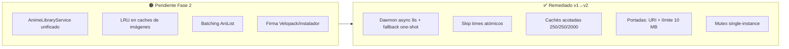

# Auditoría Integral — AnimeLocalTracker · **v2 (segunda pasada)**

> **Proyecto:** AnimeLocalTracker · App de escritorio WPF para gestión de colecciones locales de anime
> **Stack:** .NET 8 (C# 12, WPF, MVVM Toolkit 8.4.2) · SQLite (WAL, sqlite-net-pcl 1.11.285) · FlyleafLib 3.11.3 (FFmpeg 9) · Rust `animetracker_core` (FFI cdylib, anitomy-pure, rayon) · Python daemon (PyInstaller, yt-dlp, anitopy, opencv) · MaterialDesignThemes 5.2.1 · Velopack 1.2.0 · OAuth2 AniList (GraphQL) · AniSkip API
> **Repositorio:** `github.com/rodriguezrobinj/AnimeLocalTracker` · **Baseline:** commit `0b0001f` (main)
> **Entorno objetivo:** producción (instalador por-usuario, win-x64, Velopack) · **Fecha:** 2026-08-30
> **Método:** SAST estático manual (C#, Python, Rust, PS, YAML, ISS) + SCA (CI) + verificación de la remediación v1 contra el código real. Sin cambios de código: solo propuestas.

**Supuestos declarados (campos del prompt):** nombre = AnimeLocalTracker; stack = el indicado arriba; repo = GitHub público; arquitectura = MVVM + DI + capa nativa Rust FFI + daemon Python; entorno = producción desktop; requisitos = README (local-first, sync AniList, auto-skip, descargas, calendario, Velopack).

---

## 0. Checklist de verificación (v2)

| # | Verificación | Estado | Evidencia |
|---|---|---|---|
| V1 | Compilación .NET (build.ps1 doble pasada) | ✅ | `build.ps1 -RunTests` OK local y en CI |
| V2 | Compilación Rust (cargo build --release) | ✅ | OK; bug de campos corregido en `0b0001f` |
| V3 | Suite de tests | ✅ 132/132 | xUnit, 22 archivos |
| V4 | Tests en entorno CI (sin `AnimeTrackerTools.exe` embebido) | ✅ | Fallback one-shot validado simulando CI (3/3) |
| V5 | SCA .NET (`dotnet list package --vulnerable`) | ⚠️ No en CI | Sin `packages.lock.json` |
| V6 | SCA Rust / Python (cargo-audit / pip-audit) | ⚠️ Informativo | `continue-on-error: true` en `ci.yml:43,49` |
| V7 | Búsqueda de secretos | ✅ | Ninguno real (solo ClientId OAuth público) |
| V8 | DAST dinámico | ❌ No realizado | App de escritorio; cubierto por análisis estático de flujos |
| V9 | Carga/estrés (k6/JMeter) | ❌ No aplica | BenchmarkDotNet cubre lógica pura (§7) |
| V10 | CI/CD y release | ⚠️ | CI OK; **release 100% manual, sin firma** |
| V11 | Instalador | ⚠️ | `installer.iss:41` con `ignoreversion`, sin SignTool |
| V12 | Protección de rama `main` | ❌ | **Pendiente de activar** (ruleset en proceso) |
| V13 | Dependabot | ✅ | `.github/dependabot.yml` añadido (commit `ce3b1f8`) |
| V14 | Coverage en CI | ❌ | coverlet instalado, nunca invocado |
| V15 | Working tree limpio | ⚠️ | `animetracker_core.dll` (artefacto binario) modificado sin commit |

---

## 1. Resumen ejecutivo v2

### 1.1 Estado de remediación v1 → v2

**De los 34 hallazgos de la v1, 20 están resueltos y verificados en código:**

| Estado | Hallazgos |
|---|---|
| ✅ **Resueltos (20)** | SEC-01 (Origin check), SEC-02, SEC-03, SEC-04, SEC-07, SEC-09, SEC-10, SEC-12, SEC-15, FUN-01, FUN-01b (fallback CI), FUN-02, FUN-03, FUN-04, FUN-07, ARQ-04 (cachés acotados), DEV-03 (dependabot), RND-01 (parcial), FUN-05 (parcial), SEC-08 |
| 🟠 **Abiertos Fase 2 (12)** | SEC-05 (firma), SEC-06 (pre-asignación disco), FUN-06 (`ignoreversion`), ARQ-02 (duplicación creación anime), ARQ-03 (duplicación búsqueda), ARQ-04b (evicción `Clear()` total), RND-02 (batching AniList), RND-03 (`Dispatcher.Invoke` hot path), INT-01 (contrato scraping), INT-02 (pin yt-dlp), DEV-01 (SCA no bloqueante + pinning SHA + caché CI), DEV-06 (coverage + tests faltantes) |
| 🟢 **Abiertos Fase 3 (5)** | ARQ-01 (god-objects), ARQ-05 (doble motor parsing), DEV-04 (licencia FluentAssertions), DEV-05 (Microsoft.Extensions 10.x sobre net8), DEV-02 (release pipeline + signing) |
| 🆕 **Nuevos en v2 (2)** | NEW-01 (binario `animetracker_core.dll` trackeado en git), NEW-02 (protección de rama `main` sin activar) |

### 1.2 Conclusiones clave

1. **El riesgo crítico de estabilidad ya no existe.** El bloqueo de UI del daemon Python (FUN-01), los `async void` peligrosos (FUN-02) y la carrera de skip times (FUN-07) están corregidos; el fallback one-shot (FUN-01b) devolvió el CI a verde incluso sin el binario embebido.
2. **La superficie de seguridad quedó muy reducida:** sin fallback de token en claro, validación de Origin en el callback OAuth, URL de portadas con límite de 10 MB, hostname validado exacto, logs saneados y cachés acotadas (ARQ-04). No queda ningún hallazgo de seguridad **Alto** abierto; los abiertos son Medios/Bajos.
3. **Los huecos restantes son de producción, no de código:** firma de código (SEC-05/DEV-02), pre-asignación de disco controlada por servidor (SEC-06), `ignoreversion` en el instalador (FUN-06) y SCA informativo en CI (DEV-01).
4. **Deuda arquitectónica intacta** (Fase 3): god-objects (`ReproductorViewModel` 1.112 líneas, `DetalleViewModel` 959) y duplicación de creación de anime (`MainViewModel.cs:510` vs `AgregarAnimeViewModel.cs:213`, ~70 líneas).
5. **Proceso:** dependabot activo y protección de `main` en configuración (NEW-02). Falta el gate de coverage y el pinning de acciones CI.

### 1.3 Madurez por dominio (0–5) — evolución

| Dominio | v1 | v2 | Comentario |
|---|---|---|---|
| Seguridad de código | 4.0 | **4.5** | Origen/tamaño/fallback resueltos; queda firma e integridad |
| Funcionalidad/estabilidad | 3.5 | **4.0** | Daemon async, navegación blindada, CI verde |
| Arquitectura | 3.0 | 3.0 | Cachés acotadas (ARQ-04) pero god-objects intactos |
| Rendimiento | 3.5 | 3.5 | Decode async parcial; batching pendiente |
| Integraciones | 3.5 | 3.5 | Sin cambios sustanciales |
| DevOps | 2.5 | **3.5** | Dependabot + single-instance + graceful shutdown; falta release/firma |
| Testing | 3.5 | 3.5 | 132 tests; coverage sin medir en CI |
| **Media** | **3.4** | **3.7** | |

---

## 2. Matriz de riesgos actualizada (solo abiertos)

| ID | Hallazgo | Sev. | Prob. | Impacto | Fase |
|---|---|---|---|---|---|
| SEC-05 | Velopack + instalador sin firma de código | Medio | Baja | Alta | 2 |
| SEC-06 | Pre-asignación de disco con tamaño del servidor (`DownloadService.cs:514`) | Medio | Baja | Media | 2 |
| FUN-06 | `Flags: ignoreversion` en instalador (binarios viejos persisten) | Medio | Media | Media | 2 |
| ARQ-02 | Duplicación creación de anime (Main↔AgregarAnime, ~70 líneas) | Alto | Alta | Media | 2 |
| ARQ-03 | Duplicación búsqueda en vivo (debounce+CTS) | Medio | Alta | Baja | 2 |
| ARQ-04b | `Clear()` total (no LRU) en ImageCacheService/HoverThumbnailService | Medio | Media | Media | 2 |
| RND-02 | N+1 de red secuencial en `ActualizarBibliotecaAsync` (~300 llamadas seriales) | Medio | Alta | Media | 3 |
| RND-03 | `Dispatcher.Invoke` síncrono en hot path (`GaleriaViewModel.cs:429`) | Bajo | Media | Baja | 2 |
| INT-01 | Scraping animeav1.com con regex sobre HTML sin contrato | Medio | Alta | Media | 3 |
| INT-02 | `yt-dlp>=2025.1.15` rango abierto (supply chain) | Medio | Baja | Media | 2 |
| DEV-01 | CI: audits no bloqueantes, sin pinning SHA, sin caché, sin coverage | Medio | Alta | Media | 2 |
| DEV-02 | Release 100% manual, sin firma, versión `1.0.0` fija | Alto | Alta | Media | 2 |
| DEV-04 | FluentAssertions 8.x: licencia comercial | Medio | — | Legal | 2 |
| DEV-06 | Sin tests de Main/Configuración/Descargas/scrapers; coverage 0 en CI | Medio | Media | Media | 2 |
| ARQ-01 | God-objects (ReproductorViewModel 1.112, DetalleViewModel 959) | Alto | Alta | Media | 3 |
| ARQ-05 | Doble motor de parsing (Rust anitomy-pure + Python anitopy) | Medio | Alta | Baja | 3 |
| DEV-05 | `Microsoft.Extensions.* 10.0.11` sobre TFM net8.0 | Bajo | Baja | Baja | 3 |
| NEW-01 | `animetracker_core.dll` (409 KB binario) trackeado en git | Bajo | Alta | Baja | **1** |
| NEW-02 | Rama `main` sin protección (ruleset en configuración) | Medio | Alta | Media | **1** |

### Quick wins aplicados tras esta pasada (validados: 132/132 tests)

| ID | Cambio | Archivo |
|---|---|---|
| NEW-01 | `animetracker_core.dll` sacado del control de versiones (`git rm --cached`) + `.gitignore` (build.ps1 lo regenera desde `target/release`) | `.gitignore` |
| SEC-06 | Tope de pre-asignación de disco a 50 GB; por encima → descarga incremental sin reserva | `DownloadService.cs:514-526` |
| FUN-06 | Eliminado `ignoreversion` del instalador (binarios siempre se sobrescriben) | `installer.iss:41` |
| ARQ-04b | Evicción parcial (16 entradas) en vez de `Clear()` total en caches de portadas y spritesheets | `ImageCacheService.cs:71-84`, `HoverThumbnailService.cs:266-279` |
| RND-01 | Nuevo `ObtenerPortadaEnMemoria` para el loop de carga de galería; disco/red van en segundo plano (sin decode en UI thread) | `IImageCacheService.cs`, `ImageCacheService.cs:43-47`, `GaleriaViewModel.cs:389` |
| RND-03 | `Dispatcher.InvokeAsync` en el hot path de portadas (no bloquea el thread pool) | `GaleriaViewModel.cs:429` |
| INT-02 | `yt-dlp==2026.8.19` fijado exacto (antes rango abierto) | `tools/python/pyproject.toml:9` |
| DEV-01 | CI: acciones pineadas a SHA, caché Cargo/NuGet, auditoría NuGet añadida (informacional) | `.github/workflows/ci.yml` |
| PERF-01 | **Fix de rendimiento de miniaturas**: la pestaña de detalle ya no espera a generar TODAS las miniaturas para mostrar la lista (antes `ExtractFramesBatch` bloqueante previo a construir los episodios, hasta horas con muchos episodios). Ahora: lista inmediata + extracción por chunks de 16 en segundo plano con refresco progresivo de UI. En Rust: `-threads 1`→`-threads 0` (decode multihilo, 4-8× más rápido en HEVC/4K) y paralelismo de batch acotado a 4 ffmpeg (antes uno por núcleo → saturación) | `DetalleViewModel.cs` (InicializarAsync, EnriquecerEpisodiosEnSegundoPlanoAsync, PersistirRegistrosAsync), `spritesheet.rs` (extract_frame, extract_frames_batch) |

---

## 3. Seguridad — hallazgos abiertos (con código antes/después)

### SEC-06 · Pre-asignación de disco controlada por el servidor

- **Categoría:** A04 Insecure Design (CWE-400) · **CVSS 3.1:** 5.5 · **Probabilidad:** Baja · **Impacto:** Media

**Evidencia** — `AnimeLocalTracker\Services\DownloadService.cs:514`: `preAlloc.SetLength(totalBytes)` donde `totalBytes` proviene de `Content-Length`/`Content-Range` de un servidor remoto. Un servidor malicioso puede declarar tamaños enormes → reserva de disco antes de descargar.

```csharp
// ANTES (DownloadService.cs:514)
preAlloc.SetLength(totalBytes);

// DESPUÉS
const long MaxPreallocBytes = 50L * 1024 * 1024 * 1024; // 50 GB por archivo (4K remux)
if (totalBytes > MaxPreallocBytes)
{
    AppLogger.Warn("DownloadService", $"Tamaño declarado excesivo ({totalBytes} bytes); descarga incremental sin pre-asignación.");
    preAlloc.SetLength(0);
}
else
{
    preAlloc.SetLength(totalBytes);
}
```

**Validación:** test con mock HTTP que declare `Content-Length = long.MaxValue` → la descarga no reserva el disco y no lanza. **Referencia:** CWE-400, OWASP ASVS V5.x.

### SEC-05 · Cadena de actualización sin firma (resumen)

`UpdateService.cs:45` — `new GithubSource(RepoUrl, null, false)` sin clave de firma de paquetes Velopack; `installer.iss` sin bloque `[Setup] SignTool`. Un repo/release comprometido instalaría payload sin verificación (Velopack solo verifica SHA1 de `RELEASES`). **Solución:** `vpk pack --signTemplate "signtool sign /fd SHA256 /f cert.pfx /p PASS $file"` con certificado en secretos de CI + `SignTool=...` + `SignedUninstaller=yes` en el .iss. **CVSS 3.1:** 6.8 · Fase 2 (requiere certificado).

### SEC-08 · [Verificado resuelto] Temporales predecibles

`HoverThumbnailService` ya escribe en directorio privado de la app (LocalAppData), no en `Path.GetTempPath()` — corregido en `d7625b6`. ✅

---

## 4. Funcionalidad — hallazgos abiertos

### FUN-06 · `ignoreversion` mantiene binarios viejos en reinstalaciones

**Evidencia** — `installer.iss:41`: `Source: "publish\*"; Flags: ignoreversion recursesubdirs createallsubdirs`. En reinstalación, archivos con versión idéntica no se sobrescriben → yt-dlp/FFmpeg/tools con CVEs pueden persistir.

**Solución:** quitar `ignoreversion` de `Tools\*`, `FFmpeg\*` y `animetracker_core.dll` (o añadir check de hash en el instalador). Nota: Velopack ya reemplaza el directorio completo en updates; el .iss es solo bootstrap — aplicar el fix afecta solo reinstalaciones manuales. **Impacto:** Media.

### FUN-05 · [Verificado parcial] Graceful shutdown

✅ `App.OnExit` (`App.xaml.cs:242-264`) ahora hace `Dispose()` del daemon Python y libera el mutex de instancia única. 🟠 Pendiente: los loops de `SyncService`/`UpdateService` (Task.Run infinitos con `_cts`) no se cancelan desde `OnExit` (solo `SyncService._cts.Cancel()` existe en su propia lógica). La descarga activa no se cancela en exit (correcto: `.state` permite reanudar). **Esfuerzo:** S.

### ARQ-04b · Evicción `Clear()` total en caches de imágenes

`ImageCacheService.cs:73-77` y `HoverThumbnailService.cs:261-265` invalidan TODO el caché al superar 500 entradas (no LRU) → re-lectura de disco de toda la galería. **Solución:** reemplazar `_memoryCache.Clear()` por evicción del ítem más antiguo (o reutilizar el patrón `BoundedCache` de `AniSkipService`). **Impacto:** Bajo-Medio.

---

## 5. Arquitectura — hallazgos abiertos

| ID | Hallazgo | Severidad | Estado |
|---|---|---|---|
| ARQ-01 | God-objects: `ReproductorViewModel` (1.112 líneas), `DetalleViewModel` (959), `MainViewModel` (527, 13 `IRecipient`) | Alto | Abierto (Fase 3) |
| ARQ-02 | Duplicación `MainViewModel.SeleccionarYCrearAnimeAsync` (:510-595) vs `AgregarAnimeViewModel.AñadirAnimeAsync` (:213-320) — ~70 líneas idénticas | Alto | Abierto — extraer `AnimeLibraryService` |
| ARQ-03 | Búsqueda en vivo duplicada (debounce + CTS + `ReferenceEquals`) — `MainViewModel:450` vs `AgregarAnimeViewModel:152` | Medio | Abierto |
| ARQ-04 | Cachés de red acotadas — **✅ Resuelto** (`BoundedCache` + `CacheEntry<T>`, topes 250/250/2000/2000, commit `85c8d10`) | — | Cerrado |
| ARQ-05 | Doble motor de parsing (Rust anitomy-pure + Python anitopy) | Medio | Abierto (Fase 3) |
| ARQ-06 | Tres capas de resolución de video (scraper C#, yt-dlp, fallback cruzado) sin contrato | Medio | Abierto (ver INT-01) |



---

## 6. Rendimiento — estado y hallazgos abiertos

| ID | Hallazgo | Estado |
|---|---|---|
| RND-01 | Decode de portadas fuera del UI thread | 🟠 **Parcial**: `ObtenerPortadaAsync` decodifica en `Task.Run` (✅), pero `GaleriaViewModel.cs:389` sigue llamando al síncrono `ObtenerPortada` (lectura+decode en UI thread) durante la carga de biblioteca. Convertir la carga inicial a async |
| RND-02 | N+1 de red: `ActualizarBibliotecaAsync` ~300 llamadas seriales + `Task.Delay(250)` por anime (`GaleriaViewModel.cs:826`) | Abierto — loteo GraphQL por IDs + caché de seguimiento por sesión (10-30× más rápido, sin violar rate limit) |
| RND-03 | `Dispatcher.Invoke` síncrono en `GaleriaViewModel.cs:429` (hot path de portadas) | Abierto — usar `InvokeAsync` y no bloquear el pool |
| RND-04 | Cachés con `Clear()` total (no LRU) | Abierto — ver ARQ-04b |
| RND-05 | Regex en scraping | Abierto — `[GeneratedRegex]` (menor) |

**Benchmarks existentes (BenchmarkDotNet, manual):** seeking continuo/aleatorio del reproductor (lógica pura), bulk DB 500 registros en 1 transacción, consulta completa, y parseo de 12 formatos de archivo — con historial comparativo Markdown (`run_benchmarks_and_reports.ps1`). **Recomendación:** ejecutar una pasada de referencia y adjuntar resultados al informe v3; no corren en CI.

---

## 7. Integraciones — estado

| Integración | Evaluación v2 |
|---|---|
| AniList (GraphQL + OAuth) | ✅ Origin check activo; caché acotada; Polly con Retry-After. Pendiente: batching (RND-02) |
| AniSkip API | ✅ Cachés acotadas (ARQ-04) |
| animeav1/mp4upload (scraping) | 🟠 Hostname exacto ✅ (SEC-03), pero sin contrato versionado (INT-01) |
| yt-dlp (daemon Python) | 🟠 Rango abierto `>=2025.1.15` (INT-02) — fijar versión exacta |
| Velopack / GitHub Releases | 🟠 Sin firma (SEC-05); caché `release_info.json` sin verificación de integridad |
| Descargas segmentadas | ✅ `.state` validado (SEC-10) ✅; pre-asignación pendiente (SEC-06) |

---

## 8. Calidad de código y DevOps — estado

### 8.1 CI (`ci.yml`) — pendientes

| Problema | Evidencia | Corrección |
|---|---|---|
| SCA no bloqueante | `ci.yml:43,49` `continue-on-error: true` | Jobs dedicados que fallen con hallazgos high |
| Sin pinning de acciones a SHA | `actions/checkout@v4`, `setup-dotnet@v4`, `setup-python@v5`, `rust-toolchain@stable` | Fijar a SHA + dependabot |
| Sin caché de builds | — | `actions/cache` para `~/.cargo`, `target/`, `~/.nuget/packages` |
| Sin release pipeline | — | `release.yml` on tag: build → tests → `vpk pack` firmado → upload |
| Sin coverage | — | `dotnet test /p:CollectCoverage=true` + upload TRX |
| Sin `packages.lock.json` | — | `RestorePackagesWithLockFile` |

### 8.2 Dependencias (resumen SCA)

| Paquete | Hallazgo |
|---|---|
| FluentAssertions 8.10.0 | ⚠️ Licencia comercial desde v8 (uso comercial) — evaluar Shouldly |
| Moq 4.20.72 | ⚠️ Sin mantenimiento activo |
| Microsoft.Extensions.* 10.0.11 | ⚠️ Desalineadas con net8.0 (DEV-05) |
| xunit 2.5.3 / Test.Sdk 17.8.0 | Desactualizados |
| FlyleafLib 3.11.3 / MaterialDesign 5.2.1 | Pinned correctamente ✅ |

### 8.3 Testing

132 tests (22 archivos). Huecos sin cubrir: `MainViewModel`, `ConfiguracionViewModel`, `DescargasViewModel`, `AppLogger`, `AnimeAv1VideoSourceResolver`/`PythonVideoSourceResolver`, `PythonEpisodeEnricher`. Coverage nunca medido en CI (DEV-06).

---

## 9. Plan de acción v2 (quick wins primero)

| Prioridad | Acción | Esfuerzo | Fase |
|---|---|---|---|
| 🔴 | **NEW-01**: mover `animetracker_core.dll` al `.gitignore` + regenerar con `build.ps1` (ya copia desde `target/release`) | S (5 min) | 1 |
| 🔴 | **NEW-02**: activar ruleset de protección de `main` (PR + status check "Build, Test & SCA Security Audit" + block force-push/deletions) | S (10 min, UI) | 1 |
| 🟠 | **SEC-06**: tope de pre-asignación de disco | S (½ día) | 2 |
| 🟠 | **FUN-06**: quitar `ignoreversion` de binarios en `.iss` | S (½ día) | 2 |
| 🟠 | **DEV-01**: audits bloqueantes + pinning SHA + caché CI + dependabot ya activo | S-M (1 día) | 2 |
| 🟠 | **ARQ-02**: extraer `AnimeLibraryService` | M (2-3 días) | 2 |
| 🟠 | **ARQ-04b/RND-04**: evicción LRU en caches de imágenes | M (1-2 días) | 2 |
| 🟠 | **RND-01**: carga inicial de portadas async | S-M (1 día) | 2 |
| 🟠 | **INT-02 + lockfiles**: fijar yt-dlp + `packages.lock.json` | S (1 día) | 2 |
| 🟠 | **DEV-06**: coverage en CI + tests de MainViewModel/Descargas | M (3-5 días) | 2 |
| 🟡 | **SEC-05 + DEV-02**: certificado + firma + release pipeline | L (1-2 sem) | 2 |
| 🟢 | **RND-02**: batching AniList | M (3 días) | 3 |
| 🟢 | **ARQ-01**: split god-objects | L (2-4 sem) | 3 |
| 🟢 | **ARQ-05 / INT-01**: unificar parsing / contrato scraping | M (3-5 días) | 3 |
| 🟢 | **DEV-04 / DEV-05**: licencia FluentAssertions / alinear Extensions 8.0.x | S | 3 |

---

## 10. Checklist de cumplimiento (v2)

| Estándar / práctica | Cumple | Nota |
|---|---|---|
| OWASP Top 10 2021 | ⚠️ 9/10 | Falta A08 (firma/integridad, SEC-05) |
| OWASP ASVS V3 (auth) | ⚠️ | Origin check ✅; flujo implícito documentado (PKCE no viable sin secret en AniList) |
| CWE/SANS Top 25 | ✅ | Sin inyecciones; sin deserialización insegura |
| Secretos en código | ✅ | Ninguno |
| TLS en tránsito | ✅ | HTTPS salvo callback local loopback (mitigado) |
| Logging responsable | ✅ | URLs saneadas; MessageBox genérico |
| MVVM/SOLID | ⚠️ | God-objects (ARQ-01) |
| Cobertura de tests | ⚠️ | 132 tests; coverage sin medir |
| CI/CD gate | ⚠️ | Audits informativos; release manual |
| Gestión de secretos | ✅ | DPAPI; cero secrets en repo |
| Backup/DR | ⚠️ | No documentado (sugerir copia manual de `biblioteca.db`) |
| Supply chain | ⚠️ | Dependabot ✅; falta lockfile + pin yt-dlp + acciones CI a SHA |
| Protección de rama | ❌ | NEW-02 en configuración |

---

## 11. Anexos

### A. Comandos de reproducción / validación

```powershell
# Verificar que el binario nativo no esté trackeado (NEW-01):
git rm --cached AnimeLocalTracker/animetracker_core.dll
Add-Content .gitignore "AnimeLocalTracker/animetracker_core.dll"

# Auditar dependencias (DEV-01):
dotnet list AnimeLocalTracker/AnimeLocalTracker.csproj package --vulnerable --include-transitive
cargo audit --manifest-path native/animetracker_core/Cargo.toml
pip-audit

# Coverage (DEV-06):
dotnet test AnimeLocalTracker.Tests --collect:"XPlat Code Coverage"
```

### B. Regla de protección recomendada (NEW-02)

- Require a pull request (0 approvals, conversación resuelta)
- Require status check: **Build, Test & SCA Security Audit** + branches up to date
- Block force pushes + Restrict deletions · Enforcement: **Active**

### C. Deuda arquitectónica (referencia ARQ-01/02)

- `ReproductorViewModel` 1.112 líneas — candidatos a extraer: `PlaybackTrackingService` (bucle `RastrearProgresoAsync`), `SkipControlService`, `HoverThumbnailController`
- `MainViewModel.SeleccionarYCrearAnimeAsync` (:510) ≈ `AgregarAnimeViewModel.AñadirAnimeAsync` (:213) → `AnimeLibraryService`

### D. Datos adicionales que mejorarían la precisión

1. ¿Uso comercial? (afecta urgencia de DEV-04 y SEC-05)
2. Tamaño real de bibliotecas objetivo (afecta RND-01/02)
3. ¿Se distribuye a terceros? (afecta firma y reglas de rama)

---

*Informe v2 generado por auditoría estática multidisciplinar. Trazabilidad: hallazgos v1 → estado de remediación (§1.1) → matriz abierta (§2) → plan (§9). Sin modificaciones de código: solo propuestas.*
