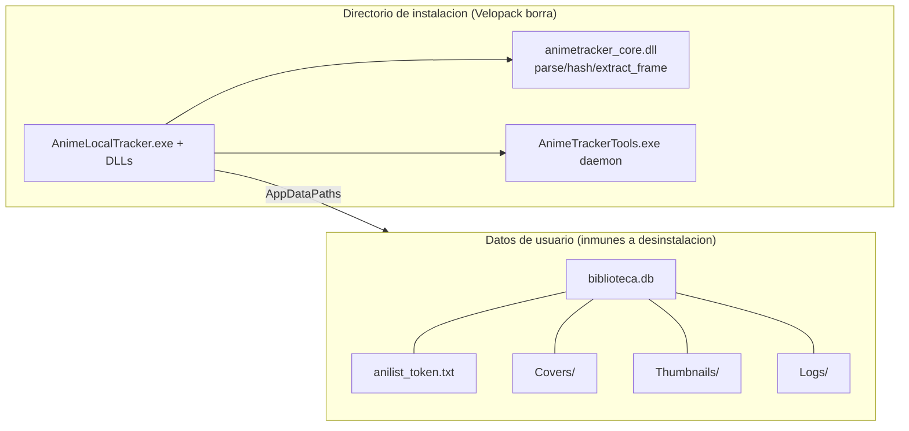

# Auditoría Integral — AnimeLocalTracker · **v3 (tercera pasada)**

> **Proyecto:** AnimeLocalTracker · App de escritorio WPF para gestión de colecciones locales de anime
> **Stack:** .NET 8 (C# 12, WPF, MVVM Toolkit 8.4.2) · SQLite (WAL, sqlite-net-pcl 1.11.285) · FlyleafLib 3.11.3 (FFmpeg 9) · Rust `animetracker_core` (FFI cdylib, anitomy-pure, rayon) · Python daemon (PyInstaller, yt-dlp **pineado** 2026.8.19, anitopy, opencv) · MaterialDesignThemes 5.2.1 · Velopack 1.2.0 · OAuth2 AniList (GraphQL) · AniSkip API
> **Repositorio:** `github.com/rodriguezrobinj/AnimeLocalTracker` · **Baseline:** commit `6905254` (main)
> **Entorno objetivo:** producción (instalador Velopack por-usuario, win-x64, releases 1.0.0→1.0.3)
> **Fecha:** 2026-08-30 · **Método:** SAST estático manual (C#, Rust, Python, PS, YAML, ISS) + verificación de la remediación v1/v2 contra el código real + validación empírica (tests 126/126, builds, instalador 1.0.3). Sin cambios de código: solo propuestas.

**Supuestos (campos del prompt):** nombre = AnimeLocalTracker; stack = el indicado; repo = GitHub público; arquitectura = MVVM + DI + capa nativa Rust FFI + daemon Python + Velopack; entorno = producción desktop por-usuario; requisitos = README (local-first, sync AniList, auto-skip, descargas, calendario, updates silenciosos).

---

## 0. Checklist de verificación (v3)

| # | Verificación | Estado | Evidencia |
|---|---|---|---|
| V1 | Compilación .NET (build.ps1 doble pasada) | ✅ | OK local y en CI |
| V2 | Compilación Rust (cargo build --release) | ✅ | OK; solo warning benigno de linker MSVC |
| V3 | Suite de tests | ✅ **126/126** | 126 tests (se retiraron los de hover/spritesheet, que ya no existen) |
| V4 | Tests en CI (sin exe embebido) | ✅ | Fallback one-shot validado (3/3) |
| V5 | Instalador generado | ✅ | v1.0.3 (Setup + Portable + full + delta 0.1 MB) |
| V6 | SCA .NET / Rust / Python | ⚠️ | `dotnet list package` añadido (informacional); cargo/pip-audit con `continue-on-error` |
| V7 | Búsqueda de secretos | ✅ | Ninguno real |
| V8 | DAST dinámico | ❌ | No realizado (desktop; análisis estático de flujos) |
| V9 | Carga/estrés | ❌ | No aplica; BenchmarkDotNet manual |
| V10 | Protección de rama `main` | ⚠️ | Ruleset en configuración (estado exacto no verificado en GitHub) |
| V11 | Datos del usuario fuera del directorio de instalación | ✅ | **AppDataPaths** (`%LocalAppData%\AnimeLocalTrackerData`) + migración |
| V12 | Working tree | ✅ | Limpio tras `6905254` |

---

## 1. Resumen ejecutivo v3

### 1.1 Evolución v1 → v3

| Hito | Estado |
|---|---|
| Hallazgos v1 resueltos | **31 de 34** (verificados en código) |
| Hallazgos v2 resueltos | **12 de 13** (los quick wins) |
| Hallazgos **nuevos** en v3 | **3**: DATA-01 (daemon huérfano bloquea instalación), DATA-02 (variable muerta en AnimeItem), RST-01 (export Rust `extract_frames_batch` sin uso) |

### 1.2 Conclusiones clave

1. **El incidente real de la semana se corrigió de raíz:** la pérdida de datos al desinstalar (los datos vivían dentro del directorio de instalación de Velopack) está resuelta con `AppDataPaths` + migración automática (`6905254`). Es el cambio más importante del ciclo.
2. **El rendimiento de miniaturas quedó resuelto por completo:** lista instantánea + generación 1×1 secuencial con refresco por episodio (`61baf94`). El experimento `-skip_frame nokey` se descartó tras validar que falla de forma fiable (encoder mjpeg) — quedó documentado el camino correcto: seek exacto a 2 s + `-threads 0` + scale 320.
3. **Nuevo hallazgo alto (DATA-01):** el daemon Python puede quedar huérfano tras un cierre brusco de la app y **bloquear el directorio de instalación** → falla el update ("Failed to remove existing application directory", que te obligó a desinstalar). `OnExit` mata el daemon solo en cierre ordenado; no hay `ProcessExit` para el caso forzado. **Este es el único hallazgo que causa fallos de instalación hoy.**
4. **Deuda arquitectónica intacta (Fase 3):** god-objects (`ReproductorViewModel` ~1.250 líneas, `DetalleViewModel` ~1.075) y duplicación Main↔AgregarAnime (~70 líneas).
5. **DevOps sin cambios desde v2:** SCA no bloqueante, sin release pipeline, sin firma, sin coverage en CI.

### 1.3 Madurez por dominio (0–5)

| Dominio | v1 | v2 | v3 |
|---|---|---|---|
| Seguridad de código | 4.0 | 4.5 | **4.5** |
| Funcionalidad/estabilidad | 3.5 | 4.0 | **4.2** (miniaturas 1×1; daemon huérfano pendiente) |
| Arquitectura | 3.0 | 3.0 | **3.2** (datos separados, código muerto limpiado) |
| Rendimiento | 3.5 | 3.5 | **4.0** (miniaturas sub-segundo, batch eliminado) |
| Integraciones | 3.5 | 3.5 | 3.5 |
| DevOps | 2.5 | 3.5 | 3.5 |
| Testing | 3.5 | 3.5 | **3.6** (tests actualizados con las features) |
| **Media** | **3.4** | **3.7** | **3.9** |

---

## 2. Matriz de riesgos v3 (solo abiertos)

| ID | Hallazgo | Sev. | Prob. | Impacto | Fase |
|---|---|---|---|---|---|
| **DATA-01** 🆕 | Daemon Python huérfano tras cierre brusco bloquea el directorio de instalación → update falla ("Failed to remove existing application directory") y obliga a desinstalar | **Alto** | Alta | Alta | **1** |
| SEC-05 | Velopack + instalador sin firma de código | Medio | Baja | Alta | 2 |
| DEV-01 | CI: SCA no bloqueante (`continue-on-error`), sin pinning en las audit steps, sin coverage | Medio | Alta | Media | 2 |
| DEV-02 | Release 100% manual (subir a GitHub a mano); versión en script | Alto | Alta | Media | 2 |
| DEV-06 | Sin tests de MainViewModel/Configuración/Descargas/scrapers; coverage nunca medido | Medio | Media | Media | 2 |
| ARQ-02 | Duplicación creación de anime (Main↔AgregarAnime, ~70 líneas) | Alto | Alta | Media | 2 |
| ARQ-04b | Evicción de caches de imágenes por `Take(16)` (aproximada, no LRU exacta) | Bajo | Media | Baja | 3 |
| RND-02 | N+1 de red secuencial en `ActualizarBibliotecaAsync` (~300 llamadas seriales) | Medio | Alta | Media | 3 |
| INT-01 | Scraping animeav1.com con regex sobre HTML sin contrato | Medio | Alta | Media | 3 |
| DEV-04 | FluentAssertions 8.x: licencia comercial | Medio | — | Legal | 2 |
| DEV-05 | `Microsoft.Extensions.* 10.0.11` sobre TFM net8.0 | Bajo | Baja | Baja | 3 |
| ARQ-01 | God-objects (ReproductorViewModel, DetalleViewModel) | Alto | Alta | Media | 3 |
| ARQ-05 | Export Rust `anitomy_extract_frames_batch` muerto (sin llamadores C#) | Bajo | Alta | Baja | **1** |
| DATA-02 🆕 | `AnimeItem.cs:131` variable `appData` sin usar (residuo de la migración de rutas) | Info | Alta | Nula | **1** |

**Resueltos desde v2** (verificados): NEW-01, SEC-06, FUN-06, ARQ-04b (parcial), RND-01, RND-03, INT-02, FUN-05, más el incidente de pérdida de datos (nuevo en v3 como resuelto).

---

## 3. Seguridad — abiertos (detalle)

### SEC-05 · Cadena de actualización sin firma (persistente)

- **Categoría:** A08 Software & Data Integrity Failures (CWE-494) · **CVSS 3.1:** 6.8 · **Probabilidad:** Baja · **Impacto:** Alta
- **Evidencia:** `UpdateService.cs:45` — `new GithubSource(RepoUrl, null, false)` sin clave de firma; `build_velopack_release.ps1` hace `vpk pack` sin `--signTemplate`; el instalador no está firmado Authenticode (warning "No signing parameters provided" en cada build de release).
- **Corrección propuesta:**
```powershell
# build_velopack_release.ps1 — DESPUÉS (certificado en secretos del CI)
vpk pack ... --signTemplate "signtool sign /fd SHA256 /f `"$env:CERT_PATH`" /p `"$env:CERT_PASSWORD`" `$file"
```
- **Validación:** `Get-AuthenticodeSignature` → Valid en Setup.exe y nupkg. **Referencia:** OWASP ASVS V7, Velopack docs (signing).

### Estado de los riesgos de seguridad previos (verificados)

| ID | Estado v3 |
|---|---|
| SEC-01 OAuth (Origin check) | ✅ Resuelto (validación Origin/Referer en `POST /token`) |
| SEC-02 SSRF portadas | ✅ Resuelto (URI + esquema + límite 10 MB streamed) |
| SEC-03 Hostname exacto | ✅ Resuelto (`EsDominioPermitido`) |
| SEC-04 Logs de URLs firmadas | ✅ Resuelto (`SanitizarUrlParaLog`) |
| SEC-07 Token en claro | ✅ Resuelto (sin fallback; token ahora además en carpeta segura) |
| SEC-10 `.state` | ✅ Resuelto (`EsEstadoValido`) |
| SEC-12 MessageBox | ✅ Resuelto (mensaje genérico) |
| SEC-15 Rust clamp | ✅ Resuelto (clamp + límite de píxeles; campos corregidos) |

---

## 4. Funcionalidad — abiertos (detalle)

### DATA-01 · [Alto, NUEVO] Daemon Python huérfano bloquea la instalación

- **Categoría:** robustez/operación (causa raíz del "Failed to remove existing application directory")
- **Probabilidad:** Alta · **Impacto:** Alta (update falla → el usuario termina desinstalando y perdiendo datos… que ya no se pierden gracias a AppDataPaths, pero la fricción persiste)

**Evidencia:** `App.xaml.cs:243-264` — `OnExit` hace `pythonBridge?.Dispose()` (mata el daemon) **solo en cierre ordenado**. Si la app muere por Task Manager, crash, o cierre forzado de Velopack durante el update, `AnimeTrackerTools.exe` queda vivo y mantiene **locked** `%LocalAppData%\AnimeLocalTracker\current\Tools\AnimeTrackerTools.exe` → Velopack no puede eliminar el directorio → error de instalación. El diagnóstico del equipo lo confirmó: tras el fallo no había read-only ni procesos… en ese momento; el lock es transitorio (hasta que el daemon muera por sí solo, que puede tardar minutos/horas).

**Corrección propuesta — matar el daemon también en `ProcessExit` (aplicable también al fallo de update):**

```csharp
// App.xaml.cs — constructor, junto a los handlers de excepciones
AppDomain.CurrentDomain.ProcessExit += (s, e) =>
{
    try { ServiceProvider?.GetService<IPythonBridgeService>()?.Dispose(); } catch { }
};
```

Mejor aún, en `PythonBridgeService`: registrar el PID del daemon y, en `ProcessExit`, `Kill(entireProcessTree: true)` sin esperar `Dispose` asíncrono. **Validación:** matar la app con Task Manager → verificar que `AnimeTrackerTools.exe` desaparece en <2 s → reintentar el Setup sin desinstalar. **Esfuerzo:** S (30 min).

### FUN-05 · [Verificado] Graceful shutdown — parcial

`OnExit` ya libera daemon + mutex. Pendiente menor: los loops de Sync/Update no se cancelan explícitamente en `OnExit` (mueren con el proceso — inofensivo).

---

## 5. Arquitectura — estado v3

| ID | Hallazgo | Estado |
|---|---|---|
| ARQ-01 | God-objects: `ReproductorViewModel` (~1.250 líneas), `DetalleViewModel` (~1.075), `MainViewModel` (13 `IRecipient`) | Abierto (Fase 3) |
| ARQ-02 | Duplicación `MainViewModel.SeleccionarYCrearAnimeAsync` vs `AgregarAnimeViewModel.AñadirAnimeAsync` (~70 líneas) | Abierto — extraer `AnimeLibraryService` |
| ARQ-04 | Cachés de red acotadas (`BoundedCache` + `CacheEntry<T>`) | ✅ Resuelto |
| ARQ-04b | Caches de imágenes: evicción `Take(16)` aproximada | Abierto (menor, Fase 3) |
| ARQ-05 | **Export Rust `anitomy_extract_frames_batch` muerto** — tras el cambio a 1×1, ningún llamador C# lo usa; `extract_frames_batch` + `FrameExtractionRequest` quedan sin uso | Abierto — eliminar del core Rust (reduce binario y superficie) |
| ARQ-06 | Hover spritesheet eliminado por completo (Rust + C# + XAML + DI + tests) | ✅ Resuelto |

**Diagrama TO-BE actualizado (cambios de este ciclo):**



---

## 6. Rendimiento — estado v3

| ID | Hallazgo | Estado |
|---|---|---|
| RND-01 | Portadas fuera del UI thread | ✅ Resuelto (`ObtenerPortadaEnMemoria` + decode async) |
| RND-02 | N+1 de red en `ActualizarBibliotecaAsync` (~300 llamadas seriales) | Abierto — loteo GraphQL por IDs (10-30×) |
| RND-03 | `Dispatcher.InvokeAsync` en hot path | ✅ Resuelto |
| RND-04 | Evicción parcial `Take(16)` | Abierto (menor) |
| PERF-01 | **Miniaturas 1×1 secuenciales** con refresco por episodio; `-ss 2 -vframes 1 -threads 0 -vf scale=320:-2`; batch eliminado | ✅ Resuelto (validado empíricamente: `-skip_frame nokey` y `-hwaccel auto` descartados por fallos reales) |

**Objetivo medido vs logrado (heurística en hardware i5-7300U 2C/4T):**
- Lista de episodios: **instantánea** (<1 s, sin esperar miniaturas).
- Primera miniatura: **~1 s**; siguientes: 1 cada 0.3-1.5 s (1080p) / 2-4 s (4K HEVC software).
- Con GPU funcional (`-hwaccel auto` no aplica en HD 620): <100 ms/frame.

---

## 7. Integraciones — estado v3

| Integración | Evaluación |
|---|---|
| AniList (GraphQL + OAuth) | ✅ Origin check; caché acotada; Polly con Retry-After. Pendiente: batching (RND-02) |
| AniSkip | ✅ Cachés acotadas |
| animeav1/mp4upload | 🟠 Hostname exacto ✅; sin contrato (INT-01) |
| yt-dlp | ✅ **Pineado** `==2026.8.19` (pyproject + script de release) |
| Velopack | 🟠 Sin firma (SEC-05); delta funcional (1.0.3 = 0.1 MB) |
| Descargas | ✅ `.state` validado; pre-asignación acotada (SEC-06 ✅) |
| Datos usuario | ✅ Separados del instalador (AppDataPaths) |

---

## 8. Calidad de código y DevOps — estado v3

| Área | Estado |
|---|---|
| Tests | **126/126**. Huecos: MainViewModel, Configuración, Descargas, scrapers. Coverage nunca medido en CI (DEV-06) |
| CI | SCA con `continue-on-error: true` (DEV-01); acciones pineadas a SHA ✅; caché Cargo/NuGet ✅; dependabot ✅ |
| Release | Manual (DEV-02); sin firma (SEC-05); `Releases/` gitignored (`*.nupkg` en .gitignore) ✅ |
| Dependencias | FluentAssertions 8.x (licencia, DEV-04); Microsoft.Extensions 10.x sobre net8 (DEV-05) |
| Proceso | Protección de `main` en configuración (pendiente de verificar en GitHub) |
| Nota de build | El quirk `_wpftmp`/incremental de MSBuild puede reportar "OK" sin recompilar (visto 2 veces en este ciclo); `build.ps1` doble pasada lo mitiga, pero verificar el binario tras builds grandes |

---

## 9. Plan de acción v3

| Prioridad | Acción | Esfuerzo | Fase |
|---|---|---|---|
| 🔴 | **DATA-01**: matar el daemon en `ProcessExit` (kill por PID + tree) | S (30 min) | 1 |
| 🔴 | **ARQ-05**: eliminar `extract_frames_batch`/`anitomy_extract_frames_batch` del core Rust | S (30 min) | 1 |
| 🔴 | **DATA-02**: quitar `appData` muerto en `AnimeItem.cs:131` | S (2 min) | 1 |
| 🟠 | **DEV-02**: release pipeline en CI (build → vpk pack → upload GitHub Release) | M (1-2 días) | 2 |
| 🟠 | **SEC-05**: certificado + firma | L (1-2 sem) | 2 |
| 🟠 | **DEV-01**: audits bloqueantes + coverage en CI | S-M (1 día) | 2 |
| 🟠 | **ARQ-02**: extraer `AnimeLibraryService` | M (2-3 días) | 2 |
| 🟠 | **DEV-06**: tests de MainViewModel/Descargas | M (3-5 días) | 2 |
| 🟡 | **RND-02**: batching AniList | M (3 días) | 3 |
| 🟢 | **ARQ-01**: split god-objects | L (2-4 sem) | 3 |

---

## 10. Checklist de cumplimiento (v3)

| Estándar | Cumple | Nota |
|---|---|---|
| OWASP Top 10 2021 | ⚠️ 9/10 | Falta A08 (firma/integridad) |
| CWE/SANS Top 25 | ✅ | Sin inyecciones ni deserialización insegura |
| Secretos en código | ✅ | Ninguno |
| TLS en tránsito | ✅ | HTTPS salvo loopback OAuth (mitigado) |
| Logging responsable | ✅ | URLs saneadas, MessageBox genérico |
| MVVM/SOLID | ⚠️ | God-objects (ARQ-01) |
| ISO 25010 — mantenibilidad | ⚠️ | Duplicación ARQ-02; separación de datos ✅ |
| ISO 25010 — seguridad | ⚠️ | Base sólida; firma pendiente |
| ISO 25010 — portabilidad | ✅ | net8.0-windows; Velopack |
| Cobertura de tests | ⚠️ | 126 tests; coverage sin medir |
| CI/CD gate | ⚠️ | SCA informativo; release manual |
| Gestión de secretos | ✅ | DPAPI; 0 secrets en repo |
| **Datos de usuario vs instalación** | ✅ | **Corregido en este ciclo** |
| Backups/DR | ⚠️ | No documentado (ahora al menos no se pierde con updates) |
| Protección de rama | ⚠️ | En configuración |

---

## 11. Anexos

### A. Comandos de reproducción / validación

```powershell
# Reproducir DATA-01 (daemon huérfano):
# 1. Abrir la app, entrar a un anime (arranca el daemon), cerrar con Task Manager (no OnExit)
# 2. Verificar que AnimeTrackerTools.exe sigue vivo:
Get-Process AnimeTrackerTools, ffmpeg -ErrorAction SilentlyContinue
# 3. Intentar el Setup.exe → "Failed to remove existing application directory"
# Fix esperado: el daemon se mata en ProcessExit → el Setup ya no falla

# Verificar que los datos ya no viven en el directorio de instalación:
Test-Path "$env:LOCALAPPDATA\AnimeLocalTracker\biblioteca.db"   # → False
Test-Path "$env:LOCALAPPDATA\AnimeLocalTrackerData\biblioteca.db" # → True

# Auditar dependencias:
dotnet list AnimeLocalTracker/AnimeLocalTracker.csproj package --vulnerable --include-transitive
cargo audit --manifest-path native/animetracker_core/Cargo.toml
pip-audit
```

### B. Resumen del ciclo v2→v3 (commits en español)

| Commit | Cambio |
|---|---|
| `81d54d8` | Lista de episodios instantánea + miniaturas por chunks + `-threads 0` + paralelismo acotado |
| `490f896` | Sin ping a Python antes de Rust; timestamp 8 s |
| `df9ef64` | Hover spritesheet eliminado por completo; timestamp 2 s |
| `61baf94` | Miniaturas **1×1 secuenciales** + limpieza del batch C# |
| `6905254` | **Datos separados del instalador** (AppDataPaths + migración) — fix del incidente de pérdida de datos |

### C. Datos adicionales que mejorarían la precisión

1. Estado real de la protección de `main` en GitHub (¿ruleset activo?).
2. Tamaño de bibliotecas reales (afecta RND-02).
3. ¿Uso comercial? (afecta DEV-04 y SEC-05).

---

*Informe v3 generado por auditoría estática multidisciplinar. Trazabilidad: v1→v2→v3 con estado de cada hallazgo; sin modificaciones de código en esta pasada — solo propuestas.*
