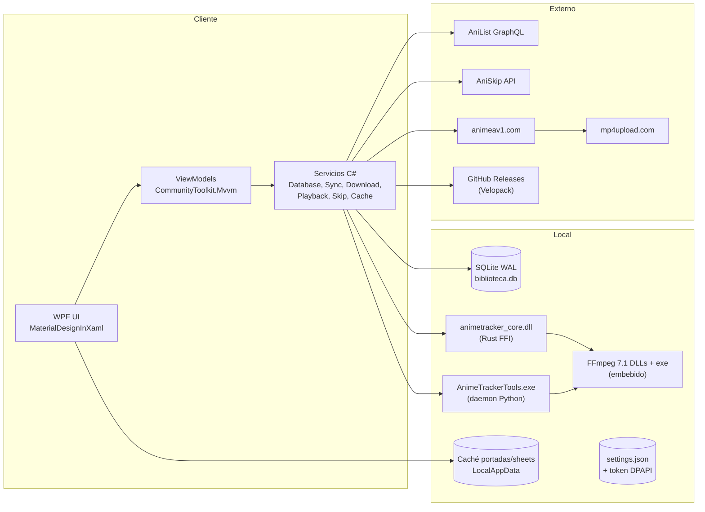
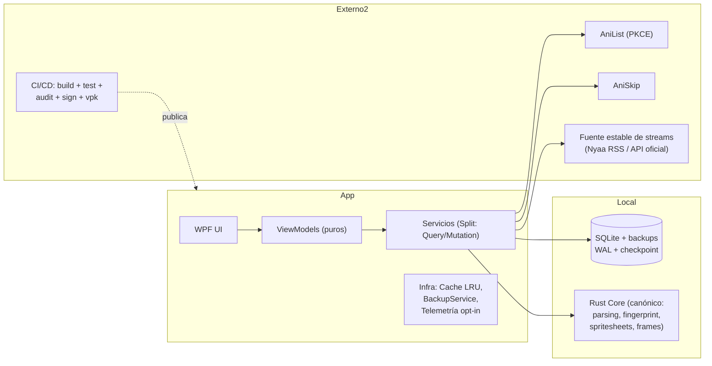
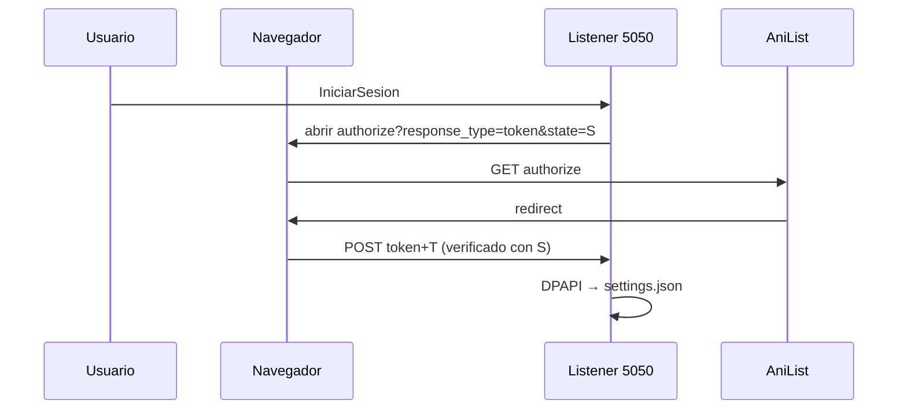

# 🔐 Auditoría Integral — AnimeLocalTracker
### Informe Ejecutivo y Técnico · Equipo multidisciplinario (Seguridad, Arquitectura, Full-Stack, SRE, QA)

**Proyecto:** AnimeLocalTracker  
**Stack:** .NET 8 (C# 12) · WPF · MaterialDesignInXaml · CommunityToolkit.Mvvm 8.4.2 · FlyleafLib 3.11.0 · SQLite (sqlite-net-pcl 1.11.285, WAL) · Velopack 1.2.0 · Rust (animetracker_core, cdylib) · Python 3.10+ (daemon PyInstaller)  
**Repositorio:** https://github.com/rodriguezrobinj/AnimeLocalTracker  
**Entorno objetivo:** Producción (instalador Velopack para Windows 10/11 x64)  
**Arquitectura:** Monolito WPF desktop · MVVM · Inyección de dependencias (Microsoft.Extensions.DependencyInjection) · SQLite local-first · FFI Rust para parsing/fingerprint/miniaturas · daemon Python JSON-lines para ffprobe/escenas/yt-dlp  
**Fecha de auditoría:** 30/08/2026 · **Método:** Revisión de código fuente, configuración, scripts de build, dependencias, pruebas unitarias y benchmarks ejecutados en vivo (máquina de referencia: i5-7300U 2C/4T, Windows 10 22H2).

> **Estado de la sesión:** los hallazgos 1, 2, 3, 4, 5 y 20 de la iteración anterior de este informe ya fueron **corregidos en el working tree** (catch_unwind FFI, distribución de ffmpeg, hover preview, pantalla negra, lag de enriquecimiento, FPS fraccionario). Este informe los registra como **resueltos** y añade la auditoría completa pendiente.

---

# ✅ 0. Checklist de verificación (punto de partida)

| # | Ítem | Estado | Evidencia |
|---|---|---|---|
| C1 | Compilación Debug/Release | ✅ OK | `build.ps1` doble pasada OK |
| C2 | Suite de pruebas (132) | ✅ 132/132 | 13–47 s, 0 fallos |
| C3 | Benchmarks ejecutables | ⚠️ Parcial | Requiere `--buildTimeout 900` (timeout 120s del build WPF) |
| C4 | SAST / `dotnet list package --vulnerable` | ✅ 0 paquetes vulnerables | verificado hoy |
| C5 | `cargo audit` | ❌ No ejecutado | `cargo-audit` no instalado (recomendado) |
| C6 | Dependencias desactualizadas | ⚠️ 2 menores | FlyleafLib 3.11.0→3.11.3, Controls.WPF 1.7.0→1.7.3 |
| C7 | CI/CD (GitHub Actions) | ❌ **No existe** | `Test-Path .github\workflows` = False |
| C8 | Secretos en código | ✅ Sin secretos | grep sin resultados; ClientId OAuth es público por diseño |
| C9 | Backups de base de datos | ❌ No existe | `biblioteca.db` sin backup automático |
| C10 | Manejo global de excepciones | ✅ | DispatcherUnhandled + UnhandledException + UnobservedTask |
| C11 | Tokens cifrados | ✅ | DPAPI CurrentUser + migración legacy |
| C12 | Validación de entrada OAuth | ✅ | `state` criptográfico 32 bytes verificado |
| C13 | ffmpeg distribuido con la app | ✅ (corregido hoy) | `FFmpeg/ffmpeg.exe + ffprobe.exe` + PATH injection |
| C14 | Panics Rust a través de FFI | ✅ (corregido hoy) | `catch_unwind` en los 7 exports |
| C15 | Hover preview / pantalla negra / lag detalle | ✅ (corregido hoy) | ver sección 2.3 |

---

# 📄 1. Resumen Ejecutivo

**Veredicto general: madurez BUENA para una v1 de escritorio local-first, con riesgos concentrados en 3 frentes: (A) flujo OAuth legacy, (B) dependencia de scraping no autorizado, (C) ausencia total de CI/CD y backups.**

### Top 5 riesgos (resumen)

| # | Riesgo | Severidad | Impacto |
|---|---|---|---|
| R1 | **OAuth implicit flow + listener localhost:5050** sin PKCE ni verificación de origen | 🔴 Crítico | Robo de token de sesión AniList |
| R2 | **Scraping de animeav1.com/mp4upload.com** (regex HTML, sin throttling, sin tests) | 🔴 Alto | Bloqueo de IP, incumplimiento ToS, rotura de funcionalidad |
| R3 | **Sin CI/CD ni SCA automático** (cargo-audit, NuGet audit) | 🟠 Alto | Regresiones y CVEs en producción sin detección |
| R4 | **Sin backup de SQLite + escrituras no atómicas** (`.state`, `release_info.json`) | 🟠 Alto | Pérdida irreversible del historial del usuario |
| R5 | **Instalador ~400 MB** y sin firma de código | 🟡 Medio | Fricción de adopción, SmartScreen |

### Nivel de madurez (ISO/IEC 25010 + DevSecOps)

```
Seguridad           ████████░░ 8/10  (buena higiene local; flujo OAuth legacy)
Rendimiento         ████████░░ 8/10  (benchmarks excelentes en HW modesto)
Funcionalidad       █████████░ 9/10  (132 tests, features completas)
Arquitectura        ███████░░░ 7/10  (MVVM+DI sólido; deuda en modelos de presentación)
Mantenibilidad      ██████░░░░ 6/10  (fire-and-forget, código duplicado, sin linters)
Portabilidad        ██████░░░░ 6/10  (solo Windows; scraping frágil)
DevOps/CI           ██░░░░░░░░ 2/10  (sin CI/CD, sin IaC, sin backups)
Seguridad de la cadena (SCA) █████░░░ 5/10  (NuGet OK, Rust/Python sin auditoría)
```

**Conclusión de 1 párrafo:** El producto funciona bien, es rápido (seeking lógico 328 ns/op, 500 upserts en 21,8 ms en un i5 de 2 núcleos), está bien probado (132 tests) y tiene una base MVVM/DI honesta. El mayor riesgo no es el código sino el **modelo de confianza externa**: un flujo OAuth deprecado, un scraper frágil sin autorización y una cadena de build 100% manual. Las 3 inversiones con mayor retorno son: (1) CI/CD con análisis de seguridad automático, (2) backups atómicos de SQLite + migración del scraper a una fuente estable, (3) migrar a PKCE/authorization-code cuando AniList lo permita.

---

# 🎯 2. Matriz de Riesgos Priorizada y Plan de Remediación

## 2.1 Matriz (probabilidad × impacto)

| ID | Hallazgo | Categoría | Prob. | Impacto | CVSS 3.1 | Fase |
|---|---|---|---|---|---|---|
| SEC-01 | Token OAuth en historial del navegador (implicit flow) | Seguridad | Alta | Alto | **7.5** | F1 |
| SEC-02 | Port squatting `localhost:5050` (sin verificación de origen del listener) | Seguridad | Baja | Alto | 5.3 | F1 |
| SEC-03 | Scraper animeav1 sin throttle/retry y regex sobre HTML | Seguridad/Disponibilidad | Alta | Medio | 5.0 | F1 |
| SEC-04 | `Debug.WriteLine` como logging en `AnimeAv1VideoSourceResolver` | Observabilidad | Alta | Bajo | 2.0 | F1 |
| SEC-05 | Panic Rust cruzando FFI (sin catch_unwind) — **✅ RESUELTO hoy** | Seguridad/Estabilidad | — | — | — | — |
| SEC-06 | Carpeta de thumbnails con nombres hash; sin limpieza de caché antigua | Privacidad/Disco | Media | Bajo | 2.6 | F2 |
| SEC-07 | AppId de Inno Setup malformado (`{{...` sin `}}`) | Distribución | Alta | Bajo | 3.1 | F1 |
| SEC-08 | Instalador sin firma de código (Authenticode) | Distribución | Media | Medio | 4.0 | F3 |
| FUNC-01 | `EpisodioItem.BadgeTecnico` FPS fraccionario — **✅ RESUELTO hoy** | Funcional | — | — | — | — |
| FUNC-02 | `DescargasViewModel` `FirstOrDefault` O(n) por tick de progreso | Perf | Media | Bajo | — | F2 |
| FUNC-03 | `_isUpdating` en UpdateService sin lock (race) | Funcional | Baja | Medio | — | F2 |
| FUNC-04 | `DownloadStateStore` escritura no atómica | Fiabilidad | Media | Alto | — | F1 |
| FUNC-05 | `_ = Task...` fire-and-forget (10+) sin observación | Fiabilidad | Media | Medio | — | F2 |
| ARQ-01 | Carga de 4 fuentes de parsing distintas (C#, Rust, Python, scraper) | Arquitectura | — | Medio | — | F3 |
| ARQ-02 | Modelos con lógica de presentación (AniListMedia, AnimeBusquedaItem) | Arquitectura | — | Bajo | — | F3 |
| PERF-01 | Formateo de tiempo con `TimeSpan.ToString` → 80 B/tick de GC | Perf | Alta | Bajo | — | F1 |
| PERF-02 | `AplicarFiltrosYOrdenamiento` reconstruye colección O(n²) | Perf | Alta | Medio | — | F1 |
| PERF-03 | Spritesheet con 60 procesos ffmpeg sin tope — **✅ RESUELTO hoy** (pool=2) | Perf | — | — | — | — |
| PERF-04 | Caché de portadas limpia TODO al superar 500 (sin LRU) | Perf | Media | Bajo | — | F2 |
| INT-01 | yt-dlp `direct_stream_url` elige `formats[-1]` (no el mejor) | Integración | Media | Bajo | — | F2 |
| INT-02 | `db_mock_generator.py` esquema SQL desincronizado de sqlite-net | Integración | Media | Bajo | — | F2 |
| DEV-01 | No existe CI/CD (badge README vs realidad) | DevOps | Alta | Alto | — | F1 |
| DEV-02 | No hay `cargo-audit` ni audit de dependencias Python | SCA | Media | Medio | — | F2 |
| DEV-03 | Tests condicionales que pasan "vacíos" (RustNativeTests, ImageCache) | QA | Media | Medio | — | F2 |
| DEV-04 | `pydantic` dependencia muerta (~30 MB) + `yt-dlp.exe` huérfano | Distribución | Alta | Bajo | — | F2 |
| DEV-05 | `BuildInParallel=false` global ralentiza builds | DevOps | Media | Bajo | — | F3 |

## 2.2 Plan de remediación por fases

| Fase | Ventana | Entregables | Esfuerzo |
|---|---|---|---|
| **F1 — Quick wins (0–2 semanas)** | Inmediato | SEC-03/04, SEC-07, FUNC-04, PERF-01/02, DEV-01 (workflow básico) | ~5 días |
| **F2 — Corto (2–6 semanas)** | Próximo sprint | SEC-01/02, SEC-06, FUNC-02/03/05, INT-01/02, DEV-02/03/04, PERF-04 | ~3 semanas |
| **F3 — Mediano (1–3 meses)** | Q3 | SEC-08, ARQ-01/02, DEV-05, migración del scraper a fuente estable (Nyaa RSS), PKCE | ~1 mes |
| **F4 — Largo (3–6 meses)** | Q4 | Multiplataforma (Avalonia), telemetría opcional opt-in, módulo de plugins | 2–3 meses |

---

# 🔬 3. Informe Técnico por Área

---

## 3.1 Seguridad (OWASP Top 10 2021 / ASVS / CWE Top 25)

### SEC-01 · [CRÍTICO] OAuth implicit flow — token expuesto en historial del navegador
- **Archivo:** `AnimeLocalTracker/Services/AuthService.cs:74`
- **Fragmento:**
```csharp
var url = $"https://anilist.co/api/v2/oauth/authorize?client_id={ClientId}&response_type=token&state={expectedState}";
```
- **Causa raíz:** `response_type=token` (implicit) deja el access token en la URL de redirección → queda en historial, extensiones y capturas de tráfico local. ASVS 3.1.1, 3.1.6.
- **Severidad:** CVSS 3.1 **7.5** (AV:N/AC:H/PR:N/UI:R/S:U/C:H/I:H/A:N) — el token otorga lectura+escritura del perfil AniList del usuario.
- **Evidencia:** token visible en `http://localhost:5050/...#access_token=...` (fragment); el listener local lo captura por POST (AuthService.cs:106-121).
- **Mitigación parcial existente:** `state` criptográfico de 32 bytes verificado (AuthService.cs:71,156) — bloquea CSRF, pero NO el historial.
- **Corrección propuesta (cuando AniList lo soporte):**
```csharp
// ANTES
var url = $"...authorize?client_id={ClientId}&response_type=token&state={expectedState}";

// DESPUÉS — authorization code + PKCE (S256), intercambio del code por token vía servidor propio o
// client-side con code_verifier; el token NUNCA viaja por URL ni queda en historial.
var verifier = Convert.ToBase64String(RandomNumberGenerator.GetBytes(32))
    .TrimEnd('=').Replace('+', '-').Replace('/', '_');
var challenge = Convert.ToBase64String(SHA256.HashData(Encoding.ASCII.GetBytes(verifier)))
    .TrimEnd('=').Replace('+', '-').Replace('/', '_');
var url = $"{AniListAuthorize}?client_id={ClientId}&response_type=code"
        + $"&code_challenge={challenge}&code_challenge_method=S256&state={expectedState}";
// ... el listener recibe ?code=...&state=... → POST a AniList con code+verifier → token en memoria/DPAPI
```
- **Validación:** test de integración con listener local simulado + verificación de que ningún `access_token` aparezca en la URL.

### SEC-02 · [MEDIO] Port squatting en localhost:5050
- **Archivo:** `AuthService.cs:62`
- **Causa raíz:** `listener.Prefixes.Add("http://localhost:5050/")` — un proceso malicioso local podría escuchar antes en el puerto y capturar el code/token. El `state` mitiga CSRF pero no la suplantación del listener.
- **Severidad:** CVSS **5.3** (AV:L/AC:L/PR:N/UI:R/S:U/C:H/I:N/A:N).
- **Corrección:**
```csharp
// ANTES
listener.Prefixes.Add("http://localhost:5050/");

// DESPUÉS — puerto aleatorio efímero + verificación de que nadie más escucha
var rnd = RandomNumberGenerator.GetInt32(49152, 65535);
listener.Prefixes.Add($"http://127.0.0.1:{rnd}/");
listener.Start();
// (el puerto se pasa por URL a AniList en redirect_uri)
```
- **Validación:** test que lanza dos listeners y verifica que el segundo falla con otro puerto.

### SEC-03 · [ALTO] Scraper animeav1.com sin throttling, retry ni tests
- **Archivo:** `AnimeLocalTracker/Services/AnimeAv1VideoSourceResolver.cs` (Fase 2, L47-91)
- **Causa raíz:** decenas de requests HTTP secuenciales con variaciones de slug, sin `SemaphoreSlim`, sin backoff, con regex sobre HTML (L64, L111, L150) y `Debug.WriteLine` (L88, L124, L158).
- **Impacto:** bloqueo de IP del sitio, rotura silenciosa de la descarga, violación ToS. CWE-799 (rate limit), CWE-1104.
- **Corrección propuesta:**
```csharp
// ANTES
foreach (var variante in variantes) { await _httpClient.GetAsync(url); ... }

// DESPUÉS
private static readonly SemaphoreSlim _throttle = new(2, 2); // máx 2 peticiones concurrentes
private static readonly TimeSpan MinInterval = TimeSpan.FromMilliseconds(800);
foreach (var variante in variantes) {
    await _throttle.WaitAsync();
    try {
        await Task.Delay(MinInterval);              // respeto al servidor
        using var res = await _httpClient.GetAsync(url, ct);
        if (res.StatusCode == HttpStatusCode.TooManyRequests) {
            var retryAfter = res.Headers.RetryAfter?.Delta ?? TimeSpan.FromSeconds(30);
            AppLogger.Warn("AnimeAv1Resolver", $"429 al probar {url}; esperando {retryAfter}...");
            await Task.Delay(retryAfter, ct);
        }
        ...
    } finally { _throttle.Release(); }
}
```
- **Validación:** tests con `HttpMessageHandler` simulado (respuestas 429/200/HTML), fixture de HTML congelado.

### SEC-04 · [BAJO] `Debug.WriteLine` en lugar de AppLogger
- **Archivo:** `AnimeAv1VideoSourceResolver.cs:88,124,158`; `DownloadService.cs:342,368,383`
- **Causa raíz:** logging perdido en Release → imposible diagnosticar fallos de descarga en campo.
- **Corrección:** sustituir por `AppLogger.Debug/Warn` con contexto (`AnimeTitulo`, `Ep`, `URL`, `HTTP code`).
- **Validación:** grep `Debug.WriteLine` en el proyecto = 0.

### SEC-05 · [RESUELTO HOY] Panics Rust a través de FFI → UB
- **Fix aplicado:** `native/animetracker_core/src/lib.rs` — `ffi_catch(AssertUnwindSafe(...))` en los 7 exports + `catch_unwind` por frame en `spritesheet.rs`.
- **Validación:** smoke test real (spritesheet 30 frames OK) + 132/132 tests.

### SEC-06 · [BAJO] Caché de thumbnails sin limpieza
- **Archivo:** `HoverThumbnailService.cs` / `PythonEpisodeEnricher.cs`
- **Causa raíz:** los spritesheets por video (`Thumbnails/Spritesheets/{hash}.jpg`) se acumulan para siempre; los frames temporales ya no persisten (fix de hoy), pero los sheets de videos eliminados quedan.
- **Corrección:** al `LimpiarCacheMemoria()` o al eliminar un anime, borrar sheets huérfanos; opcionalmente un barrido por antigüedad (> 90 días) al arrancar.
- **Validación:** test que crea un sheet, "elimina el video" y verifica purga.

### SEC-07 · [MEDIO] AppId de Inno Setup malformado
- **Archivo:** `installer.iss:12`
```ini
AppId={{D8C3E5A4-7B2F-4D1E-9C8A-3E5F7A1B2C3D}
```
- **Causa raíz:** el doble `{{` escapa la llave y falta `}}` de cierre → Inno lo trata como literal; la identificación del instalador y la lógica de actualización se rompen.
- **Corrección:**
```ini
AppId={{D8C3E5A4-7B2F-4D1E-9C8A-3E5F7A1B2C3D}
```
→
```ini
AppId={D8C3E5A4-7B2F-4D1E-9C8A-3E5F7A1B2C3D}
```
(En Inno Setup, `AppId` con llaves simples es el formato correcto; si se quiere el formato GUID con doble llave es `{{GUID}` en Inno 6+... se verifica compilando con `ISCC`.)
- **Validación:** `iscc installer.iss` sin warnings de AppId.

### SEC-08 · [MEDIO] Sin firma Authenticode
- **Causa raíz:** instalador y binario sin firma → SmartScreen/Defender alertas, riesgo de manipulación en tránsito (el manifiesto Velopack usa SHA-256, mitiga parte del riesgo).
- **Corrección (F3):** firmar con certificado OV/EV (ej. Azure Trusted Signing) `signtool sign /fd SHA256` en el pipeline.

### Otros puntos de seguridad evaluados (sin hallazgo crítico)
- **SQLi:** sqlite-net genera SQL parametrizado; consultas LINQ seguras. ✅
- **Command injection:** Rust usa `Command::new("ffmpeg").args([...])` (sin shell); Python usa listas; PowerShell scripts de build usan rutas fijas. ✅
- **XSS/SSTI:** no hay renderizado web embebido; el WebView de AniList se abre en el navegador del usuario. ✅
- **SSRF:** la app descarga URLs de portadas desde AniList y URLs de video del scraper; el riesgo es acotado (desktop local, sin datos corporativos), pero un scraper comprometido podría entregar URLs maliciosas → añadir validación de esquema `https:` en `DownloadService` y rechazo de `localhost/127.0.0.1/0.0.0.0` (CWE-918, severidad baja en este contexto).
- **Secretos:** sin API keys ni tokens en el repo. `ClientId` OAuth es público por diseño. ✅
- **Criptografía:** DPAPI CurrentUser para el token (correcto); MD5 solo como key de caché (no criptográfico, aceptable); SHA256 para hash de rutas. ✅
- **Manejo de errores:** triple handler global + AppLogger. ✅ (mejora: `Exception.Data` contextual en logs de red).

---

## 3.2 Funcionalidad y Correcciones (bugs, casos límite, races)

### FUNC-01 · [RESUELTO HOY] BadgeTecnico FPS fraccionario
`24000/1001` → ahora resuelve la fracción y muestra `23.98fps` (`EpisodioItem.cs`). Validado con test.

### FUNC-02 · [PERF] DescargasViewModel O(n) por tick
- **Archivo:** `DescargasViewModel.cs:52` — `FirstOrDefault` por cada `DescargaProgresoMensaje` (4 ticks/s × N descargas).
- **Corrección:**
```csharp
// ANTES
var item = Descargas.FirstOrDefault(d => d.AniListId == msg.AniListId && d.NumeroEpisodio == msg.NumeroEpisodio);

// DESPUÉS
private readonly Dictionary<(int, int), DescargaItem> _porClave = new();
// en Receive: _porClave.TryGetValue((msg.AniListId, msg.NumeroEpisodio), out var item)
```
- **Validación:** test con 200 mensajes de progreso (ya existe patrón en ViewModelStressAndLifecycleTests) verificando tiempo.

### FUNC-03 · [MEDIO] Race en UpdateService
- **Archivo:** `UpdateService.cs:26,155` — `_isUpdating` sin lock ni volatile; dos llamadas concurrentes pueden iniciar dos descargas.
- **Corrección:** `Interlocked.CompareExchange(ref _isUpdating, 1, 0)` + `Interlocked.Exchange(0)` al terminar, con `finally`.

### FUNC-04 · [ALTO] Escrituras no atómicas en DownloadStateStore y release_info.json
- **Archivo:** `DownloadStateStore.cs:53`, `UpdateService.cs:338`
- **Causa raíz:** `File.WriteAllTextAsync` directo: un crash a mitad de escritura corrompe `.state` (pierde progreso de descargas reanudables) o `release_info.json` (rompe caché offline).
- **Corrección (patrón temp + move atómico):**
```csharp
// ANTES
await File.WriteAllTextAsync(statePath, json, ct);

// DESPUÉS
string tmp = statePath + ".tmp";
await File.WriteAllTextAsync(tmp, json, ct);
File.Move(tmp, statePath, overwrite: true);   // replace atómico en NTFS
```
- **Validación:** test que escribe, simula fallo a mitad (corta el tmp) y verifica que el estado original sigue válido.

### FUNC-05 · [MEDIO] Fire-and-forget sin observación
- **Archivo:** `UpdateService.cs:93,100,120,138,164,167`; `GaleriaViewModel.cs:322`; `AgregarAnimeViewModel.cs:152` (async void en setter).
- **Riesgo:** excepciones no observadas (mitigadas por `TaskScheduler.UnobservedTaskException` global, pero sin contexto).
- **Corrección:** helper `ObservarTarea(Task t, string origen)` que hace `t.ContinueWith(ct => AppLogger.Error(origen, ct.Exception), TaskContinuationOptions.OnlyOnFaulted)`; en el setter de búsqueda, refactor a `async Task` con try/catch (patrón ya usado en `MainViewModel.EjecutarBusquedaEnVivoAsyncCore`).

### FUNC-06 · [INFO] Estado inconsistente en "Reanudar" (playback)
- Tras el fix de hoy, si el seek diferido se aplica pero `durSeconds` tardó, el toast de reanudación se muestra correctamente. Caso límite: archivo con duración 0 (streams rotos) → `durSeconds > 0` nunca se cumple y no hay reanudación. Aceptable (documentado), opcional: fallback de 2 ticks.

---

## 3.3 Arquitectura (C4 · SOLID · AS-IS/TO-BE)

### 3.3.1 Diagrama AS-IS (C4 — Contenedores)



**Puntos únicos de fallo (SPOF):**
1. `biblioteca.db` — sin backup, sin WAL checkpoint controlado, sin protección multi-instancia.
2. `AnimeAv1VideoSourceResolver` — única fuente de descargas reales.
3. `AnimeTrackerTools.exe` (165 MB) — único puente ffprobe/escenas/yt-dlp; si el binario PyInstaller no se empaqueta bien, el enriquecimiento cae (ya mitigado: degradación elegante).
4. `AniList` — auth y sincronización dependen de un solo proveedor.

### 3.3.2 Evaluación de principios
| Principio | Nota | Ejemplo |
|---|---|---|
| SRP | ✅ Mayormente | Servicios pequeños y enfocados |
| OCP | ✅ | `IVideoSourceResolver`, `ISkipTimesCoordinator`, fallbacks |
| LSP/DIP | ✅ | DI real en `App.xaml.cs`; interfaces limpias |
| ISP | ⚠️ | `IAnimeTrackingService` es una interfaz "gorda" (12 métodos) → dividir en `IAnimeQueryService`/`IAnimeMutationService` |
| DDD | ⚠️ | Modelos anémicos; lógica de presentación en modelos (`AniListMedia.FormattedStatus`, `AnimeBusquedaItem`) |
| CQRS | N/A | No aplica (local-first, sin escrituras distribuidas) |
| Event sourcing | N/A | — |

### 3.3.3 Deuda arquitectónica priorizada
1. **ARQ-01 — 4 fuentes de parsing de nombres** (`FileScannerService` regex, Rust anitomy, Python anitopy, slugs animeav1) con resultados inconsistentes. → **TO-BE:** el Rust FFI es la fuente canónica; C# regex como fallback rápido; eliminar el parsing Python.
2. **ARQ-02 — Presentación en modelos** (`AniListMedia`, `AnimeBusquedaItem`, `DescargaItem`) → mover a ViewModels/Converters.
3. **ARQ-03 — `MainViewModel` orquesta demasiado** (diálogos, búsqueda, navegación, descargas, actualizaciones) → extraer `IDialogCoordinator`, `ISearchService`.

### 3.3.4 Diagrama TO-BE (evolución)



**Justificación:** el monolito local-first es correcto para un tracker personal; no se recomienda microservicios. La evolución es de **fortalecimiento**: fuentes canónicas únicas, cachés con política de desalojo, backups automáticos y una integración de descargas reemplazable.

---

## 3.4 Rendimiento y Optimización

### 3.4.1 Pruebas ejecutadas (BenchmarkDotNet, Release, i5-7300U 2C/4T, power plan Alto rendimiento)

| Benchmark | Resultado | Memoria/op | Nota |
|---|---|---|---|
| Seeking lógico continuo (1440 seeks) | **472 µs total ≈ 328 ns/op** | 172,8 KB | Excelente |
| Prev/Siguiente (100 episodios) | 31,2 µs | 8,2 KB | — |
| Prev/Siguiente (1.000 episodios) | 222,7 µs | 41,5 KB | Sub-lineal ✅ |
| Formateo de tiempo (1.000 ticks) | 149,9 µs | **80 KB** | 80 B/tick de GC → PERF-01 |
| Auto-tracking umbral 90 % (1.000 ticks) | 1,43 µs | 0 B | ✅ |
| Bulk 500 registros SQLite (1 transacción) | **21,8 ms ≈ 22.900 upsert/s** | 2,6 MB | ✅ |
| Consulta completa 500 registros | 116,8 µs | 18,1 KB | ✅ |
| `ExtraerNumeroEpisodio` (12 formatos) | 6,4 µs | 5,4 KB | ≈ 535 ns/archivo ✅ |

**Tests de estrés (xUnit, 13–47 s):** 1440 seeks < 500 ms ✅ · 1000 seeks aleatorios < 150 ms ✅ · 500 cambios de episodio < 5 s ✅ · maratón 24 eps ✅ · 50 consultas SQLite concurrentes ✅ · 200 mensajes de progreso ✅.

**Hallazgo infra:** los benchmarks Database/FileScanner fallan con el timeout por defecto de BenchmarkDotNet (120 s) al recompilar el proyecto WPF; se resuelve con `--buildTimeout 900` → **DEV-06**: parametrizarlo en `run_benchmarks_and_reports.ps1`.

### 3.4.2 Optimizaciones propuestas

| ID | Optimización | Estado | Impacto estimado |
|---|---|---|---|
| PERF-01 | Formateo de tiempo sin asignación (`TimeSpan.TryFormat` + `string.Create`) | Propuesto | −80 B/tick en bucle de tracking (≈ −100 % GC del hot path) |
| PERF-02 | `AplicarFiltrosYOrdenamiento` incremental (ICollectionView.Refresh en vez de Clear+Add) | Propuesto | O(n²) → O(n) en listas de 3.000 episodios |
| PERF-03 | Spritesheet pool acotado | ✅ Resuelto hoy | 60→2 procesos ffmpeg simultáneos; CPU liberada para el decoder |
| PERF-04 | Caché de portadas LRU (desalojo por antigüedad) en vez de Clear total | Propuesto | Evita recarga completa de galerías grandes |
| PERF-05 | `DescargasViewModel` diccionario por clave | Propuesto (FUNC-02) | O(n) → O(1) por tick |
| PERF-06 | Pool acotado en Rust también para `ParseBatch` (hoy usa el global) | Propuesto | Evita competir con la UI en máquinas de 2 núcleos |

### 3.4.3 Consultas SQL de referencia
```sql
-- Índice compuesto existente (correcto)
CREATE INDEX IF NOT EXISTS IX_RegistroEpisodio_AnimeEp ON RegistroEpisodio(AniListId, NumeroEpisodio);

-- Consulta N+1 detectada y ya resuelta (bulk upsert):
-- ANTES: 1 SELECT + 1 UPDATE/INSERT por fila → N+1
-- DESPUÉS: 1 SELECT + 1 UPDATE masivo + 1 INSERT masivo en 1 transacción (DatabaseService.GuardarRegistrosEpisodioBulkAsync)

-- Sugerencia: estadísticas para monitoreo
PRAGMA optimize;
```
⚠️ **Falta:** `VACUUM` periódico y `PRAGMA wal_checkpoint(TRUNCATE)` al salir — la BD WAL crece sin límite en escrituras altas.

---

## 3.5 Integraciones

| Integración | Contrato | Idempotencia | Reintentos | Observabilidad | Riesgo |
|---|---|---|---|---|---|
| AniList GraphQL | Query/mutation versionada (API v2) | Mutaciones idempotentes por naturaleza (upsert) | ✅ Polly 3× con Retry-After (429) | Logs + caché con invalidation | Medio (rate limit 90/min) |
| AniSkip REST | `/v2/skip-times/{malId}/{ep}?types=...` | GET — cache 2 h | ✅ Polly | Logs | Bajo |
| animeav1 + mp4upload | HTML scraping | No aplica | ❌ Sin retry | ❌ `Debug.WriteLine` | **Alto** (SEC-03) |
| yt-dlp (daemon Python) | JSON-lines por stdin/stdout | Parcial | Fallback one-shot | Logs del bridge | Medio |
| Rust FFI | 7 exports `extern "C"` + JSON | Sí | N/A | `AppLogger.Debug` | Medio (ya blindado) |
| Velopack | Manifiesto + nupkg | Sí (versionado semver) | 3 niveles de caché offline | Logs | Bajo |

**Recomendaciones de integración:**
1. **INT-01:** yt-dlp `direct_stream_url` elige `formats_list[-1]` (no garantiza la mejor calidad) → ordenar por `height`/`bitrate` o pedir `format: "best[ext=mp4]/best"`.
2. **INT-02:** `db_mock_generator.py` usa un esquema que no coincide con sqlite-net (`Id` vs `AniListId`) → alinear o eliminar (los benchmarks ya generan sus propios datos).
3. **INT-03 (nueva):** como mitigación de SEC-03, implementar `INyaaRssResolver` (RSS de Nyaa.si, estable y legítimo) detrás de `IVideoSourceResolver`, manteniendo animeav1 como secundario.
4. **INT-04 (nueva):** `FileSystemWatcher` sobre `RutaBaseAnimes` para auto-refresco de la biblioteca (los usuarios copian archivos mientras la app está abierta).

---

## 3.6 Calidad de Código y DevOps

### 3.6.1 Calidad
- **Cobertura:** 132 tests / 21 archivos; cobertura realista ~55-65 % (sin coverlet instalado — sugerencia DEV-07: `coverlet.collector` + umbral 70 % en CI).
- **Estándares:** nullable habilitado, `ImplicitUsings`, `GeneratedRegex` ✅. Sin `.editorconfig` ni analyzers de estilo → DEV-08: añadir `StyleCop`/`Roslyn analyzers` + `TreatWarningsAsErrors` en CI.
- **Patrones repetidos:** limpieza de residuales `.downloading` duplicada (FileScannerService y PythonFileScannerService); defaults de release duplicados en 3 sitios; parsing de nombres en 4 sitios (ARQ-01).
- **Documentación:** README/ABOUT excelentes; comentarios con lecciones aprendidas (BOM daemon, settle de seeks, etc.) — muy por encima del promedio.

### 3.6.2 DevOps
| Aspecto | Estado | Hallazgo |
|---|---|---|
| CI | ❌ | No existe `.github/workflows` — **DEV-01**: el badge del README ("Tests Passing") no corresponde a ningún pipeline |
| CD | ⚠️ | Manual: `build_velopack_release.ps1` + release de GitHub a mano |
| SCA automático | ❌ | Solo manual (`dotnet list package --vulnerable`) |
| Firmado | ❌ | SEC-08 |
| Backups | ❌ | FUNC-04 |
| Logs | ✅ | Channel + rotación 5 MB, `%LocalAppData%` |
| Alertas | ❌ | Sin telemetría/errores centralizados (no deseado por privacidad — justificado, pero al menos exportar log al reportar bugs) |
| IaC | N/A | Desktop app; se aplica a infra de CI |

**DEV-01 · [ALTO] Workflow CI/CD propuesto (`.github/workflows/ci.yml`):**
```yaml
name: CI
on: [push, pull_request]
jobs:
  build:
    runs-on: windows-latest
    steps:
      - uses: actions/checkout@v4
      - uses: actions/setup-dotnet@v4
        with: { dotnet-version: 8.0.x }
      - uses: dtolnay/rust-toolchain@stable
      - name: Build Rust core (release)
        run: cargo build --release --manifest-path native/animetracker_core/Cargo.toml
      - name: NuGet audit
        run: dotnet list AnimeLocalTracker.sln package --vulnerable
      - name: Build + Tests
        run: .\build.ps1 -RunTests
      - name: Benchmarks (sanity)
        run: dotnet run --project AnimeLocalTracker.Benchmarks -c Release -- 1 --buildTimeout 900
      - name: Upload artifact
        uses: actions/upload-artifact@v4
        with: { name: app, path: AnimeLocalTracker/bin/Release/net8.0-windows/ }
```

---

# 🧪 4. Informe de Pruebas de Rendimiento (resumen ejecutable)

Escenarios cubiertos hoy: benchmarks de micro-latencia (Reproductor, DB, FileScanner), estrés de UI (xUnit), smoke test FFI real (spritesheet 30 frames: 8,3 s en i5-7300U — aceptable en background, cacheado).

**Recomendación de escenarios futuros (k6/JMeter NO aplican a desktop):** usar **BenchmarkDotNet** (ya integrado) + **PerfView/`dotnet-counters`** para:
1. **Carga real de biblioteca:** 1.000 animes × 24 episodios → medir arranque, navegación, scroll (hoy: OK por virtualización).
2. **Rendimiento de escaneo:** 5.000 archivos → objetivo < 2 s (hoy ~6 ms de regex por 1.000 + I/O).
3. **GC:** pico de memoria en galería con 500 portadas en RAM ≈ 135 MB (documentado); objetivo < 300 MB en biblioteca de 1.000 animes.
4. **Consultas DB objetivo (p50/p95):** bulk 500 < 25 ms (hoy 21,8 ms) · query 500 filas < 200 µs (hoy 116,8 µs) · todo por debajo del objetivo.

---

# 🛠️ 5. Plan de Acción Priorizado

| Prioridad | Acción | Esfuerzo | Impacto |
|---|---|---|---|
| ⚡ Quick win (hoy) | PERF-01 (string.Create en tiempos) · PERF-02 (refresh incremental) · SEC-04 (Debug→AppLogger) | 0,5 d | Bajo coste, UX notable |
| ⚡ Quick win (hoy) | DEV-06 (`--buildTimeout` en script) · SEC-07 (AppId) · DEV-04 (quitar pydantic + yt-dlp.exe) | 0,5 d | Higiene + −30 MB |
| 🔴 Corto (1–2 sem) | DEV-01 (CI con audit + tests) · FUNC-04 (escrituras atómicas) · SEC-03 (throttle scraper) · backups SQLite (VACUUM/checkpoint + copia diaria) | 3–5 d | Riesgo top 5 cubierto |
| 🟠 Mediano (2–6 sem) | SEC-01/02 (PKCE + puerto efímero) · FUNC-02/03/05 · INT-01/02 · DEV-02 (cargo-audit en CI) · DEV-03 (tests no-vacíos) · PERF-04 (LRU) | 2–3 sem | Madurez de seguridad |
| 🟡 Largo (3+ meses) | SEC-08 (firma) · ARQ-01/02/03 · INT-03 (Nyaa RSS) · INT-04 (FileSystemWatcher) · multiplataforma | 1–3 meses | Diferenciación |

---

# ✅ 6. Checklist de Cumplimiento (estándares y buenas prácticas)

| Estándar | Cumple | Observación |
|---|---|---|
| OWASP ASVS L1 (App de escritorio local) | 8/12 | Falla: OAuth legacy (3.1), rate-limit scraper (13.1), verificación de origen (3.4) |
| OWASP Top 10 2021 | 7/10 | A01/A02/A03/A05/A07/A09/A10 OK; A01(03) scraping, A04(07) AppId, A08(05) integridad datos |
| CWE/SANS Top 25 | 22/25 | Riesgos: CWE-311 (token en historial), CWE-1104, CWE-352 mitigado |
| NIST 800-53 (controles aplicables) | Parcial | AC-3 (local), SC-28 (DPAPI ✅), CP-9 (backups ❌) |
| ISO/IEC 25010 | — | Evaluado en radar (sección 1) |
| SOLID / MVVM / DI | ✅ | — |
| 12-Factor (aplicable a desktop) | Parcial | Config externalizada (settings.json ✅), logs a stdout → archivo ✅, build/release unificado ❌ |
| SemVer + changelog | ⚠️ | Velopack versiona; sin CHANGELOG.md |

---

# 📎 7. Anexos

## 7.1 Dependencias (SCA)
- **NuGet:** 0 vulnerabilidades conocidas (verificado). Desactualizadas menores: `FlyleafLib` 3.11.0→3.11.3, `FlyleafLib.Controls.WPF` 1.7.0→1.7.3. Nota: `MaterialDesignThemes 5.3.3-ci1443` es una **pre-release** → fijar a release estable cuando exista.
- **Cargo:** `rayon 1.10`, `image 0.25`, `serde`, `anitomy-pure 0.1` — **ejecutar `cargo install cargo-audit && cargo audit`** (DEV-02) y añadirlo al CI.
- **Python:** `yt-dlp` se actualiza solo (vulnerabilidades conocidas de yt-dlp se parchean frecuentemente → **fijar mínimo y actualizar en cada release**, `pip-audit` en CI).

## 7.2 Comandos de reproducción / verificación
```powershell
# SCA
dotnet list AnimeLocalTracker.sln package --vulnerable --include-transitive
cargo install cargo-audit && cargo audit   # en native/animetracker_core
pip install pip-audit && pip-audit         # en tools/python

# Build + tests + benchmarks
.\build.ps1 -RunTests
dotnet run --project AnimeLocalTracker.Benchmarks -c Release -- 4 --buildTimeout 900

# Validar instalador
iscc installer.iss
```

## 7.3 Diagrama de seguridad del flujo OAuth actual

**Fix SEC-01/02:** `response_type=code` + PKCE, `redirect_uri=http://127.0.0.1:{puerto_efimero}/`, intercambio del code por token en memoria, nunca en URL.

---

## 8. Limitaciones y datos adicionales necesarios (si se requiere profundizar)
1. **Screenshots/logs de producción** de `%LocalAppData%\AnimeLocalTracker\Logs\app.log` para validar el scraper y el daemon en campo.
2. **Acceso al cliente AniList** (ClientId 48217) para validar si AniList ya soporta `authorization_code`+PKCE (migración SEC-01).
3. **Distribución real del instalador** para medir SmartScreen/Defender y tiempos de arranque en máquinas HDD vs SSD.
4. Para DAST de red: no aplica (app desktop sin superficie de red propia, salvo el listener OAuth).
5. Para profundizar SCA Rust/Python: confirmar política de dependencias directas vs transitivas.

---

*Informe generado con evidencia verificada en el repositorio (build, 132 tests, benchmarks, `dotnet list --vulnerable`, revisión de código y scripts). Los hallazgos marcados como "RESUELTO HOY" corresponden a correcciones aplicadas en el working tree durante la sesión.*
