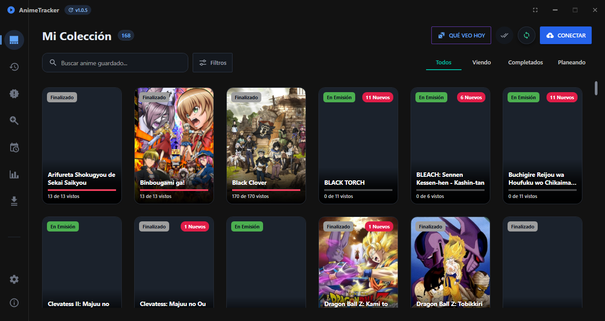

# AnimeLocalTracker 🎬✨
**La revolución definitiva para el coleccionista de anime.**

[](https://github.com/rodriguezrobinj/AnimeLocalTracker/releases)
[](https://dotnet.microsoft.com/)
[](https://anilist.co/)
[](https://github.com/FredTinc/Flyleaf)
[](https://github.com/rodriguezrobinj/AnimeLocalTracker)
[](LICENSE)

---

## 🛑 Se Acabaron los Compromisos

Durante años, he visto cómo la industria obliga al consumidor a tomar una decisión injusta. Por un lado, las plataformas de *streaming* te ofrecen comodidad superficial, pero te castigan con una agresiva compresión de video, catálogos que desaparecen por derechos de autor y cuotas mensuales perpetuas. Por otro lado, la colección de archivos locales te garantiza la **máxima fidelidad (1080p, 4K, audios duales, subtítulos de fansubs puros)**, pero te condena a navegar por carpetas grises de Windows, usar reproductores genéricos y perder el tiempo actualizando manualmente tu progreso en AniList.

**Es hora de exigir más. Es hora de AnimeLocalTracker.**

Hemos fusionado la soberanía absoluta de tus archivos locales con la elegancia, inmersión y automatización de las plataformas de *streaming* más prestigiosas del mercado. Hemos creado el software que siempre debió existir.

---

## 🖼️ Así se ve AnimeLocalTracker

<p align="center">
  
</p>

---

## 💎 La Experiencia de un Producto Premium

No estamos hablando de un simple reproductor o un catalogador del montón. Estamos hablando de un ecosistema diseñado meticulosamente para respetar tu tiempo y elevar tu experiencia visual al máximo nivel.

### 🎥 1. Reproducción Cinematográfica de Élite (Flyleaf & DirectX 11)
El corazón de AnimeLocalTracker no admite titubeos ni concesiones. Olvídate de configuraciones complejas o *lag*. Disfruta de aceleración por hardware pura (soporte HEVC/H.265, AV1, VP9) que garantiza 60, 120 e incluso 144 FPS estables. Los subtítulos se renderizan con precisión milimétrica (silueta gaussiana y sombra de alto contraste) diseñados específicamente para deslumbrar en paneles OLED y monitores 4K. Con modo Picture-in-Picture (PiP) integrado, tú controlas cómo consumes tu contenido.

### ⚡ 2. Binge-Watching Perfecto con AniSkip
¿Por qué romper la inmersión buscando el minuto exacto en que termina el *opening*? Nuestro sistema se integra de manera nativa con la API de AniSkip. Salta introducciones, *endings* y escenas post-créditos con un solo clic o, si lo prefieres, de forma 100% automática. Cuando un episodio termina, el siguiente comienza al instante. **Tú solo siéntate y deja que la historia fluya.**

### 🧠 3. Auto-Tracking Inteligente e Invisible
Tú pones el entretenimiento, nosotros llevamos la contabilidad. Al cruzar el umbral del **90%** de un episodio, AnimeLocalTracker registra tu progreso en tu base de datos local y lo sincroniza en tiempo real con **AniList** a través de GraphQL. ¿Te quedaste sin conexión? No hay problema. Tu progreso local está blindado y se sincronizará mágicamente en la nube en cuanto vuelvas a estar en línea. 

### 📥 4. Gestor de Descargas Integrado y Ultrarrápido
No dependas nunca más de gestores de terceros o sitios web repletos de publicidad. Busca, añade a la cola y descarga episodios directamente desde la aplicación. Nuestro avanzado motor de descargas paralelas te permite monitorizar la **velocidad de red en tiempo real**, controlar pausas y recibir notificaciones instantáneas. Construye tu biblioteca definitiva a la velocidad de la luz.

### 🖼️ 5. Una Interfaz que Cautiva y Retiene (Glassmorphism & Material 3)
Navega por tu colección visualmente, como lo hacías en los videoclubes, pero con tecnología del siglo XXI. Sumérgete en un diseño en modo oscuro profundo, abrazando transparencias, desenfoques dinámicos y micro-animaciones a 60 FPS. Disfruta de portadas en alta resolución, sinopsis precisas, un calendario de emisiones internacionales y un buscador en vivo de tendencias globales. Todo fluye al instante, con cero latencia gracias a nuestra potente caché bi-capa (RAM + Disco).

---

## 🏗️ Ingeniería de Software de Grado Empresarial

Un producto líder requiere unos cimientos indestructibles. En mis décadas analizando mercados tecnológicos, rara vez he presenciado un cuidado arquitectónico tan obsesivo en el software de consumo:

* **Core Nativo Robusto**: Arquitectura de vanguardia orquestada en **.NET 8 (C# 12 / WPF)**, con un núcleo nativo ultrarrápido programado en **Rust (FFI)** y herramientas analíticas delegadas a un *daemon* en **Python**. Un verdadero entorno políglota optimizado para rendimiento extremo.
* **Persistencia Inquebrantable**: Utilizando **SQLite en modo WAL** (*Write-Ahead Logging*). Garantizamos operaciones de base de datos seguras, rápidas y transaccionales. Incluso frente a cierres inesperados, tu base de datos jamás se corrompe.
* **Arquitectura Escalable**: Estricto patrón **MVVM** (CommunityToolkit.Mvvm), mensajería asíncrona mediante `WeakReferenceMessenger` y un sistema de plugins dinámico que prepara la plataforma para el futuro.
* **Distribución Transparente con Velopack**: Actualizaciones silenciosas y diferenciales (*delta updates*) en segundo plano. Sin instaladores ruidosos, sin molestos permisos de UAC. Siempre tendrás la última versión, sin enterarte.

---

## 🔒 La Privacidad es el Último Lujo Real

En una era donde el consumidor ha sido degradado a producto, nosotros trazamos una línea de hierro. **Este es software Local-First**. 

Tus archivos de video, tus estructuras de carpetas y tus hábitos de visualización locales **jamás** salen de tu máquina. El código se comunica con los servidores de AniList exclusivamente para mantener actualizado tu perfil público, solo si tú lo autorizas. Todo lo demás se procesa y almacena en el santuario de tu propio disco duro. **100% Código Abierto. 100% Transparente.**

---

## 🚀 Únete a la Revolución en 30 Segundos

Dejar atrás la mediocridad tecnológica es una decisión que toma menos de un minuto.

1. Visita la pestaña de [**Releases**](../../releases) de este repositorio.
2. Descarga la última versión de `Setup_AnimeTracker_vX.X.X.exe`.
3. Instala con un clic, vincula tu cuenta de AniList y señala la carpeta donde atesoras tus animes.

**Bienvenido al estándar premium. Bienvenido a tu nuevo hogar.**

---

## 💻 Para Desarrolladores, Arquitectos y Visionarios

Si hablas el idioma del código y quieres formar parte de la construcción del reproductor definitivo:

```bash
# 1. Clona el repositorio a tu entorno local
git clone https://github.com/rodriguezrobinj/AnimeLocalTracker.git
cd AnimeLocalTracker

# 2. Restaura dependencias y compila (Requiere .NET 8 SDK)
dotnet build

# 3. Verifica nuestra obsesión por la fiabilidad (Ejecuta más de 1112 Tests Unitarios)
dotnet test --no-build

# 4. Inicia la experiencia en entorno de depuración
dotnet run --project AnimeLocalTracker/AnimeLocalTracker.csproj
```

**Nuestra calidad no es negociable:** Nuestro *pipeline* CI ejecuta un exigente escáner de código estático (*SCA*) bloqueante, requiere cero advertencias (`TreatWarningsAsErrors = true`) y valida integraciones complejas. Si compartes nuestra visión de la excelencia, tus *Pull Requests* son más que bienvenidos.

---

<div align="center">
  <h3>AnimeLocalTracker</h3>
  <p><em>Porque el mejor contenido del mundo exige la plataforma más avanzada para reproducirlo.</em></p>
  <sub>Diseñado y distribuido bajo la estricta y permisiva Licencia MIT.</sub>
</div>
