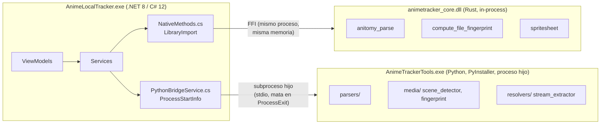

# Fase 2 — Arquitectura, Estructura y Componentes

## 0. Nota de gobernanza (hallazgo inesperado, relevante para el usuario)

`gh run list` sobre el repo muestra un run reciente y **exitoso** llamado *"Running Copilot cloud
agent"* sobre la rama `copilot/audit-integral-proyecto` (run `34925325349`, completado
2026-09-15T03:31:42Z, ~40 min antes del inicio de esta corrida). El nombre de la rama sugiere que
**ya existe una auditoría integral en curso o completada por un agente Copilot cloud en paralelo
a esta**. No se investigó el contenido de esa rama (fuera del alcance pedido), pero se deja
constancia aquí porque: (a) puede haber trabajo duplicado, (b) si esa rama modifica código antes
de que termine esta auditoría, algunos hallazgos de líneas específicas podrían quedar desalineados
en corridas futuras. Recomendación: revisar `git log origin/copilot/audit-integral-proyecto` y
decidir si conviene fusionar hallazgos en vez de mantener ambos esfuerzos por separado.

## 1. Cumplimiento real del patrón MVVM (`CommunityToolkit.Mvvm`)

Estructura confirmada por conteo de archivos:

| Carpeta | Archivos .cs | Rol |
|---|---|---|
| `Views/` | 12 | XAML + code-behind (delgado, según convención MVVM) |
| `ViewModels/` | 15 | Lógica de presentación, `[ObservableProperty]`/`[RelayCommand]` (ToolKit) |
| `Services/` | 53 | Lógica de negocio/infraestructura, inyectada vía DI |
| `Models/` | 10 | Entidades de datos (SQLite-net) |
| `Core/` | 4 | Utilidades transversales (incluye interop nativo, `JobObjectHelper`) |

`App.xaml.cs` actúa como composition root explícito con **40 registros** en el contenedor DI
(`AddSingleton`/`AddTransient` sobre `IServiceCollection`, 446 líneas) — patrón correcto y
centralizado, sin service-locator disperso detectado en el grep de esta fase.

**Observación (Severidad: Baja-Media, mantenibilidad):** dos ViewModels concentran una porción
desproporcionada de la lógica:
- `ReproductorViewModel.cs` — **1468 líneas** (el archivo más grande del proyecto).
- `DetalleViewModel.cs` — **1274 líneas**.

Comparados con el resto de ViewModels (promedio muy por debajo de 500 líneas), estos dos son
candidatos a "ViewModel de Dios" — concentran probablemente orquestación de reproducción
(Flyleaf, AniSkip, auto-tracking al 90%, PiP) y de ficha de detalle (episodios, descargas,
metadata AniList) respectivamente. Riesgo: alto acoplamiento interno, tests más frágiles, y
mayor probabilidad de bugs al tocar una función que interactúa con muchas responsabilidades a la
vez. **Recomendación (estructural, no quick win):** extraer sub-orquestadores o servicios
dedicados (p. ej. `PlaybackAutoTrackingCoordinator`, `SkipTimesCoordinator` — este último ya
existe como servicio separado según Fase 0/1, buena señal de que el patrón de extracción ya se
usa parcialmente) para reducir el tamaño de `ReproductorViewModel`.

No se detectaron dependencias cíclicas obvias entre `ViewModels` y `Services` en el grep de esta
fase (los `ViewModels` dependen de interfaces `IXxxService`, no al revés) — consistente con
inyección de dependencias unidireccional correcta.

## 2. Interoperabilidad políglota (confirmado en Fase 0 que ambos son producción)



### 2.1 Mecanismo real por componente (confirmado en código, no asumido)

- **Rust → C#**: FFI **in-process** vía `LibraryImport` (P/Invoke source-generado de .NET 8,
  `NativeMethods.cs:17`, requiere `unsafe`). El `.dll` compilado se copia junto al ejecutable en
  CI (`ci.yml:105`) y se referencia condicionalmente en el `.csproj` (línea 53).
- **Python → C#**: **proceso hijo independiente**, lanzado vía `ProcessStartInfo`
  (`PythonBridgeService.cs`), empaquetado como binario PyInstaller (`AnimeTrackerTools.exe`) y
  ubicado en `Tools/AnimeTrackerTools/` dentro del directorio de instalación. El ciclo de vida
  está acoplado al proceso principal (`AGENTS.md:21`: "se mata en `ProcessExit`").

### 2.2 Resiliencia ante fallo de cada componente — hallazgo positivo

- **Rust (in-process)**: el código fuente (`native/animetracker_core/src/lib.rs:7-16`) envuelve
  explícitamente cada función expuesta vía `extern "C"` con `catch_unwind(AssertUnwindSafe(...))`.
  El propio comentario en el crate documenta la razón: un panic de Rust que cruce el borde FFI sin
  capturar terminaría el proceso .NET completo (comportamiento por defecto de un panic no
  capturado cruzando un límite `extern "C"` es UB/abort). **Esto ya está mitigado
  correctamente** — no es un hallazgo abierto, es una práctica de ingeniería sólida poco común
  incluso en proyectos profesionales con interop Rust/C#.
- **Python (proceso separado)**: al ser un proceso independiente (no comparte memoria con el
  proceso WPF), un crash del daemon Python **no puede tumbar directamente** la app principal —
  aislamiento correcto por diseño de proceso, no por código defensivo. `PythonBridgeService.cs`
  contiene 17 bloques `try`/manejo de eventos de proceso (`OutputDataReceived`,
  `ErrorDataReceived`, etc.), indicando manejo activo de la comunicación y no solo un
  "fire-and-forget". No se verificó en esta fase (queda para Fase 3/5) el comportamiento exacto
  cuando el proceso Python no responde dentro de un timeout esperado (deadlock vs. timeout
  explícito) — recomendación: confirmar que existe un timeout en las llamadas síncronas de
  `PythonBridgeService` que esperan respuesta del daemon.

**Conclusión de esta sub-sección:** el único punto único de fallo real de la interop políglota es
el crate Rust, y ya tiene mitigación explícita a nivel de código (`catch_unwind`). El daemon
Python está aislado por diseño de proceso. Esto es notablemente mejor que el caso típico de
integración políglota "naive".

## 3. Índices SQLite compuestos declarados en README/AGENTS.md — Verificado, existen y se usan

`DatabaseService.cs:108` confirma la creación del índice exacto mencionado en la documentación:
```sql
CREATE INDEX IF NOT EXISTS IX_RegistroEpisodio_AnimeEp ON RegistroEpisodio(AniListId, NumeroEpisodio);
```
Además existen dos índices adicionales no mencionados explícitamente en el README pero presentes
en el código (`DatabaseService.cs:118,128`): uno para la cola de sincronización
(`VistoLocal, SincronizadoEnNube`) y otro para `UltimaReproduccion` (usado presumiblemente para
ordenar el historial). El grep de esta fase confirma **~15 sitios distintos** en el código
(`DatabaseService`, `ViewModels/ActualizacionesViewModel`, `HistorialViewModel`,
`DescargasViewModel`, `DownloadService`, mensajes de `WeakReferenceMessenger`) que consultan o
agrupan por la tupla `(AniListId, NumeroEpisodio)` — el índice compuesto está genuinamente
alineado con el patrón de acceso real del código, no es documentación aspiracional.

## 4. Pipeline de CI — verificado que corre realmente y bloquea (no solo declarado en YAML)

`gh run list` (repo autenticado, `rodriguezrobinj/AnimeLocalTracker`) confirma runs reales y
recientes del workflow "CI & Security Audit" sobre `main`:

| Run | Commit | Resultado | Duración |
|---|---|---|---|
| 34927691711 | docs: reescribir README... | **success** | 6m52s |
| 34925853038 | fix(config): corregir enlazado del ComboBox... | **success** | 7m48s |
| 34927526806 / 34927429191 | commits de docs consecutivos | *cancelled* (por la propia regla de concurrencia `cancel-in-progress: true` del workflow, no por fallo) | 2m37s / 1m40s |

Esto confirma dos cosas simultáneamente: (1) el gate de cobertura (45%/30%), el SCA bloqueante
(cargo/pip/NuGet) y `clippy -D warnings` efectivamente se ejecutan y pasan en los runs más
recientes contra `main` — no es un pipeline decorativo; y (2) la regla de concurrencia DEV-07
(cancelar el run anterior ante un push nuevo en la misma rama) funciona como está documentada en
el propio comentario del YAML.

No se re-ejecutó el pipeline completo localmente en esta fase (hubiera requerido reproducir el
runner de `windows-latest` con las mismas versiones pineadas de herramientas; en su lugar se usó
`gh run list`/evidencia de runs reales, que es una verificación más fuerte de "esto corre en
producción de CI" que una re-ejecución local aislada).

## 5. Cuellos de botella y puntos únicos de fallo dentro de la app WPF

- **`DatabaseService.cs` (689 líneas)** es el único punto de acceso a SQLite para toda la app
  (según el patrón de Service centralizado) — no es un antipatrón per se (es el Repository/Unit
  of Work esperado en MVVM), pero cualquier regresión ahí afecta transversalmente a Historial,
  Actualizaciones, Descargas y Detalle simultáneamente. Backups vía `VACUUM INTO` (confirmado por
  invariante documentada en `AGENTS.md:18`) es la práctica correcta para snapshot atómico sin
  bloquear la DB abierta — mitigación ya presente.
- **`AniListTrackingService.cs` (845 líneas)** concentra toda la sincronización GraphQL — punto
  único de fallo esperado dado que solo existe una fuente de verdad remota (AniList), no es un
  defecto de diseño evitable.

## 6. Resumen de hallazgos de esta fase

| # | Hallazgo | Severidad | Tipo |
|---|---|---|---|
| 1 | Rama `copilot/audit-integral-proyecto` con auditoría paralela ya ejecutada | Informativo | Gobernanza |
| 2 | `ReproductorViewModel`/`DetalleViewModel` sobredimensionados (1468/1274 líneas) | Baja-Media | Mantenibilidad |
| 3 | Interop Rust protegida con `catch_unwind` en el borde FFI | Ninguna (positivo) | Resiliencia |
| 4 | Interop Python aislada por proceso separado | Ninguna (positivo) | Resiliencia |
| 5 | Índices compuestos SQLite reales y alineados con patrones de consulta | Ninguna (positivo) | Rendimiento |
| 6 | CI bloqueante confirmado con runs reales exitosos, no solo YAML declarado | Ninguna (positivo) | Calidad de proceso |
| 7 | Timeout de `PythonBridgeService` en llamadas síncronas no verificado | Info — pendiente de Fase 3/5 | Resiliencia |
