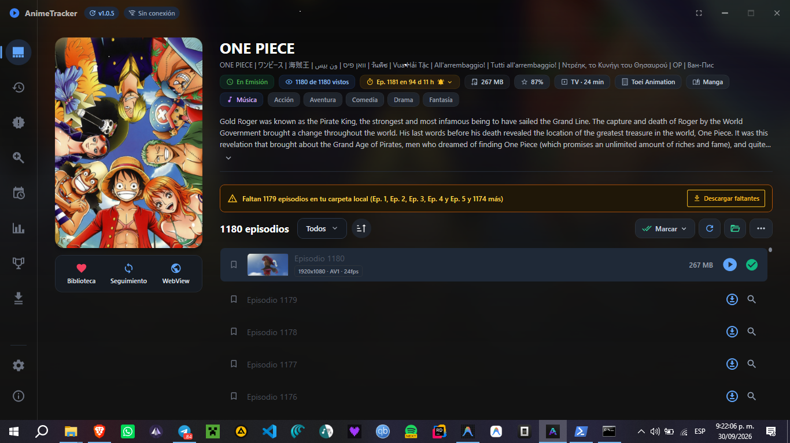
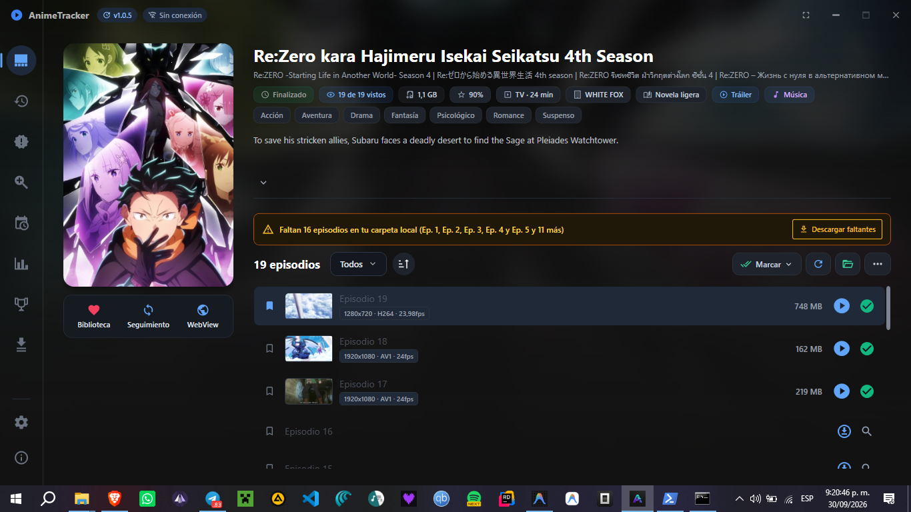
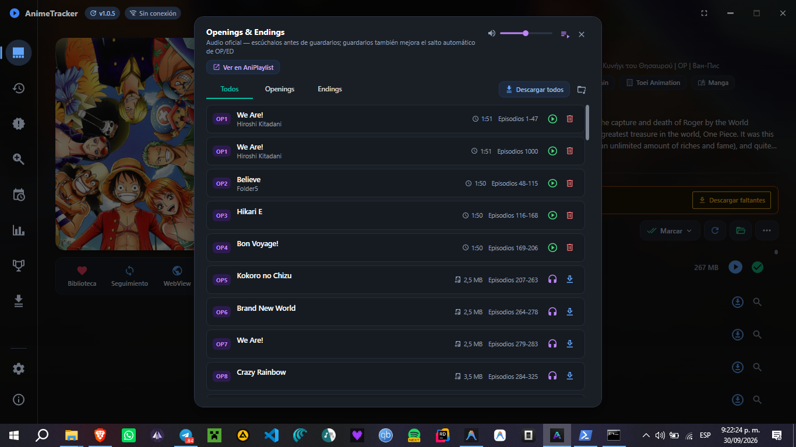
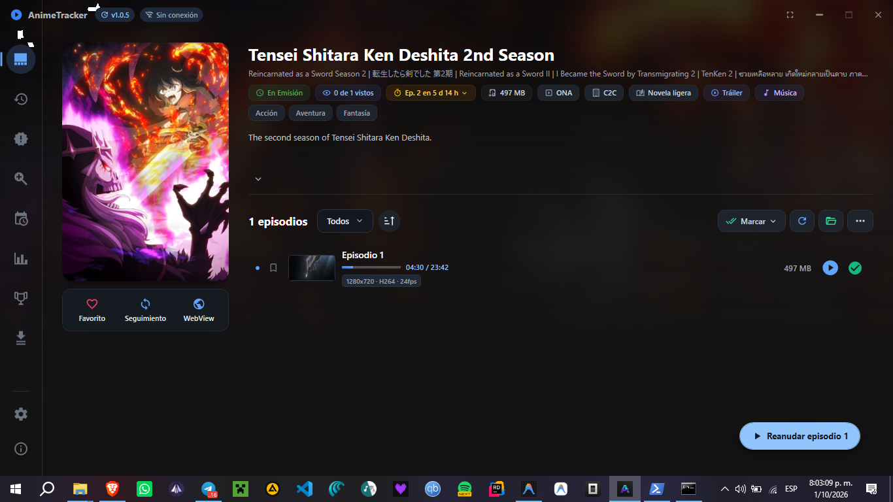
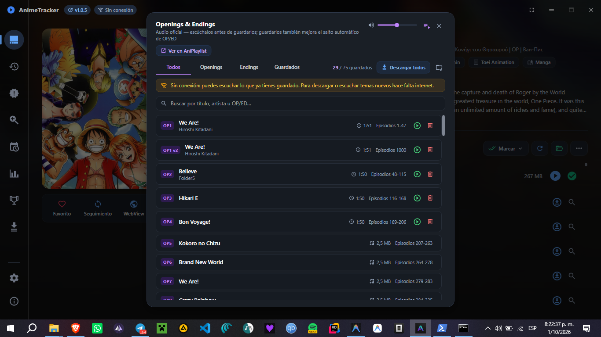
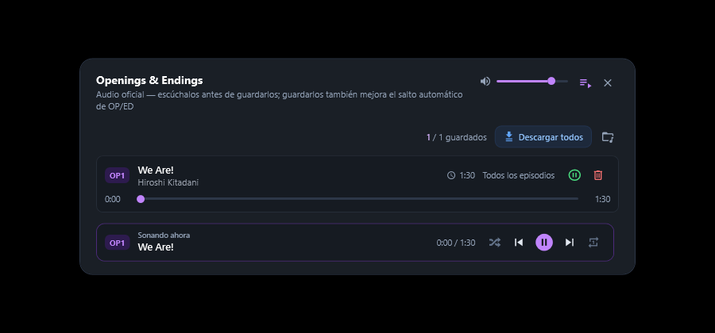
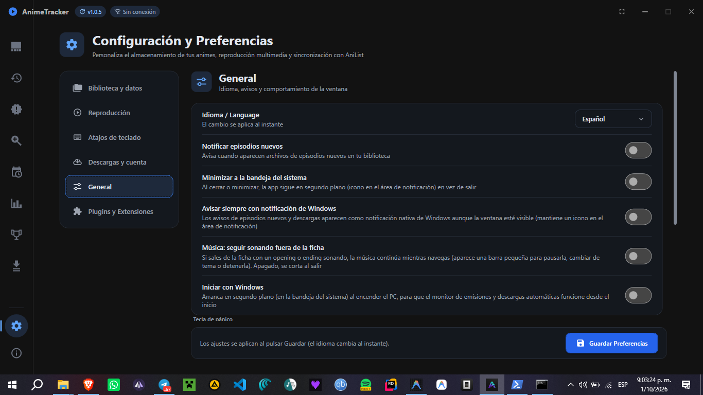
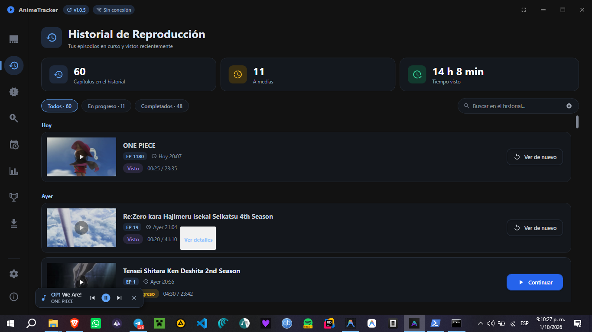

# Investigación: Ficha del anime y ventana de música (2026-09-30)

Estado real de la pestaña de detalles y de la ventana "Openings & Endings", antes de tocar nada. Solo se investigó: no hay
cambios de código en este informe.

## Cómo se investigó

- **Código leído completo:** `DetalleViewModel` (5 archivos), `DetalleView.xaml` y su code-behind, `ControlReproduccionTemas`,
  `TemaAnimeItem`, `AudioTrackPlayer`, `EpisodeEnrichmentCoordinator`, `NavigationService`, y las partes de
  `DatabaseService`, `FileScannerService`, `AnimeThemesDownloadService`, `DatosExtraService` y `AniListTrackingService` que
  usa la ficha.
- **App real**, con una instancia de prueba sin red (`ANIMELOCALTRACKER_SIN_RED=1`), en tu pantalla de 1366×768: ficha de
  Re:Zero 4th Season (19 episodios) y de One Piece (1.180 filas, 75 temas), con sus ventanas de música. Solo navegación
  (sin clics de ratón, sin reproducir ni descargar). `settings.json` quedó idéntico.
- **Cada hallazgo dice cómo se sabe:** *visto en la app*, *medido* o *leído en el código*. Lo que no se pudo medir está al
  final.

## La ficha en números

| | |
|---|---|
| ViewModel | 2.970 líneas en 5 archivos, 20 dependencias en el constructor, 46 comandos, 47 propiedades observables |
| Vista | 2.085 líneas de XAML con 4 ventanas superpuestas dentro (seguimiento, música, calendario, menús) |
| Colores | 257 colores escritos a mano (62 distintos); ninguno sale de la paleta `Brush.*` de `App.xaml` |
| Pruebas | 304 pruebas en 23 archivos cubren ficha y música: hay red de seguridad para reorganizar |
| Tu biblioteca | 244 carpetas (la mayor, 15 videos), 236 mp3 en 93 carpetas, 617 miniaturas |

---

## 1. Errores confirmados

### 1.1 "Faltan 1179 episodios" y un botón que los descargaría todos — *visto en la app + código*

El aviso de "episodios faltantes" cuenta como hueco **todo episodio sin archivo por debajo del más alto que tengas**, aunque
ya lo hayas visto. Como tu forma normal de usar la app es ver y liberar espacio, el aviso sale casi siempre:

- One Piece (1180 de 1180 vistos, solo el 1180 en disco): "Faltan 1179 episodios".
- Re:Zero 4th Season (19 de 19 vistos, 3 en disco): "Faltan 16 episodios".

El botón **"Descargar faltantes" pone en cola los 1.179 de golpe, sin preguntar** (`DescargarFaltantesAsync` recorre la lista
y `IniciarDescargaEpisodioAsync` solo encola). No lo pulsé.

**Arreglo propuesto:** un episodio ya visto no es un hueco; confirmación con número y tamaño estimado cuando sean más de
unos pocos; el aviso se puede descartar por anime.

### 1.2 Los filtros de episodios no hacen nada con la app en inglés — *código*

El desplegable ofrece los textos traducidos ("Downloaded", "Watched", "Unwatched", "Favorites"), pero
`EpisodiosOrganizador.FiltrarYOrdenar` compara contra los textos en español ("Descargados", "Vistos", "No Vistos",
"Favoritos"). En inglés ningún filtro coincide y siempre se ve la lista entera. El mismo fallo está en dos comprobaciones
del ViewModel (`FiltroEpisodios is "Vistos" or "No Vistos"`, `== "Favoritos"`). Además la lista de opciones se crea una vez:
si cambias de idioma con la ficha abierta, no se retraduce.

**Arreglo propuesto:** filtrar por una clave fija (enum) y mostrar el texto traducido aparte, igual que ya hace la música
con "Todos/Openings/Endings".

### 1.3 Cada ficha que abres se queda en memoria hasta cerrar la app — *código + medición orientativa*

Tres causas que se suman:

1. El ViewModel se suscribe a `SettingsService.ConfiguracionModificada` (servicio único) y nunca se da de baja.
2. Se pide al contenedor raíz como transitorio desechable: el contenedor guarda una referencia a cada instancia hasta que
   la app se cierra (el comentario del código dice lo contrario).
3. `Dispose()` solo se llama al pasar de una ficha a otra. Si sales a Galería, Historial o cualquier otra pestaña, nunca.

Medido abriendo la ficha de One Piece 8 veces seguidas: la memoria privada pasó de **346 MB a 458 MB** (417 MB tras 20 s en
reposo). Es orientativo, porque el recolector decide cuándo limpiar, pero cuadra con ~9 MB por apertura.

Consecuencias que se deducen del código (no las vi ocurrir):

- Las fichas viejas siguen escuchando mensajes. Si abriste la ficha de un anime 5 veces y termina una descarga suya, las 5
  generan la miniatura, escriben en la base de datos y lanzan el aviso de "descarga completada".
- Cada guardado de configuración (por ejemplo, mover el volumen de la música) despierta a todas.
- Al salir a otra pestaña no se cancelan las cargas de fondo ni se libera el reproductor de audio.

**Arreglo propuesto:** `NavigationService` desecha la ficha al salir de ella hacia cualquier sitio; el aviso de
configuración pasa por `WeakReferenceMessenger`; la ficha se crea con una fábrica que no deja rastro en el contenedor.

### 1.4 "Marcar como vistos / no vistos" sin selección cambia todo, sin preguntar ni deshacer — *código*

Sin episodios seleccionados, el menú **Marcar** actúa sobre todos los visibles. Un clic en "Marcar como no vistos" en One
Piece borra el visto y el punto de reanudación de 1.180 episodios. Los cuatro comandos de marcado además ponen a cero
`ProgresoSegundos` y `TotalSegundos` de cada episodio.

**Arreglo propuesto:** confirmación cuando afecte a más de un episodio sin selección explícita, y aviso con "Deshacer".

### 1.5 "Reproducir" en un episodio que no tienes abre nyaa.si en el navegador — *código*

El menú contextual muestra "Reproducir" en todas las filas. En una sin archivo, enseña un aviso y abre una búsqueda de
Nyaa en el navegador. Es un resto de antes de tener descargas integradas.

**Arreglo propuesto:** ocultarlo en esas filas u ofrecer "Descargar".

### 1.6 Cada apertura consulta a AniList para un aviso que casi nunca aparece — *registro + código*

`CargarProximosEpisodiosDeAniListAsync` pide el anime a AniList en cada apertura. El aviso solo sale si el próximo
episodio supera las filas de la lista, y la lista ya se alarga sola con la cuenta atrás (dato local). Sin conexión deja un
aviso en el registro por cada ficha abierta (lo vi para 189046 y 21).

**Arreglo propuesto:** sacar ese dato de `ProximaEmisionService`, que ya lo tiene guardado, y eliminar la consulta.

### 1.7 Otros fallos menores

| Qué | Cómo se sabe |
|---|---|
| El botón "Biblioteca" (corazón) en realidad **elimina** el anime de la biblioteca | código |
| El favorito del anime no se puede marcar desde la ficha: `AlternarFavoritoAnimeCommand` existe pero ningún botón lo usa. Igual `VolverAGaleriaCommand`, `EstadoDuplicados`, `TieneEpisodios` | código |
| Borrar un mp3 de la música no pide confirmación | código |
| En la música, las dos versiones de un mismo tema salen iguales ("OP1 We Are!" dos veces): no se muestra "v2" | visto |
| Sin conexión, "Escuchar antes de descargar", "Descargar" y "Descargar todos" siguen activos | visto (no los pulsé) |
| Manchas blancas sobre el fondo oscurecido con la música abierta en Re:Zero (dos capturas iguales); causa sin determinar | visto |
| El título de un tema está en un panel horizontal: si es largo no puede acortarse con "…" | código |
| "Detectar opening" usa el método antiguo (dos episodios, plugin) en vez de la detección por lotes; su título es el literal "Info" | código |
| Una línea DEBUG por cada episodio con progreso, en cada apertura | código |
| Dos `Image` con `IsAsync=True`, que la regla del proyecto prohíbe | código |
| Orden y filtro de episodios sin nombre accesible (solo tooltip) | código |
| El guardado de miniaturas y datos técnicos reescribe también visto y progreso con lo que la fila tenía en ese momento. Hoy no pierde nada, pero es el mismo tipo de guardado que ya causó pérdidas de progreso | código (riesgo) |

---

## 2. Rendimiento

| Qué | Detalle | Cómo se sabe |
|---|---|---|
| **La lista se rehace entera** | `AplicarFiltrosYOrdenamiento` vacía y vuelve a añadir todas las filas (1.180 avisos en One Piece) al cambiar orden o filtro, al terminar cada miniatura, al acabar una descarga, al marcar, al añadirse un episodio nuevo. Se pierden la selección y la posición | código; sin cronometrar |
| **Fuga de memoria** | Ver 1.3 | medido (orientativo) |
| **Fondo de la ficha** | La portada se decodifica a tamaño completo dos veces y una pasa por un desenfoque de radio 50 a toda la ventana | código; sin cronometrar |
| **Menú contextual por fila** | Cada fila lleva su propio menú con sus plantillas completas, en vez de uno compartido | código |
| **Disco al abrir** | Recorrido recursivo de la carpeta, limpieza de parciales y 3 lecturas por miniatura. Con tus carpetas (máximo 15 videos) es poco | código + tamaño real |
| **Música** | Por cada tema se comprueba el disco y, si no está, se lista la carpeta entera (75 temas × 29 mp3 en One Piece). La ruta del tema se busca en el hilo de la interfaz al reproducir | código |
| **Red al abrir** | Hasta 3 peticiones: AniList (1.6), datos extra si tienen más de 7 días, AnimeThemes si la lista tiene más de 12 h | código + registro |

No hay cronómetro interno de "ficha lista" como el `[Perf]` de la Galería. Por UIA, la lista de Re:Zero apareció en menos
de 2,3 s, pero esa cifra incluye lo que tarda la propia consulta de UIA: no sirve como medida. **Lo primero de la fase de
rendimiento debería ser añadir ese registro** para medir antes y después.

---

## 3. Interfaz y experiencia de uso

- **La lista de episodios es lo que menos sitio tiene.** En tu pantalla, título, etiquetas, sinopsis, aviso y barra de
  acciones ocupan algo más de la mitad; quedan unas 4 filas y media. Debajo de la portada, la columna izquierda está vacía.
- **Episodios vistos casi ilegibles:** gris `#6B7280` al 60 % sobre fondo oscuro (la regla del proyecto ya lo prohíbe).
- **Sinopsis plegada:** en Re:Zero se ve una línea, un hueco en blanco y la flecha.
- **La etiqueta de estado siempre tiene fondo verde,** también en "Finalizado".
- **Nombres alternativos:** una línea con todos los idiomas (tailandés, ruso, árabe…).
- **No hay acción principal.** "Reanudar" solo aparece con un episodio a medias; no existe "Ver el siguiente".
- **Doble clic o Enter sobre un episodio no hacen nada.**
- **Series largas:** en One Piece no hay forma de saltar a un episodio ni de agrupar por rangos.
- **Escape y clic fuera** cierran la música, pero no el editor de seguimiento ni el calendario.

- **75 temas sin buscador** ni contador de cuántos tienes guardados.
- **55 de 75 temas sin artista:** es dato de origen (la API de AnimeThemes tampoco los da hoy; comprobado). La fila deja
  igualmente una línea vacía.
- **Las pestañas Todos/Openings/Endings son verdes** y el resto de la ventana, morado.
- **No hay controles generales:** anterior/siguiente, qué suena ahora, repetir o aleatorio. Para saber qué suena hay que
  buscar la fila.
- **La música se corta al salir de la ficha** (decisión anterior; ver 4).

---

## 4. Estructura y arquitectura

- **Un ViewModel para todo.** Episodios, descargas, seguimiento de AniList, calendario, cuenta atrás, espacio en disco,
  etiquetas, música, enlaces externos y herramientas viven en una sola clase partida en archivos.
- **Código repetido:** cuatro comandos de marcado casi idénticos; el "vaciar los datos del archivo" de un episodio está dos
  veces; el manejador de "descarga terminada" tiene 115 líneas con guardado en base de datos dentro del ViewModel.
- **La vista mezcla cuatro pantallas** en un archivo, con sus estilos dentro.

**Reparto propuesto** (extraer clases, sin cambiar comportamiento, apoyado en las 304 pruebas):

| Pieza | Qué se lleva |
|---|---|
| `DetalleViewModel` (queda como contenedor) | Anime, cabecera, etiquetas, ciclo de vida |
| `EpisodiosFichaViewModel` | Lista, filtro, orden, marcar, descargar, borrar, huecos |
| `MusicaFichaViewModel` + `PanelMusicaView` | Todo `DetalleViewModel.Musica.cs` y su ventana |
| `SeguimientoEditorViewModel` + vista | Editor de AniList y calendario |
| `ReproductorMusicaService` (único en la app) | El reproductor de temas, fuera de la ficha |

La última pieza es la que abre funciones nuevas: con el reproductor fuera de la ficha, la música puede seguir sonando al
cambiar de pestaña y tener una barra de "sonando ahora". Eso cambia una decisión tuya anterior (cortar al salir), así que
queda como pregunta.

---

## 5. Plan por fases

| Fase | Contenido | Riesgo |
|---|---|---|
| **1. Errores y seguridad de datos** | 1.1 (faltantes), 1.2 (filtros en inglés), 1.3 (fuga), 1.4 (marcar sin confirmar), 1.5, borrar mp3 con confirmación, "v2" en temas | Bajo; cambios pequeños con prueba cada uno |
| **2. Rendimiento** | Registro `[Perf]` de la ficha; lista sin rehacerse entera; quitar la consulta de 1.6; fondo de la ficha; menú contextual compartido | Medio; hay que medir antes y después |
| **3. Estructura** | Reparto de la sección 4 | Medio; sin cambios visibles |
| **4. Interfaz de la ficha** | Más sitio para episodios, contraste, sinopsis, acción principal, doble clic, salto a episodio, colores a la paleta, Escape en todas las ventanas | Medio; decisiones de diseño tuyas |
| **5. Música** | Buscador, contador, controles generales, estado sin conexión y, si lo decides, música que sigue entre pestañas | Medio |

Recomiendo empezar por la fase 1: son fallos que hoy pueden costarte datos o una cola de 1.179 descargas.

### Fase 1 — hecha (2026-09-30)

| Hallazgo | Qué se hizo |
|---|---|
| 1.1 Faltantes | Un episodio ya visto no cuenta como hueco (`EpisodiosOrganizador.CalcularFaltantes`). "Descargar faltantes" pregunta cuando son más de 3. No se añadió el descarte del aviso por anime |
| 1.2 Filtros | Se filtra por clave fija; el desplegable muestra la traducción (`OpcionFiltroEpisodios`) y se retraduce al cambiar de idioma |
| 1.3 Fuga | La ficha se descarta al salir hacia cualquier sitio (`NavigationService.OnVistaActualChanged`), se da de baja de la configuración y de los mensajes, y se crea con una fábrica que el contenedor no retiene. "Descargar todos" de la música sigue aunque se salga |
| 1.4 Marcar | "Marcar vistos / no vistos" sin selección pregunta antes si afecta a más de un episodio; ya no se pierde la duración guardada. No hay "Deshacer". "Marcar temporada completa" no pregunta (el nombre ya lo dice) |
| 1.5 Reproducir | Oculto en el menú de los episodios sin archivo; ya no abre Nyaa en el navegador |
| Música | Borrar un mp3 pide confirmación; las versiones se distinguen ("OP1 v2") |

Comprobado: 2.265 pruebas (23 nuevas). En la app real, One Piece ya no muestra el aviso, la lista gana una fila y la
memoria se estabiliza en torno a 410 MB tras 8 aperturas (antes subía hasta 458 MB). Los diálogos de confirmación y los
filtros en inglés solo están cubiertos por pruebas, no se pulsaron en la app.

**Efecto a tener en cuenta:** como la ficha ya no sigue viva al salir de ella, la miniatura y los datos técnicos de un
episodio que termine de descargarse con la ficha cerrada se generan la próxima vez que la abras, no en el momento.

### Fase 2 — hecha (2026-09-30)

Lo primero fue el cronómetro (`[Perf] Ficha …` en el registro, y `[Perf] Vista de la ficha` / `[Perf] Lista de episodios`
con el registro detallado). Con él y con un perfil de CPU (`dotnet-trace`) salió que **el reparto real no era el que suponía
la sección 2**:

- La consulta a la base de datos tarda 0,5–4 ms (medida aparte sobre tu `biblioteca.db`: 3.407 registros, con índice).
- Rehacer la lista de 1.180 filas costaba ~20 ms, no era el cuello de botella.
- Lo que domina es **la interfaz construyendo la vista de la ficha en cada visita: ~230 ms**, casi todo instanciando
  plantillas de controles. Los datos, listos en milisegundos, esperaban a que terminara.

| Cambio | Efecto medido |
|---|---|
| Base de datos, carpeta y filas en una sola tarea fuera del hilo de la interfaz, en paralelo con la vista | Datos listos a los 2–48 ms; entran en la lista ~40–70 ms antes (One Piece: 273–280 → 230–233 ms; primera apertura 408 → 335 ms) |
| La lista solo se toca si cambia, y de una vez (`ColeccionReemplazable`) | 17–27 ms → 0–2 ms; marcar un episodio, una miniatura que llega o una descarga que termina ya no devuelven la lista arriba ni quitan la selección |
| Fuera la consulta a AniList del aviso "próximos episodios" (y el aviso, que no podía llegar a mostrarse) | 1 petición menos por apertura (5 fallidas en la sesión de prueba sin red → 0) |
| Filas más ligeras: botones de icono con plantilla simple y un único menú contextual para toda la lista | Pintar las filas tras llenar la lista: ~125–170 ms → ~75–130 ms; cambiar de filtro: 212–269 → 157 ms |

**Resultado global, sin adornos:** la lista aparece unos 45 ms antes y pintada del todo unos 50 ms antes, pero el tiempo
hasta que la ficha deja de moverse apenas cambia en aperturas repetidas (One Piece ~565 ms antes y después; la primera
apertura 899 → 765 ms). La mejora grande que queda es la construcción de la vista, y no se tocó: pide rehacer la cabecera
con controles más ligeros o conservar la vista entre visitas, que encaja con las fases 3 y 4. Ahora hay registro para
medirlo.

**No se hizo:** el fondo desenfocado de la ficha. Su coste está en el hilo de dibujado y la tarjeta gráfica, donde estas
mediciones no ven nada; cambiarlo a ciegas no sería una mejora demostrable.

De paso: las opciones del filtro ya tienen nombre para lectores de pantalla (leían el nombre de la clase, fallo introducido
en la fase 1) y el menú de un episodio sin archivo ya no deja una raya suelta al final. Comprobado en la app que el menú
compartido abre el del episodio correcto con el botón y con clic derecho en filas distintas. Suite: 2.275 pruebas.

### Fase 3 — hecha (2026-09-30 y 2026-10-01); queda el reproductor de música único

| Pieza | Antes | Ahora |
|---|---|---|
| Música | `DetalleViewModel.Musica.cs` (parte de la clase de la ficha) + bloque dentro de `DetalleView.xaml` | `MusicaFichaViewModel` (888 líneas) + `PanelMusicaView` (434); la ficha la expone como `Musica` |
| Editor de seguimiento y calendario | Repartido entre `DetalleViewModel.cs` y `.Seguimiento.cs` + dos bloques en `DetalleView.xaml` | `SeguimientoEditorViewModel` (366) + `EditorSeguimientoView` (591); la ficha lo expone como `Seguimiento` |
| Lista de episodios | Dentro de `DetalleViewModel.cs` | `EpisodiosFichaViewModel` (1.067 líneas): cargar, filtrar, marcar, descargar, reproducir, borrar, huecos y herramientas; la ficha la expone como `Episodios` |
| Ficha | ViewModel de 2.970 líneas, vista de 2.085 | ViewModel de 872 líneas en 3 archivos (cabecera, espacio en disco, cuenta atrás y coordinación de las piezas), vista de 1.093 |
| Estilos compartidos | Dentro de `DetalleView.xaml` | `Views/FichaEstilos.xaml`, cargado una vez desde `App.xaml` |

También: el "vaciar los datos del archivo" de un episodio vive en un solo sitio (`EpisodioItem.QuitarArchivo`) y lo que se
hace con un episodio recién descargado salió del manejador del mensaje (`PrepararEpisodioRecienDescargadoAsync`).

**Efecto en rendimiento (medido):** las ventanas de música, seguimiento y calendario ya no se construyen en cada visita,
solo la primera vez que se abren. La vista queda colocada en 64–153 ms (antes 164–249) y la ficha asentada en 280–415 ms
en aperturas repetidas (antes 524–565), en dos tandas de medición.

**Regresión encontrada y corregida al probar en la app:** el editor de seguimiento se abría con los campos vacíos. Al crear
su vista se ajustaba el idioma del calendario en mitad de la propagación del DataContext, y eso la cortaba. Ahora se hace
al cargarse la vista; hay una prueba de vista para ese caso (`VentanasDeLaFichaTests`). Suite: 2.277 pruebas.

**Lista de episodios (2026-10-01):** la ficha lee los datos con `Episodios.LeerAsync` (fuera del hilo de la interfaz) y los
muestra con `Episodios.Mostrar` en el mismo paso en que arranca lo demás. Hacerlo en un solo método asíncrono de la pieza
añadía un segundo salto al hilo de la interfaz que esperaba a que se pintaran las filas (~190 ms de retraso, medido y
corregido). La pieza avisa a la ficha con dos eventos (`ArchivosCambiados`, `ReproduccionSolicitada`) para lo que no es
suyo: el espacio en disco y cortar la música. Las rutas de enlace de las vistas hacia las piezas
(`DataContext.Episodios.…`) se comprueban en `EnlacesDeLaFichaTests`: una ruta mal escrita no da error, el botón deja de
funcionar sin más. Suite: 2.284 pruebas.

**No se hizo:**

- `ReproductorMusicaService` único para toda la app: depende de la decisión 3 (música entre pestañas).

### Fase 4 — hecha (2026-10-01); queda la paleta de colores

Para el botón "Biblioteca" se aplicó la opción recomendada (no la elegiste expresamente; es fácil de revertir).

- **Distribución: se probó la opción A y se descartó.** Etiquetas y sinopsis bajo la portada daban ~9 filas de
  episodios, pero no te gustó cómo quedaba: la ficha vuelve a la distribución original (portada 255×365, etiquetas y
  sinopsis sobre la lista). No volver a proponerla.
- **Botón principal de la lista** (abajo a la derecha): ofrece lo siguiente que tiene sentido — "Reanudar episodio N"
  (el más reciente a medias que esté en disco), si no "Ver episodio N" (el primero sin ver, si está descargado) o
  "Descargar episodio N" (si no lo está). No aparece si ya lo viste todo o si ese episodio ya se está descargando.
- **Ir a un episodio:** casilla "Ir al ep." junto al filtro, solo en animes de 30 episodios o más. Número + Enter
  desplaza la lista y resalta la fila; si el filtro lo oculta, lo avisa.
- **Corazón = favorito.** El primer botón bajo la portada marca/desmarca el anime como favorito (antes lo eliminaba).
  "Eliminar de la biblioteca" está ahora al final del menú de herramientas (⋯), con la misma confirmación de siempre.
- **Teclado y ratón:** doble clic o Enter sobre una fila reproduce el episodio (si está en disco); Escape cierra el
  editor de seguimiento y el calendario; clic fuera del calendario lo cierra. El clic fuera del editor NO lo cierra a
  propósito: se perderían los cambios sin guardar.
- **Legibilidad y accesibilidad:** los episodios vistos usan `#94A3B8` sin transparencia (antes `#6B7280` al 60 %); la
  etiqueta de estado solo es verde si el anime está en emisión; los tres botones bajo la portada, el filtro y el botón
  de orden tienen nombre para lectores de pantalla.

Comprobado en la app (instancia de prueba, sin red): ficha de Tensei Shitara Ken y One Piece, botón "Reanudar
episodio 1", salto al 500 de One Piece, aviso con un número inexistente, menú de herramientas, Escape en el editor.
No se pulsó el corazón, ni "Eliminar", ni el botón principal (cambiarían datos reales). Suite: 2.296 pruebas; fallan 3
de `DownloadServiceTests` porque el disco C: tiene menos de 200 MB libres (piden ~100 MB), no por estos cambios.

**No se hizo:**

- Pasar los 257 colores literales de `DetalleView.xaml` a la paleta `Brush.*`: es un cambio grande y solo cosmético por
  dentro; conviene hacerlo aparte, con capturas antes/después.
- "Deshacer" tras marcar episodios y poder descartar el aviso de faltantes por anime.

### Fase 5 — hecha (2026-10-01); la música sigue cortándose al salir de la ficha

- **Buscador** (solo con 8 temas o más): por título, artista o etiqueta ("OP3", "ED12"), sin distinguir mayúsculas ni
  acentos. Se combina con las pestañas. Un tema tapado por spoiler solo se encuentra por su etiqueta, para no destaparlo.
- **Contador "29 / 75 guardados"** y pestaña nueva **Guardados**. Se actualiza al descargar o borrar.
- **Barra de "sonando ahora"** al pie de la ventana: qué suena, tiempo, anterior, play/pausa, siguiente, aleatorio y
  repetir. Pulsar el título lleva la lista hasta ese tema (quitando el filtro si lo tapa).

  

  - *Siguiente* salta los temas sin archivo y, al final, vuelve al primero. *Anterior* vuelve al principio del tema si ya
    lleva más de 3 s; si no, pasa al anterior.
  - *Aleatorio* no repite un tema hasta que han sonado todos. *Repetir* vuelve a empezar el mismo tema al terminar.
    Los dos se recuerdan entre sesiones (como el volumen).
- **Sin conexión:** un aviso arriba, y las filas dejan de ofrecer "escuchar antes de descargar" y "descargar" (antes
  seguían activos y fallaban). Lo guardado se escucha igual, y una vista previa ya preparada se puede guardar. "Descargar
  todos" queda atenuado. Al volver la red, los botones reaparecen solos.
- **Detalles:** las pestañas son moradas como el resto de la ventana (eran verdes); un título largo se acorta con "…";
  los temas sin artista ya no dejan una línea vacía; la ventana no encoge mientras se escribe en el buscador.

Comprobado en la app (instancia de prueba sin red, One Piece): contador, pestañas, aviso sin conexión y buscador. La barra
de "sonando ahora" se comprobó dibujando la ventana desde una prueba, sin reproducir nada en la app real (sonaría en los
altavoces). Suite: 2.325 pruebas.

**No se hizo:**

- Que la música siga sonando al cambiar de pestaña: hecho después como opción (fase 6).
- Manchas blancas con la música abierta en Re:Zero: no se volvieron a ver; sin causa.

### Fase 6 — hecha (2026-10-01): música fuera de la ficha (opcional), colores a la paleta y "Deshacer"

**Seguir sonando fuera de la ficha (opción, apagada por defecto).** Se activa en Configuración → General, o con la
chincheta de la ventana de música (es el mismo ajuste).

- Con la opción activa, si sales de la ficha con un tema **sonando**, la música sigue mientras navegas. Abajo a la
  izquierda aparece una barra pequeña: tema y anime, anterior, play/pausa, siguiente y cerrar. En pausa no se queda.

  
- Pulsar el título de la barra vuelve a la ficha de ese anime con la ventana de música abierta, **en el mismo punto de la
  canción** (no se corta ni vuelve a empezar).
- Nunca suenan dos cosas a la vez: la música de fondo se corta al abrir un episodio, al reproducir música en la ficha de
  otro anime y al sonar un clip de "Adivina el opening/ending".
- Apagada, todo sigue como antes: la música se corta al salir.
- Cómo está hecho: `MusicaDeFondoService` (único en la app). La ficha, al cerrarse, le entrega su `MusicaFichaViewModel`
  en vez de liberarlo; la ficha del mismo anime lo recupera al abrirse. No hizo falta un reproductor nuevo.

**Colores a la paleta.** 260 de los 302 colores escritos a mano en la ficha, la ventana de música y el editor de
seguimiento ahora salen de la paleta de `App.xaml` (`Brush.*`), **con el mismo valor exacto**: no cambia nada a la vista
(comparado con capturas de antes y después). Se añadieron 12 tonos a la paleta, los que se repetían 3 veces o más sin
nombre (morado de la música, ámbar de avisos, superficies y bordes de controles). Quedan 42 literales de un solo uso
(degradado del fondo, sombras, fondos de avisos puntuales).

**"Deshacer" tras marcar episodios.** Después de marcar varios episodios como vistos o no vistos aparece 15 segundos un
aviso sobre la lista ("12 episodios marcados como vistos · Deshacer"). Deshacer deja cada episodio como estaba, incluido
el minuto donde te habías quedado (marcar lo pone a cero).

Comprobado en la app (instancia de prueba, sin red, con el volumen de la música a cero): interruptor en Configuración,
chincheta, barra de fondo en Historial, vuelta a la ficha en el mismo punto y "Detener". El aviso de "Deshacer" no se
pulsó en la app real (cambiaría tus episodios vistos); está cubierto por pruebas. Suite: 2.341 pruebas.

## Decisiones que son tuyas

1. **Aviso de faltantes:** ¿quitarlo cuando los huecos son episodios ya vistos, o mantenerlo con otro texto?
2. **Botón "Biblioteca":** aplicado en la fase 4 con la opción recomendada (favorito; "eliminar" en herramientas). Sin
   confirmar por ti: dilo si lo prefieres como antes.
3. **Música entre pestañas:** resuelta en la fase 6 — es una opción tuya (apagada por defecto).
4. **Distribución:** resuelta — se queda la original; la opción A se probó en la fase 4 y la descartaste.

## Lo que no se pudo comprobar

- **Tiempos exactos** de apertura y de rehacer la lista: no hay registro interno y UIA no sirve de cronómetro.
- **Recuento exacto de fichas en memoria:** un volcado de memoria ocupa cientos de MB y **al disco C: le quedan 1,3 GB**.
- **Filtros en inglés, el clic en "Descargar faltantes" y los botones de música sin conexión:** se dedujeron del código o
  se vieron activos, pero no se pulsaron.
- **Manchas blancas** de la ventana de música: vistas dos veces en Re:Zero y ninguna en One Piece; sin causa.
